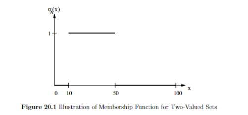
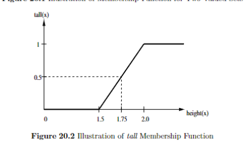

TARGET DECK: CI::FuzzySystems::2.FuzzySet&MembershipDefinition
# Fuzzy Set Definitions and Membership Functions
START
Basic
## What is the formal definition of a fuzzy set in terms of its membership function?
Back:
A fuzzy set *A* is characterized by a membership mapping function ***µA* : *X* → [0, 1]**, where *X* is the domain or universe of discourse. For all *x* ∈ *X*, *µA*(*x*) indicates the certainty to which element *x* belongs to fuzzy set *A*.

### How is a fuzzy set represented for a discrete domain *X* using set notation?
For a discrete domain *X* = {*x*1, *x*2, ···, *xnx*}, the fuzzy set *A* is represented as *A* = {(*µA*(*xi*)/*xi*)| *xi* ∈ *X*, *i* = 1, ···, *nx*}.
<!--ID: 1750609082514-->
END

START
Basic
## What is the membership function in the context of fuzzy sets?
Back:

The membership function is the characteristic function of a fuzzy set that associates a degree of membership to each element of the domain. It defines how much an element belongs to the fuzzy set, with values ranging from 0 (no membership) to 1 (full membership).
<!--ID: 1750609082518-->
END


START
Basic
## What is the range of values that the membership function *µA*(*x*) can take for a fuzzy set?
Back:

The membership function *µA*(*x*) for a fuzzy set can take any value in the closed interval [0, 1], where 0 indicates no membership and 1 indicates full membership.
<!--ID: 1750609082520-->
END


START
Basic
## What are the constraints that a membership function must satisfy?
Back:

A membership function must satisfy the following constraints:
1. It must be bounded between 0 and 1, i.e., the range is [0, 1].
2. For each element *x* in the domain *X*, the membership degree *µA(x)* must assign exactly one value in [0, 1] to each $x \in X$.
<!--ID: 1750609082522-->
END


START
Basic
## What is the sum notation for representing a fuzzy set in a discrete domain, and what does the sum signify?
Back:
The sum notation for a fuzzy set *A* in a discrete domain is:

The sum notation indicates that *A* is a set of ordered pairs and should not be confused with algebraic summation.

Example: If *X* = {*a, b, c, d*} and *A* = 0.3/*a* + 0.9/*b* + 0.1/*c* + 0.7/*d*, then *card*(*A*) = 0.3 + 0.9 + 0.1 + 0.7 = 2.0.
<!--ID: 1750609082525-->
END

START
Basic
## How is a continuous fuzzy set *A* denoted?
Back:

A continuous fuzzy set *A* is denoted as:


The integral notation should not be algebraically interpreted.
<!--ID: 1750609082527-->
END


START
Basic
## Consider the crisp set *A* ⊂ *X* of all floating-point numbers in the range [10, 50]. What is the membership function for this set?
Back:

The membership function for the crisp set *A* is:
- *µA(x)* = 1 if *x* ∈ [10, 50]
- *µA(x)* = 0 otherwise.

<!--ID: 1750609082529-->
END

START
Basic
## Define the membership function for the *tall* fuzzy set as described in the content. What is *µA(1.75)*?
Back:

The membership function for the *tall* fuzzy set is:

0 if *length(x)* < 1.5m
*tall(x)* = ( *length(x)* − 1.5m ) × 2.0m if 1.5m ≤ *length(x)* ≤ 2.0m
1 if *length(x)* > 2.0m

For *x* = 1.75m, *µA(1.75)* = 0.5.


<!--ID: 1750609082532-->
END


START
Basic
## List and briefly define at least three characteristics of fuzzy set membership functions mentioned in the text.
Back:

1. **Core**: The set of elements with membership degree 1.
2. **Cut**: The set of elements with membership degrees greater than or equal to a specified threshold.
3. **Cardinality**: The sum of membership degrees for all elements in the set.
4. **Height**: The highest membership degree in the fuzzy set.
5. **Unimodality**: The membership function has a single peak.
6. **Support**: The set of elements with non-zero membership degrees.
7. **Normality**: A fuzzy set is normal if it has at least one element with membership degree 1.

CCCHUSN
<!--ID: 1750609082535-->
END

START
Basic
## What is the definition of *normality* in fuzzy sets?
Back:

A fuzzy set *A* is normal if it has at least one element that belongs to the set with a membership degree of 1. Mathematically, this is expressed as:

∃ *x* ∈ *X* • *µA*(*x*) = 1

If no such element exists, the set is subnormal.
<!--ID: 1750609082537-->
END

START
Basic
## How is the *height* of a fuzzy set defined?
Back:

The height of a fuzzy set is defined as the supremum (least upper bound) of its membership function: (The **maximum membership value** that occurs in the set.)
### 📚 What does **supremum** mean?

- The **supremum** is the **least upper bound**
    
- It's the **smallest number that is greater than or equal to all membership values**


<!--ID: 1750609082539-->
END

START
Basic
## What is the *support* of a fuzzy set *A*?
Back:

The support of fuzzy set *A* is the set of all elements in the universe of discourse *X* that have a non-zero membership degree in *A*:

*support*(*A*) = {*x* ∈ *X* | *µA*(*x*) > 0}
<!--ID: 1750609082542-->
END

START
Basic
## Define the *core* of a fuzzy set *A*.
Back:

The core of fuzzy set *A* is the set of all elements in the universe of discourse *X* that have a membership degree of 1 in *A*:

*core*(*A*) = {*x* ∈ *X* | *µA*(*x*) = 1}
<!--ID: 1750609082545-->
END

START
Basic
## What is an *α-cut* of a fuzzy set *A*?
Back:

The *α-cut* of fuzzy set *A* is the set of all elements in *X* with a membership degree greater than or equal to *α*:

*Aα* = {*x* ∈ *X* | *µA*(*x*) ≥ *α*}
<!--ID: 1750609082548-->
END

START
Basic
## **Example 2: Trapezoidal Fuzzy Set with Given $\alpha$-Cuts**
Back:

- The fuzzy set $A$, interpreted on the basis set $X = [0, 10]$, is represented by a **trapezoidal membership function**.
- The height of the fuzzy set is 1.
- The $\alpha$-cuts are:
  - For $\alpha = 0.2$: $[2, 7]$
  - For $\alpha = 0.7$: $[4, 6]$

---

### **1. Plot the Membership Function and Give the Function Form**

#### 🔍 **What is a Trapezoidal Membership Function?**

A trapezoidal membership function is defined by four points $a, b, c, d$:

- $a < b < c < d$
- Increases linearly from $a$ to $b$
- Stays at 1 from $b$ to $c$
- Decreases linearly from $c$ to $d$

$$
\mu_A(x) =
\begin{cases}
0 & x \leq a \\
\frac{x - a}{b - a} & a < x \leq b \\
1 & b < x \leq c \\
\frac{d - x}{d - c} & c < x \leq d \\
0 & x > d
\end{cases}
$$

---

#### 🧩 **Find Parameters from Given $\alpha$-Cuts**

Given:

- At $\alpha = 0.2$: $\mu_A(2) = \mu_A(7) = 0.2$
- At $\alpha = 0.7$: $\mu_A(4) = \mu_A(6) = 0.7$

##### Left side (increasing from $a$ to $b$):

$$
\begin{aligned}
0.2 &= \frac{2 - a}{b - a} \\
0.7 &= \frac{4 - a}{b - a}
\end{aligned}
$$

Subtract:

$$
0.5 = \frac{2}{b - a} \Rightarrow b - a = 4
$$

Now plug in:

$$
0.2 = \frac{2 - a}{4} \Rightarrow a = 1.2 \Rightarrow b = 5.2
$$

##### Right side (decreasing from $c$ to $d$):

$$
\begin{aligned}
0.7 &= \frac{d - 6}{d - c} \\
0.2 &= \frac{d - 7}{d - c}
\end{aligned}
$$

Subtract:

$$
0.5 = \frac{1}{d - c} \Rightarrow d - c = 2
$$

Now plug in:

$$
0.2 = \frac{d - 7}{2} \Rightarrow d = 7.4 \Rightarrow c = 5.4
$$

---

#### ✅ **Final Parameters**:  
$a = 1.2$, $b = 5.2$, $c = 5.4$, $d = 7.4$

---

#### ✏️ **Function Form**:

$$
\mu_A(x) =
\begin{cases}
0 & x \leq 1.2 \\
\frac{x - 1.2}{4.0} & 1.2 < x \leq 5.2 \\
1 & 5.2 < x \leq 5.4 \\
\frac{7.4 - x}{2.0} & 5.4 < x \leq 7.4 \\
0 & x > 7.4
\end{cases}
$$

---

#### 📈 **Sketch (ASCII Diagram)**

```
μ(x)
 |
1|            _______
 |           /       \
 |          /         \
 |         /           \
0|________/             \________
     1.2  5.2  5.4     7.4       x
```

---

### **2. Support, Core, and General $\alpha$-Cut**

#### 📌 **Support**: where $\mu_A(x) > 0$  
$(1.2, 7.4)$

#### 📌 **Core**: where $\mu_A(x) = 1$  
$[5.2, 5.4]$

#### 📌 **General $\alpha$-Cut**:

Left side (increasing):

$$
\alpha = \frac{x - 1.2}{4.0} \Rightarrow x_L(\alpha) = 4\alpha + 1.2
$$

Right side (decreasing):

$$
\alpha = \frac{7.4 - x}{2.0} \Rightarrow x_R(\alpha) = 7.4 - 2\alpha
$$

So:

$$
\boxed{
A_\alpha = \left[4\alpha + 1.2,\; 7.4 - 2\alpha\right] \quad \text{for } 0 < \alpha \leq 1
}
$$
<!--ID: 1750609082551-->
END

START
Basic
## What does it mean for a fuzzy set to be *unimodal*?
Back:

A fuzzy set is unimodal if its membership function has exactly one maximum (i.e., it peaks at only one point).
<!--ID: 1750609082554-->
END

START
Basic
## **Example 3: Symmetric Trapezoidal Fuzzy Set with Known $\alpha$-cut and 45° Slopes**
Back:

* The fuzzy set $A$, interpreted on $X = [0, 10]$, is represented by a **symmetric trapezoidal membership function**.
* The height is 1.
* The $0.5$ $\alpha$-cut is: $[4, 7]$
* The angles at the base of the trapezoid are 45 degrees.

**Tasks**:

1. Plot the membership function of fuzzy set $A$ and give it also in function form.
2. Give the **support**, **core**, and **general equation** for the $\alpha$-cut.

### **1. Plot the Membership Function and Give It in Function Form**

#### 🔍 **Step 1: Understand the Problem**

You are given:

* A **symmetric trapezoidal fuzzy set** (this means the left and right sides are mirror images).
* The trapezoid has **height = 1**, so the core reaches full membership.
* A **$0.5$ $\alpha$-cut** is given: $[4, 7]$ → this is the interval where membership ≥ 0.5
* **45° angles at the base** → tells us the **slopes of the sides**

---

#### 🧩 **Step 2: What Does a 45° Slope Mean?**

* A 45° angle means the rise and run are equal → **slope = 1**
* That means as $x$ increases by 1, $\mu\_A(x)$ increases or decreases by 1

---

#### 🧮 **Step 3: Work Backward from the 0.5 α-cut**

We know:

* At $\alpha = 0.5$, the fuzzy set spans $[4, 7]$
* The function slopes are ±1 → it takes 0.5 distance to go from 0 to 0.5, and another 0.5 to go from 0.5 to 1

##### So:

* From 4 to left base = $4 - 0.5 = 3.5$
* From 7 to right base = $7 + 0.5 = 7.5$

Now the full trapezoid spans:

* **Support** = $[3.5, 7.5]$
* **Core (flat top)**: this is the horizontal region where $\mu\_A(x) = 1$
* To find it:

  * At 45° slope, to rise from 0 to 1 → it takes 1 unit
  * So the flat top must start 1 unit after the left base and end 1 unit before the right base:

    * Left rise from $3.5$ to $4.5$
    * Right fall from $6.5$ to $7.5$
    * So **core = $[4.5, 6.5]$**

---

#### ✅ **Trapezoid Parameters**

* $a = 3.5$ (left end of support)
* $b = 4.5$ (left start of core)
* $c = 6.5$ (right end of core)
* $d = 7.5$ (right end of support)

---

#### ✏️ **Function Form**

$$
\mu_A(x) = 
\begin{cases}
0 & x \leq 3.5 \\
x - 3.5 & 3.5 < x \leq 4.5 \\
1 & 4.5 < x \leq 6.5 \\
7.5 - x & 6.5 < x \leq 7.5 \\
0 & x > 7.5
\end{cases}
$$

---

#### 📈 **Sketch (ASCII Diagram)**

```
μ(x)
 |
1|         ________
 |        /        \
 |       /          \
 |      /            \
0|_____/              \_____
    3.5  4.5  6.5   7.5     x
```

---

### **2. Support, Core, and General α-Cut**

---

#### 📌 **Support**: where $\mu\_A(x) > 0$

* $\boxed{[3.5, 7.5]}$

---

#### 📌 **Core**: where $\mu\_A(x) = 1$

* $\boxed{[4.5, 6.5]}$

---

#### 🧮 **General α-Cut**:

We want to find:

$$
A_\alpha = [x_L(\alpha), x_R(\alpha)]
$$

##### Left Side (increasing):

From $a = 3.5$ with slope = 1:

$$
\alpha = x - 3.5 \Rightarrow x_L(\alpha) = \alpha + 3.5
$$

##### Right Side (decreasing):

From $d = 7.5$ with slope = -1:

$$
\alpha = 7.5 - x \Rightarrow x_R(\alpha) = 7.5 - \alpha
$$

---

#### ✅ **Final Answer**:

$$
\boxed{A_\alpha = [\alpha + 3.5,\; 7.5 - \alpha]} \quad \text{for } 0 < \alpha \leq 1
$$

Let me know if you want a graph plotted or to work through a similar example!
<!--ID: 1750609082556-->
END

START
Basic
## How is the *cardinality* of a finite fuzzy set *A* calculated? Provide an example.
Back:

For a finite domain *X*, the cardinality of fuzzy set *A* is the sum of the membership degrees of all elements in *X*:


Example: If *X* = {*a, b, c, d*} and *A* = 0.3/*a* + 0.9/*b* + 0.1/*c* + 0.7/*d*, then *card*(*A*) = 0.3 + 0.9 + 0.1 + 0.7 = 2.0.
<!--ID: 1750609082559-->
END

START
Basic
## How is the *cardinality* of an infinite fuzzy set *A* defined?
Back:

For an infinite domain *X*, the cardinality of fuzzy set *A* is defined as:


<!--ID: 1750609082561-->
END

START
Basic
## What is the process of *normalization* for a fuzzy set?
Back:

Normalization of a fuzzy set involves dividing its membership function by the height of the set to ensure at least one element has a membership degree of 1:


<!--ID: 1750609082564-->
END

