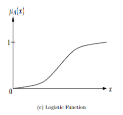
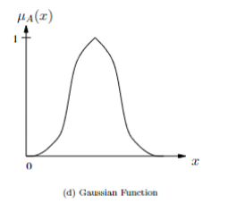

TARGET DECK: CI::FuzzySystems::3.TypesOfMembershipFunction

# Types of Membership Functions

START
Basic
## How to Derive a Ramp Function from Two Points?
Back:

If you're given two points:

* Point $a = (x\_1,\ y\_1)$
* Point $b = (x\_2,\ y\_2)$

To create a ramp function from two points:

$$
\mu(x) = \frac{y_2 - y_1}{x_2 - x_1}(x - x_1) + y_1
$$

Use this formula for both **rising** and **falling** ramps.

---

### ✅ Step 1: Calculate the Slope

$$
m = \frac{y_2 - y_1}{x_2 - x_1}
$$

This tells you how much $y$ changes for every unit change in $x$.

---

### ✅ Step 2: Use Point-Slope Equation

Using the slope and point $a = (x\_1, y\_1)$, the ramp function is:

$$
y = m(x - x_1) + y_1
$$

Substitute the value of $m$ to get your ramp function.

---
<!--ID: 1750609082584-->
END

START
Basic
## What is an example of a rising ramp function? Example 1: Rising Ramp
Back:

Given:

* $a = (1.5,\ 0)$
* $b = (2.0,\ 1)$

### Step 1: Slope

$$
m = \frac{1 - 0}{2.0 - 1.5} = \frac{1}{0.5} = 2
$$

### Step 2: Line Equation

$$
y = 2(x - 1.5) + 0 = 2(x - 1.5)
$$

✅ Final ramp function:

$$
\mu(x) = 2(x - 1.5) \quad \text{for } 1.5 \leq x \leq 2.0
$$

---
<!--ID: 1750609082588-->
END

START
Basic
## What is an example of a falling Ramp function?  Example 2: Falling Ramp
Back:

Given:

* $a = (1.5,\ 1)$
* $b = (2.0,\ 0)$

#### Step 1: Slope

$$
m = \frac{0 - 1}{2.0 - 1.5} = \frac{-1}{0.5} = -2
$$

#### Step 2: Line Equation

$$
y = -2(x - 1.5) + 1 = 1 - 2(x - 1.5)
$$

✅ Final ramp function:

$$
\mu(x) = 1 - 2(x - 1.5) \quad \text{for } 1.5 \leq x \leq 2.0
$$

Alternative (equivalent) form:

$$
\mu(x) = (2.0 - x) \times 2
$$
<!--ID: 1750609082592-->
END

START
Basic
## What is a **Triangular Membership Function**?
Back:
- **Shape**: Triangle ▲  
- **Used for**: A quick rise and fall, like “medium speed.”
- **Defined by** three points: $( \alpha_{\text{min}} )$, peak $( \beta )$, and $( \alpha_{\text{max}} )$.

$$
\mu_A(x) = 
\begin{cases}
0 & \text{if } x \leq \alpha_{\text{min}} \\
\frac{x - \alpha_{\text{min}}}{\beta - \alpha_{\text{min}}} & \text{if } x \in (\alpha_{\text{min}}, \beta] \\
\frac{\alpha_{\text{max}} - x}{\alpha_{\text{max}} - \beta} & \text{if } x \in (\beta, \alpha_{\text{max}}) \\
0 & \text{if } x \geq \alpha_{\text{max}}
\end{cases}
$$

![[triangular.png]]

---
<!--ID: 1750609082594-->
END

START
Basic
## What is a **Trapezoidal Membership Function**?
Back:
- **Shape**: Trapezoid ▱  
- **Used for**: Values that stay fully true for a while, like “comfortable temperature.”

$$
\mu_A(x) = 
\begin{cases}
0 & \text{if } x \leq \alpha_{\text{min}} \\
\frac{x - \alpha_{\text{min}}}{\beta_1 - \alpha_{\text{min}}} & \text{if } x \in [\alpha_{\text{min}}, \beta_1) \\
1 & \text{if } x \in [\beta_1, \beta_2] \\
\frac{\alpha_{\text{max}} - x}{\alpha_{\text{max}} - \beta_2} & \text{if } x \in (\beta_2, \alpha_{\text{max}}) \\
0 & \text{if } x \geq \alpha_{\text{max}}
\end{cases}
$$

![[trapezoidal.png]]

---
<!--ID: 1750609082597-->
END

START
Basic
## What is a **Gamma Membership Function**?
Back:

The **Gamma** (written as $\Gamma$) membership function is a **soft curve** used in **fuzzy logic** to describe situations where something **starts slowly** and then **grows** more strongly.

The function is:

$$
\mu_A(x) = 
\begin{cases}
0 & \text{if } x \leq \alpha \\
1 - e^{-\gamma(x - \alpha)^2} & \text{if } x > \alpha
\end{cases}
$$

| Symbol      | Meaning                                 |
| ----------- | --------------------------------------- |
| $x$         | The input (e.g., temperature, speed)    |
| $\alpha$    | The value where the function **starts** |
| $\gamma$    | Controls **how fast** the rise happens  |
| $\mu\_A(x)$ | Membership value (from 0 to 1)          |

Use a **Gamma function** when you want a **slow, natural rise** from 0 to 1.

![[gamma.png]]

#### 🔢 What does it mean?

* $x - \alpha$ → how far past the starting point you are
* Square it:$(x - \alpha)^2$→ grows faster the farther you go
* Multiply by $\gamma$: controls **how steep** the curve is

  * Bigger $\gamma$ = faster rise
  * Smaller $\gamma$ = gentler curve

Then:

* $e^{-something}$ → gives a number between 0 and 1 that **shrinks**
* Subtract from 1: the value **starts near 0**, and goes **up smoothly** to 1
### Think of:

* A car **warming up** from cold to hot
* A person **waking up slowly**
* Water **getting warm** before becoming hot

It's smooth, not sudden — like a **gentle S-curve**, but only the **rising part**.

---

### 🧠 The Formula Explained

#### ✅ Case 1: $x \leq \alpha$

* If $x$ is **less than or equal to** $\alpha$
  → The input is too small.
  → So, the membership is **zero**: it does **not belong** at all.

> Imagine: Water that’s still cold, below the warming threshold.

---

#### ✅ Case 2: $x > \alpha$

* If
 $x$ is **greater than** $\alpha$  → The input is starting to become warm
  → The formula becomes:

$$
\mu_A(x) = 1 - e^{-\gamma(x - \alpha)^2}
$$

It **never jumps** — it’s continuous and gentle.

```
0 ────────╮
          ╰───────╮
                  ╰────╮
                       ╰───▶
         (Looks like a soft S starting at α)
```

---
---
<!--ID: 1750609082600-->
END

START  
Basic  
## What is an **S-shaped Membership Function**?  
Back:

- **Shape**: S-curve  
- **Used for**: Smooth start and end, fast middle.
$$

\mu_A(x) = 
\begin{cases}
0 & x \leq \alpha_{\text{min}} \\
2 \left( \frac{x - \alpha_{\text{min}}}{\alpha_{\text{max}} - \alpha_{\text{min}}} \right)^2 & \alpha_{\text{min}} < x \leq \beta \\
1 - 2 \left( \frac{x - \alpha_{\text{max}}}{\alpha_{\text{max}} - \alpha_{\text{min}}} \right)^2 & \beta < x < \alpha_{\text{max}} \\
1 & x \geq \alpha_{\text{max}}
\end{cases}


$$

| Range                                | Behavior             |
| ------------------------------------ | -------------------- |
| $x \leq \alpha_{\text{min}}$         | Membership = 0       |
| $x \in [\alpha_{\text{min}}, \beta]$ | Slow increase        |
| $x \in (\beta, \alpha_{\text{max}})$ | Smooth curve up to 1 |
| $x \geq \alpha_{\text{max}}$         | Membership = 1       |

**Shape**: Like a smooth S-curve — starts slow → grows fast in the middle → flattens smoothly.

**Used for**: Smooth transitions  
Examples: "warm", "young", "safe speed"

### 📐 Parameters

* $\alpha_{\text{min}}$: Where the function starts (membership = 0)  
* $\alpha_{\text{max}}$: Where the function ends (membership = 1)  
* $\beta = \frac{\alpha_{\text{min}} + \alpha_{\text{max}}}{2}$: The midpoint (where rise is fastest)

![[s-shaped.png]]

---

### 📈 The Formula

#### 🟥 If $x \leq \alpha_{\text{min}}$

Value is too low → not part of the fuzzy set:

$$
\mu(x) = 0
$$

---

#### 🟧 If $x \in [\alpha_{\text{min}}, \beta]$

First half of the rise → slow increase using a quadratic curve:

$$
\mu(x) = 2\left(\frac{x - \alpha_{\text{min}}}{\alpha_{\text{max}} - \alpha_{\text{min}}}\right)^2
$$

---

#### 🟨 If $x \in (\beta, \alpha_{\text{max}})$

Second half → curve slows down as it approaches 1:

$$
\mu(x) = 1 - 2\left(\frac{x - \alpha_{\text{max}}}{\alpha_{\text{max}} - \alpha_{\text{min}}}\right)^2
$$

---

#### 🟩 If $x \geq \alpha_{\text{max}}$

Fully inside the fuzzy set:

$$
\mu(x) = 1
$$

---

### 🌡️ Example: "Warm Temperature"

Let:

* $\alpha_{\text{min}} = 20$  
* $\alpha_{\text{max}} = 30$  
* $\beta = 25$

Then:

* $x = 20$ → $\mu = 0$  
* $x = 22.5$ → $\mu \approx 0.25$  
* $x = 25$ → $\mu = 0.5$  
* $x = 27.5$ → $\mu \approx 0.75$  
* $x = 30$ → $\mu = 1$

---
<!--ID: 1750609082603-->  
END


START
Basic
## What is a **Logistic Membership Function**?
Back:
- **Shape**: Smooth S, like a sigmoid.  
- **Used for**: Biological growth, population models, or anything with natural saturation.

$$
\mu_A(x) = \frac{1}{1 + e^{-\gamma x}}
$$

<!--ID: 1750609082605-->
END

START
Basic
## What is an **Exponential-like Membership Function**?
Back:
- **Shape**: Bell-like, smoother than triangle but still sharp.  
- **Used for**: Data peaking around a value, like “near average.”

$$
\mu_A(x) = \frac{1}{1 + \gamma(x - \beta)^2}
$$

![[exponential.png]]

---
<!--ID: 1750609082608-->
END

START
Basic
## What is a **Gaussian Membership Function**?
Back:
- **Shape**: Bell curve, like a normal distribution.  
- **Used for**: "About average" values — common in uncertainty or noise modeling.

$$
\mu_A(x) = e^{-\gamma(x - \beta)^2}
$$


<!--ID: 1750609082612-->
END


