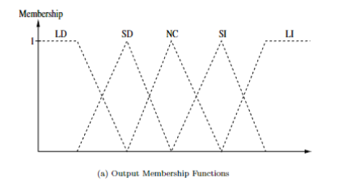

TARGET DECK: CI::FuzzySystems::4.LinguisticHedgesAndModifiers
# Linguistic Hedges and Modifiers 

START
Basic
## What is a hedge in fuzzy systems theory? Provide an example.
Back:

A hedge is a modifier of fuzzy values, such as an adjective that quantifies a noun. Example: *very* in *very tall* modifies the membership values of the set *tall*.

<!--ID: 1750609082616-->
END

START
Basic
## What are hedges in fuzzy systems theory and how do they modify fuzzy values?
Back:

Hedges in fuzzy systems theory are modifiers of fuzzy values, similar to adjectives in natural language. They change the membership of elements in a fuzzy set to different membership values in a modified set. For example, the hedge *very* transforms the membership values of the set *tall* to those of the set *very tall*. Hedges are implemented using mathematical functions to systematically alter membership values.
<!--ID: 1750609082620-->
END

START
Basic
## What are concentration hedges in fuzzy logic?
Back:

- Concentration hedges (like "very") make the fuzzy set **more focused** by **reducing smaller membership values**.
    
- They "shrink" the fuzzy set toward the areas where the membership is already high.
    
- This is done by **raising** the membership values to a power greater than 1:
    
$$
μ_{A'}(x) = μ_A(x)^p \quad \text{for } p > 1
$$

- Example: If $μ_A(x) = 0.6$ and $p = 2$, then $μ_{A'}(x) = 0.6^2 = 0.36$.
- The word "very" applied to "hot" would give lower values except near the hottest temperatures.
    

---
<!--ID: 1750609082623-->
END

START
Basic
## What are dilation hedges in fuzzy logic?
Back:

- Dilation hedges (like "somewhat", "sort of", "generally") **expand** the fuzzy set by **boosting lower values**.
    
- They make the fuzzy set **wider and fuzzier**.
    
- This is done by **taking the $p$th root** of the membership value:
    
$$
μ_{A'}(x) = μ_A(x)^{1/p} \quad \text{for } p > 1
$$

- Example: If $μ_A(x) = 0.3$ and $p = 2$, then $μ_{A'}(x) = 0.3^{1/2} ≈ 0.55$.
    
- "Somewhat hot" would include cooler temperatures more than just "hot".
    

---
<!--ID: 1750609082626-->
END

START
Basic
## What is contrast intensification in fuzzy logic?
Back:

- It **pushes values away from 0.5**: weak memberships get weaker, strong ones get stronger.
    
- This creates **sharper boundaries** — like emphasizing the difference between "hot" and "not hot".
    
- Used for words like "extremely", "absolutely".
    
- Defined as:
$$
μ_{A'}(x) =
\begin{cases}
2^{p-1}μ_A(x)^p & \text{if } μ_A(x) \leq 0.5 \\
1 - 2^{p-1}(1 - μ_A(x))^p & \text{if } μ_A(x) > 0.5
\end{cases}
$$

- Example: If $μ_A(x) = 0.3$ and $p = 2$, then:
    - $μ_{A'}(x) = 2 \cdot 0.3^2 = 0.18$ (smaller!)
- If $μ_A(x) = 0.8$, then:
    - $μ_{A'}(x) = 1 - 2 \cdot (1 - 0.8)^2 = 0.92$ (bigger!)
        

---
<!--ID: 1750609082628-->
END

START
Basic
## What is a vague hedge in fuzzy logic?
Back:

- Vague hedges are the **opposite** of contrast intensification.
    
- They make **everything closer to 0.5**, increasing **fuzziness**.
    
- Used for words like "seldom", "perhaps", or "a bit".
    
- Defined as:

$$
μ_{A'}(x) =
\begin{cases}
\frac{\sqrt{μ_A(x)}}{2} & \text{if } μ_A(x) \leq 0.5 \\
1 - \frac{\sqrt{1 - μ_A(x)}}{2} & \text{if } μ_A(x) > 0.5
\end{cases}
$$

- Example: If $μ_A(x) = 0.2$, then:
    
    - $μ_{A'}(x) = \frac{\sqrt{0.2}}{2} ≈ 0.22$
        
- If $μ_A(x) = 0.8$, then:
    
    - $μ_{A'}(x) = 1 - \frac{\sqrt{0.2}}{2} ≈ 0.78$
        

---
<!--ID: 1750609082631-->
END

START
Basic
## What are probabilistic hedges in fuzzy logic?
Back:

- These are modifiers like "likely", "probably", "not very likely".
    
- They do **not have a fixed mathematical form** like the others.
    
- They are modeled based on **probability theory** or real-world data.
    
- Example: "likely hot" might be modeled as $μ_A(x)$ being greater than 0.7 with some confidence.
    
<!--ID: 1750609082635-->
END

START
Basic
## What are some common linguistic hedges for the output fuzzy set *C*, and what might their membership values be?
Back:

The linguistic hedges are:
- Large decrease (LD)
- Slight Decrease (SD)
- No change (NC)
- Slight increase (SI)
- Large increase (LI)

Example membership values might be *µLI* = 0.8, *µSI* = 0.6, and *µNC* = 0.3.
<!--ID: 1750609396117-->
END

START
Basic
## What are the linguistic hedges defined for the linguistic variable *C* in the content?
Back:

The linguistic hedges are:
- Large decrease (LD)
- Slight Decrease (SD)
- No change (NC)
- Slight increase (SI)
- Large increase (LI)

<!--ID: 1750609082639-->
END

