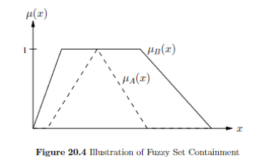
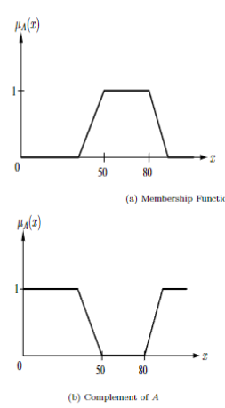
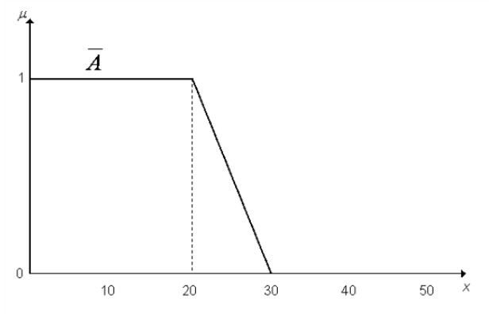
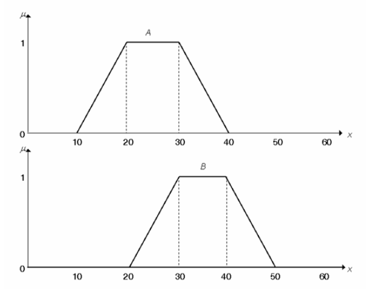
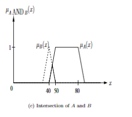
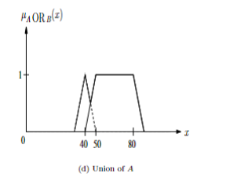

TARGET DECK: CI::FuzzySystems::5.OperationsOnFuzzySets
# Operations on Fuzzy Sets


START
Basic
## What is the condition for two fuzzy sets *A* and *B* to be considered equal?
Back:

Two fuzzy sets *A* and *B* are equal if and only if they have the same domain and *µA*(*x*) = *µB*(*x*) for all *x* ∈ *X*. That is, *A* = *B*.
<!--ID: 1750609082642-->
END

START
Basic
## How is the containment of fuzzy sets *A* and *B* defined?
Back:

Fuzzy set *A* is a subset of fuzzy set *B* if and only if *µA*(*x*) ≤ *µB*(*x*) for all *x* ∈ *X*. That is, *A* ⊂ *B*.

<!--ID: 1750609082644-->
END

START
Basic
## What is the complement of a fuzzy set *A*? Include the image.
Back:

The complement of a fuzzy set *A* consists of all the elements of set *A*, but the membership degrees are inverted. The image below illustrates this:

<!--ID: 1750609082648-->
END

START
Basic
## What is the condition for fuzzy set *A* to be a subset of fuzzy set *B*?
Back:

Fuzzy set *A* is a subset of fuzzy set *B* if and only if *µA*(*x*) ≤ *µB*(*x*) for all *x* ∈ *X*. This is denoted as *A* ⊂ *B*.
<!--ID: 1750609082650-->
END

START
Basic
## What does the complement (NOT) of a fuzzy set *A* represent, and how is it different from a two-valued set complement?
Back:

The complement of a fuzzy set *A* consists of all the elements of set *A* but with membership degrees inverted (e.g., *µA'*(*x*) = 1 - *µA*(*x*)). For a two-valued set, the complement is simply the set containing the entire domain without the elements of that set.
<!--ID: 1750609082653-->
END

START
Basic
## **Example 4: Recovering Fuzzy Set $A$ from Its Zadeh Complement**
Back:

* The **Zadeh complement** of fuzzy set $A$ is interpreted on $X = [0, 50]$, shown in the figure.

**Tasks**:

1. Plot the membership function of fuzzy set $A$ and give it in function form.
2. Give the **support**, **core**, and **general equation** of the $\alpha$-cut of fuzzy set $A$.

### **1. Plot and Function Form of Membership Function $\mu\_A(x)$**

#### 🔍 **Step 1: Understand the Figure**

* The figure shows **$\mu\_{\bar{A}}(x)$**, the **Zadeh complement** of $A$.
* Zadeh complement:

  $$
  \mu_{\bar{A}}(x) = 1 - \mu_A(x)
  $$
* So, to recover $\mu\_A(x)$:

  $$
  \mu_A(x) = 1 - \mu_{\bar{A}}(x)
  $$

---

#### 🧩 **Step 2: Analyze the Plot**

From the graph:

* $\mu\_{\bar{A}}(x) = 1$ from $x = 0$ to $x = 20$
* Then linearly **decreases** from 1 to 0 between $x = 20$ and $x = 30$
* Then $\mu\_{\bar{A}}(x) = 0$ for $x \geq 30$

---

#### 🔄 **Step 3: Use Complement Formula**

From this, compute:

* On $[0, 20]$:

  $$
  \mu_A(x) = 1 - 1 = 0
  $$
* On $[20, 30]$:
  $\mu\_{\bar{A}}(x)$ decreases linearly from 1 to 0 ⇒ slope = $-\frac{1}{10}$
  So $\mu\_{\bar{A}}(x) = -\frac{1}{10}(x - 20) + 1 = 1 - \frac{x - 20}{10}$
  Then:

  $$
  \mu_A(x) = 1 - \left(1 - \frac{x - 20}{10}\right) = \frac{x - 20}{10}
  $$
* On $[30, 50]$:

  $$
  \mu_A(x) = 1 - 0 = 1
  $$

---

#### ✅ **Final Function Form of $\mu\_A(x)$**

$$
\mu_A(x) = 
\begin{cases}
0 & x \leq 20 \\
\frac{x - 20}{10} & 20 < x \leq 30 \\
1 & x > 30
\end{cases}
$$

---

#### 📈 **Sketch of $\mu\_A(x)$ (ASCII)**

```
μ_A(x)
 |
1|                        _________
 |                       /
 |                      /
 |                     /
0|____________________/
  0   20   30        50   → x
```

---

### **2. Support, Core, and General $\alpha$-Cut**

---

#### 📌 **Support**: where $\mu\_A(x) > 0$

* $\mu\_A(x) = 0$ for $x \leq 20$
* $\mu\_A(x) > 0$ starts at $x = 20$ (but not including 20)
* So: $\boxed{(20, 50]}$

---

#### 📌 **Core**: where $\mu\_A(x) = 1$

* From $x = 30$ to $x = 50$
* So: $\boxed{[30, 50]}$

---

#### 🧮 **General $\alpha$-cut**

We want to find all $x$ such that $\mu\_A(x) \geq \alpha$

From the function:

* On $[20, 30]$: $\mu\_A(x) = \frac{x - 20}{10}$
  Solve:

  $$
  \frac{x - 20}{10} \geq \alpha \Rightarrow x \geq 10\alpha + 20
  $$

* On $[30, 50]$: $\mu\_A(x) = 1 \geq \alpha$ (always true if $\alpha \leq 1$)

So:

$$
A_\alpha = [\max(10\alpha + 20,\; 30),\; 50]
$$

But note:

* For $\alpha \leq 1$, $10\alpha + 20 \leq 30$, so max is 30
* For $\alpha > 1$, $A\_\alpha = \emptyset$

So:

$$
\boxed{
A_\alpha = 
\begin{cases}
[10\alpha + 20,\; 50] & \text{if } \alpha \in (0, 1) \\
[30,\; 50] & \text{if } \alpha = 1 \\
\emptyset & \text{if } \alpha > 1
\end{cases}
}
$$

Let me know if you want the graph drawn or if you'd like a reversed exercise!
<!--ID: 1750609082655-->
END

START
Basic
## What is the equilibrium point of a fuzzy complement function?
Back:

* **Definition**:
  The **equilibrium point** $e$ of a fuzzy complement function $c$ is the value where:

  $$
  c(e) = e
  $$

* **Meaning**:

  * This is the point that **maps to itself** under the complement.
  * Graphically, it's the point where the curve of $c(a)$ intersects the line $c(a) = a$.

* **Example**:

  * For the **standard complement** $c(a) = 1 - a$, the equilibrium point is:

    $$
    1 - e = e \Rightarrow e = 0.5
    $$

* **Significance**:

  * It tells us the "balance" point where membership and non-membership are equal.

---
<!--ID: 1750609082658-->
END

START
Basic
## What is the dual of an element *a* under a fuzzy complement function?
Back:

* **Definition**:
  The **dual** of a value $a \in \[0,1]$ under a fuzzy complement function $c$ is simply:

  $$
  c(a)
  $$

* **Intuitive meaning**:

  * The dual is the **opposite degree of membership**.
  * If $a = 0.2$, and $c(a) = 0.8$, then the dual of 0.2 is 0.8.

* **Example** (standard complement):

  * $c(a) = 1 - a$
  * Dual of 0.3 is $1 - 0.3 = 0.7$

* **Usefulness**:

  * Helps in expressing operations like De Morgan's laws and negations in fuzzy logic.

    
<!--ID: 1750609082660-->
END

START
Basic
## What are the axioms that a fuzzy complement function must satisfy (c1–c4)?
Back:

* A **fuzzy complement function** $c: \[0, 1] \to \[0, 1]$ maps a membership value $a$ to its complement $c(a)$.
* It must satisfy four key **axioms** to behave logically and consistently.

### Axiom C1: Boundary Conditions

* **Definition**:

  * $c(0) = 1$
  * $c(1) = 0$
* **Meaning**: Full non-membership (0) becomes full membership (1), and vice versa — this mirrors classical set complements.

---

### Axiom C2: Monotonic Decreasing

* **Definition**:

  * If $a \leq b$, then $c(a) \geq c(b)$
* **Meaning**: As membership increases, the complement should decrease.

---

### Axiom C3: Continuity

* **Definition**:

  * $c(a)$ is a **continuous function** on $\[0, 1]$
* **Meaning**: No sudden jumps; small changes in input produce small changes in output.

---

### Axiom C4: Involution

* **Definition**:

  * $c(c(a)) = a$ for all $a \in \[0, 1]$
* **Meaning**: Taking the complement twice brings you back to the original value (like flipping a light switch twice).

---
<!--ID: 1750609082663-->
END


START
Basic
## What are some alternative t-norms for intersection in fuzzy logic besides $\min(a, b)$?
Back:

* **T-norms (triangular norms)** generalize the idea of **logical AND** (intersection).
* While $\min(a, b)$ is the standard t-norm, others offer **different behaviors** and flexibility.

### Alternative t-norms:

1. **Algebraic Product**:

   $$
   T(a, b) = a \cdot b
   $$

   * Example: $T(0.6, 0.8) = 0.48$
   * Allows **gradual decrease** — useful in probabilistic settings

2. **Bounded Difference (Lukasiewicz t-norm)**:

   $$
   T(a, b) = \max(0, a + b - 1)
   $$

   * Example: $T(0.6, 0.8) = \max(0, 1.4 - 1) = 0.4$
   * Sharp cut-off when $a + b < 1$

3. **Drastic Product**:

   $$
   T(a, b) = 
   \begin{cases}
   \min(a, b) & \text{if } \max(a, b) = 1 \\
   0 & \text{otherwise}
   \end{cases}
   $$

   * Very "extreme" behavior — useful in special cases

---
<!--ID: 1750609082665-->
END

START
Basic
## What are the major s-norms used for union in fuzzy logic and how do they differ from standard operations?
Back:

* **S-norms (also called t-conorms)** generalize **logical OR** (union).

### Major s-norms:

1. **Maximum (standard)**:

   $$
   S(a, b) = \max(a, b)
   $$

   * Simple, intuitive

2. **Algebraic Sum**:

   $$
   S(a, b) = a + b - a \cdot b
   $$

   * Example: $S(0.6, 0.8) = 1.4 - 0.48 = 0.92$
   * Smooth and differentiable

3. **Bounded Sum (Lukasiewicz s-norm)**:

   $$
   S(a, b) = \min(1, a + b)
   $$

   * Capped at 1 — avoids "overshooting"

4. **Drastic Sum**:

   $$
   S(a, b) = 
   \begin{cases}
   \max(a, b) & \text{if } \min(a, b) = 0 \\
   1 & \text{otherwise}
   \end{cases}
   $$

   * Like drastic product: very binary behavior

---
<!--ID: 1750609082668-->
END

START
Basic
## **Example 5: Zadeh Union of Fuzzy Sets $A$ and $B$**
Back:

* The fuzzy sets $A$ and $B$ are interpreted on the universe $X = [0, 60]$, shown as piecewise linear graphs.

**Tasks**:

1. Sketch the membership function of the **Zadeh union** of fuzzy sets $A$ and $B$. Also provide the union in function form.
2. Give the **support**, **core**, and **general equation** of the $\alpha$-cut of the union.
 

### **1. Membership Function of the Zadeh Union**

#### 🔍 **Step 1: What is the Zadeh Union?**

* The **Zadeh union** is defined **pointwise** as:

  $$
  \mu_{A \cup B}(x) = \max(\mu_A(x), \mu_B(x))
  $$

---

#### 📊 **Step 2: Read Parameters from the Plots**

From the image:

**Set A** (top graph):

* Support: $[10, 40]$
* Core: $[20, 30]$
* So:

  $$
  \mu_A(x) = 
  \begin{cases}
  0 & x \leq 10 \text{ or } x \geq 40 \\
  \frac{x - 10}{10} & 10 < x \leq 20 \\
  1 & 20 < x \leq 30 \\
  \frac{40 - x}{10} & 30 < x < 40
  \end{cases}
  $$

**Set B** (bottom graph):

* Support: $[20, 50]$
* Core: $[30, 40]$
* So:

  $$
  \mu_B(x) = 
  \begin{cases}
  0 & x \leq 20 \text{ or } x \geq 50 \\
  \frac{x - 20}{10} & 20 < x \leq 30 \\
  1 & 30 < x \leq 40 \\
  \frac{50 - x}{10} & 40 < x < 50
  \end{cases}
  $$

---

#### 🧮 **Step 3: Construct the Union**

We now compute $\mu\_{A \cup B}(x) = \max(\mu\_A(x), \mu\_B(x))$

We analyze intervals piece-by-piece:

* $x < 10$: both $\mu = 0$ → union = 0
* $10 \leq x \leq 20$:

  * $\mu\_A(x) = \frac{x - 10}{10}$
  * $\mu\_B(x) = 0$
    ⇒ union = $\mu\_A(x)$
* $20 < x \leq 30$:

  * $\mu\_A(x) = 1$
  * $\mu\_B(x) = \frac{x - 20}{10}$
    ⇒ union = 1
* $30 < x \leq 40$:

  * $\mu\_A(x)$ decreases: $\frac{40 - x}{10}$
  * $\mu\_B(x) = 1$
    ⇒ union = 1
* $40 < x < 50$:

  * $\mu\_A(x) = 0$
  * $\mu\_B(x) = \frac{50 - x}{10}$
    ⇒ union = $\mu\_B(x)$
* $x \geq 50$: both zero

---

#### ✅ **Final Function Form of the Union**

$$
\mu_{A \cup B}(x) = 
\begin{cases}
0 & x \leq 10 \\
\frac{x - 10}{10} & 10 < x \leq 20 \\
1 & 20 < x \leq 40 \\
\frac{50 - x}{10} & 40 < x < 50 \\
0 & x \geq 50
\end{cases}
$$

---

#### 📈 **Sketch (ASCII Diagram)**

```
μ(x)
1|             _____________
 |            /             \
 |           /               \
 |          /                 \
0|_________/                   \_________
   10  20  30  40           50         60
             ← union flat top →
```

---

### **2. Support, Core, and General $\alpha$-Cut**

---

#### 📌 **Support**: where $\mu\_{A \cup B}(x) > 0$

* From the function: non-zero from $x = 10$ to $50$
* So: $\boxed{[10, 50]}$

---

#### 📌 **Core**: where $\mu\_{A \cup B}(x) = 1$

* Union has height 1 from $x = 20$ to $x = 40$
* So: $\boxed{[20, 40]}$

---

#### 🧮 **General α-Cut of the Union**

We want the set of $x$ such that $\mu\_{A \cup B}(x) \geq \alpha$

Let’s solve for two parts of the trapezoid:

##### Left slope: $\mu = \frac{x - 10}{10}$

Solve $\mu \geq \alpha$:

$$
\frac{x - 10}{10} \geq \alpha \Rightarrow x \geq 10\alpha + 10
$$

##### Right slope: $\mu = \frac{50 - x}{10}$

Solve $\mu \geq \alpha$:

$$
\frac{50 - x}{10} \geq \alpha \Rightarrow x \leq 50 - 10\alpha
$$

---

#### ✅ **Final α-Cut Equation**

$$
\boxed{
A_\alpha = [10\alpha + 10,\; 50 - 10\alpha] \quad \text{for } 0 < \alpha \leq 1
}
$$

Let me know if you'd like a similar intersection example or graph rendered!
<!--ID: 1750609082670-->
END


START
Basic
## **Example 6: Intersection of Fuzzy Sets Using Algebraic Product**
Back:

* Let fuzzy set $A$ on $X = [0, \frac{\pi}{2}]$ be defined by:

  $$
  \mu_A(x) = \cos(x)
  $$
* Let fuzzy set $B$ on the same universe be defined by:

  $$
  \mu_B(x) = \sin(x)
  $$

**Tasks**:

1. Plot the membership function of the intersection of $A$ and $B$ using the **algebraic multiplication t-norm**:

   $$
   t(a, b) = ab
   $$

   and give it as a function.
2. Give the **support**, **core**, **height**, and **general function of the $\alpha$-cut** of the intersection.
3. Give the **exact subset** of the $\alpha$-cut for $\alpha = \frac{1}{4}$.

---

We are given two fuzzy sets:

* $\mu\_A(x) = \cos(x)$
* $\mu\_B(x) = \sin(x)$
* Domain: $X = [0, \frac{\pi}{2}]$

We are to compute their **intersection** using the **algebraic product t-norm**:

$$
\mu_{A \cap B}(x) = \mu_A(x) \cdot \mu_B(x) = \cos(x) \cdot \sin(x)
$$

---

### **1. Membership Function of the Intersection Using Algebraic Product**

#### 🔍 **Step-by-Step**

Let’s define the intersection:

* $$
  \mu_{A \cap B}(x) = \cos(x) \cdot \sin(x)
  $$
* Use the identity: $\cos(x)\sin(x) = \frac{1}{2} \sin(2x)$

So:

$$
\mu_{A \cap B}(x) = \frac{1}{2} \sin(2x)
\quad \text{for } x \in [0, \frac{\pi}{2}]
$$

---

#### ✅ **Function Form**

$$
\boxed{
\mu_{A \cap B}(x) = \frac{1}{2} \sin(2x)
\quad \text{for } x \in \left[0, \frac{\pi}{2}\right]
}
$$

---

#### 📈 **Sketch Idea**

* $\sin(2x)$ increases from $0$ to $1$ on $[0, \frac{\pi}{4}]$
* Decreases back to $0$ on $[\frac{\pi}{4}, \frac{\pi}{2}]$
* So $\mu\_{A \cap B}(x)$ looks like a bell shape with max at $x = \frac{\pi}{4}$, where:

  $$
  \mu_{A \cap B}\left(\frac{\pi}{4}\right) = \frac{1}{2} \cdot \sin\left(\frac{\pi}{2}\right) = \frac{1}{2}
  $$

---

### **2. Support, Core, Height, and General $\alpha$-Cut**

---

#### 📌 **Support**: where $\mu\_{A \cap B}(x) > 0$

* $\frac{1}{2} \sin(2x) > 0$ whenever $\sin(2x) > 0$
* $\sin(2x) > 0$ when $2x \in (0, \pi)$ → $x \in (0, \frac{\pi}{2})$
* So: $\boxed{(0, \frac{\pi}{2})}$

---

#### 📌 **Core**: where $\mu\_{A \cap B}(x) = 1$

* Not possible, since max value is $\frac{1}{2}$

So: $\boxed{\emptyset}$

---

#### 📌 **Height**: maximum value of $\mu\_{A \cap B}(x)$

* Occurs at $x = \frac{\pi}{4}$:

  $$
  \boxed{\mu_{A \cap B}\left(\frac{\pi}{4}\right) = \frac{1}{2}}
  $$

---

#### 🧮 **General α-Cut**

We solve:

$$
\mu_{A \cap B}(x) = \frac{1}{2} \sin(2x) \geq \alpha
\Rightarrow \sin(2x) \geq 2\alpha
$$

Now invert:

* $\sin(2x) \geq 2\alpha$
* Solve $2x \in \[\sin^{-1}(2\alpha), \pi - \sin^{-1}(2\alpha)]$

So:

$$
x \in \left[ \frac{1}{2} \sin^{-1}(2\alpha),\; \frac{\pi}{2} - \frac{1}{2} \sin^{-1}(2\alpha) \right]
$$

#### ✅ **General α-Cut Equation**

$$
\boxed{
A_\alpha = \left[
\frac{1}{2} \sin^{-1}(2\alpha),\;
\frac{\pi}{2} - \frac{1}{2} \sin^{-1}(2\alpha)
\right]
\quad \text{for } \alpha \in \left(0, \frac{1}{2}\right]
}
$$

---

### **3. Exact Subset of α-Cut for α = 1/4**

Set $\alpha = \frac{1}{4}$:

* $2\alpha = \frac{1}{2}$
* $\sin^{-1}(1/2) = \frac{\pi}{6}$

So:

$$
x \in \left[
\frac{1}{2} \cdot \frac{\pi}{6},\; \frac{\pi}{2} - \frac{1}{2} \cdot \frac{\pi}{6}
\right]
= \left[
\frac{\pi}{12},\; \frac{5\pi}{12}
\right]
$$

---

#### ✅ **Answer for α = 1/4 Cut**

$$
\boxed{
A_{1/4} = \left[ \frac{\pi}{12},\; \frac{5\pi}{12} \right]
}
$$

Let me know if you'd like this visualized on a graph or want to do a different t-norm (like min)!
<!--ID: 1750609082673-->
END

START
Basic
## What are the required axioms for functions to qualify as valid t-norms or s-norms?
Back:

### Axioms for **t-norms** $T(a, b)$ (AND):

1. **Commutativity**:
   $T(a, b) = T(b, a)$

2. **Associativity**:
   $T(a, T(b, c)) = T(T(a, b), c)$

3. **Monotonicity**:
   If $a \leq c$ and $b \leq d$, then $T(a, b) \leq T(c, d)$

4. **Boundary condition**:
   $T(a, 1) = a$ (1 is the neutral element for AND)

---

### Axioms for **s-norms** $S(a, b)$ (OR):

1. **Commutativity**:
   $S(a, b) = S(b, a)$

2. **Associativity**:
   $S(a, S(b, c)) = S(S(a, b), c)$

3. **Monotonicity**:
   If $a \leq c$ and $b \leq d$, then $S(a, b) \leq S(c, d)$

4. **Boundary condition**:
   $S(a, 0) = a$ (0 is the neutral element for OR)

---

These axioms ensure that the operators behave logically and consistently across fuzzy systems.

    
<!--ID: 1750609082677-->
END

START
Basic
## What are the two most popular t-norms used for the intersection (AND) of fuzzy sets, and how do they differ?
Back:

The two most popular t-norms are:
1. **Min-operator**: *µA∩B*(*x*) = min{*µA*(*x*), *µB*(*x*)}, ∀*x* ∈ *X*.
2. **Product operator**: *µA∩B*(*x*) = *µA*(*x*) * *µB*(*x*), ∀*x* ∈ *X*.
The product operator results in lower membership degrees for the intersection compared to the min-operator.

<!--ID: 1750609082680-->
END


START
Basic
## What is the effect of repeatedly applying the product operator for intersections in fuzzy sets?
Back:

Repeatedly applying the product operator for intersections results in membership degrees approaching 0.0, even if the original sets had high membership degrees.
<!--ID: 1750609082683-->
END

START
Basic
## What are the two most frequently used s-norms (union operators) for fuzzy sets? Provide their mathematical definitions.
Back:

The two most frequently used s-norms are:
1. **Max-operator**: $\mu_{A \cup B}(x) = \max\{\mu_A(x), \mu_B(x)\}, \forall x \in X$
2. **Summation operator**: $\mu_{A \cup B}(x) = \mu_A(x) + \mu_B(x) - \mu_A(x)\mu_B(x), \forall x \in X$

<!--ID: 1750609082686-->
END


START
Basic
## Explain the potential issue with using the summation operator for a series of unions in fuzzy sets.
Back:

The summation operator can result in a membership degree approximating 1.0 after a series of unions, even if the original sets had low membership degrees. This occurs because the operator accumulates membership values, which may not accurately reflect the true union of the sets.
<!--ID: 1750609082688-->
END

START
Basic
## What is the significance of the "dual triple" in fuzzy set theory?
Back:

* **Definition**:
  A **dual triple** is a set of three functions:

  $$
  \langle T, S, c \rangle
  $$

  where:

  * $T$ is a **t-norm** (AND)
  * $S$ is an **s-norm** (OR)
  * $c$ is a **complement function** (NOT)

* These must satisfy **De Morgan duality**:

  * $c(T(a, b)) = S(c(a), c(b))$
  * $c(S(a, b)) = T(c(a), c(b))$

* **Significance**:

  * Ensures **logical consistency** between AND, OR, and NOT in fuzzy logic.
  * Important in **fuzzy inference**, **rule systems**, and **decision-making**

* **Example** (Standard dual triple):

  * $T(a, b) = \min(a, b)$
  * $S(a, b) = \max(a, b)$
  * $c(a) = 1 - a$

---
<!--ID: 1750609082691-->
END


START
Basic
## **Example 7: De Morgan Triple Verification**
Back:

Does the following t-norm s-norm pair with parameter $p \ (0 \leq p \leq 1)$ form a De Morgan triple with Zadeh's complement?

**Give reasoning for your answer.**
(Note: You have to consider two De Morgan identities in the solution.)

$$
t(a, b) = \frac{ab}{\max(a, b, p)}
$$

$$
s(a, b) = \frac{a + b - ab - \min(a, b, 1 - p)}{\max(1 - a, 1 - b, p)}
$$

---


We are given a **t-norm and s-norm pair parameterized by $p \in \[0, 1]$**, and asked to check if they form a **De Morgan triple** with **Zadeh’s complement**.

---

### 🔍 **Step 1: What Is a De Morgan Triple?**

A **De Morgan triple** is a triple $(t, s, c)$ of:

* **t-norm** $t(a, b)$
* **s-norm** $s(a, b)$
* **complement** $c(a)$

Such that the following two **De Morgan identities** hold **for all** $a, b \in \[0,1]$:

#### **De Morgan 1:**

$$
c(t(a, b)) = s(c(a), c(b))
$$

#### **De Morgan 2:**

$$
c(s(a, b)) = t(c(a), c(b))
$$

We are testing with:

* Complement: **Zadeh** ⇒ $c(a) = 1 - a$
* Given t-norm:

  $$
  t(a, b) = \frac{ab}{\max(a, b, p)}
  $$
* Given s-norm:

  $$
  s(a, b) = \frac{a + b - ab - \min(a, b, 1 - p)}{\max(1 - a, 1 - b, p)}
  $$

---

### ✅ **Step 2: Try to Prove or Disprove the First De Morgan Identity**

Let’s test:

$$
1 - t(a, b) \stackrel{?}{=} s(1 - a, 1 - b)
$$

Let’s pick **simple test values** for $a$, $b$, and $p$ to see if the equality holds **numerically**.

---

### 🔢 **Step 3: Counterexample (Try $a = 0.6$, $b = 0.8$, $p = 0.3$)**

**Compute LHS:**

$$
t(0.6, 0.8) = \frac{(0.6)(0.8)}{\max(0.6, 0.8, 0.3)} = \frac{0.48}{0.8} = 0.6
\Rightarrow 1 - t(a, b) = 1 - 0.6 = 0.4
$$

**Compute RHS:**

$$
s(1 - 0.6, 1 - 0.8) = s(0.4, 0.2)
$$

Now compute:

* Numerator:

  $$
  0.4 + 0.2 - (0.4)(0.2) - \min(0.4, 0.2, 0.7) = 0.6 - 0.08 - 0.2 = 0.32
  $$
* Denominator:

  $$
  \max(0.6, 0.8, 0.3) = 0.8
  $$

So:

$$
s(0.4, 0.2) = \frac{0.32}{0.8} = 0.4
$$

✔️ **LHS = RHS = 0.4** — **identity holds for this case**

---

### 🔁 **Try De Morgan 2 with same values**

$$
1 - s(0.6, 0.8) \stackrel{?}{=} t(1 - 0.6, 1 - 0.8) = t(0.4, 0.2)
$$

**Compute $s(0.6, 0.8)$**:

* Numerator:

  $$
  0.6 + 0.8 - 0.48 - \min(0.6, 0.8, 0.7) = 1.4 - 0.48 - 0.6 = 0.32
  $$
* Denominator:

  $$
  \max(0.4, 0.2, 0.3) = 0.4
  $$

So:

$$
s(0.6, 0.8) = \frac{0.32}{0.4} = 0.8
\Rightarrow 1 - s(a, b) = 0.2
$$

Now compute $t(0.4, 0.2)$:

$$
t(0.4, 0.2) = \frac{(0.4)(0.2)}{\max(0.4, 0.2, 0.3)} = \frac{0.08}{0.4} = 0.2
$$

✔️ Match again: $1 - s = t(1 - a, 1 - b)$

---

### ⚠️ **Still Not a Proof!**

* Numerical matches do **not** prove a De Morgan triple — they only **suggest** it might be one.
* To **prove** this rigorously, we need to **algebraically derive** both identities and check if they hold **for all $a,b \in [0,1]$**.

---

### 🧠 **Observation: These t- and s-norms Were Constructed to Be Duals**

Let’s simplify the s-norm definition:

Given $c(a) = 1 - a$, the duality condition:

$$
s(a, b) = 1 - t(1 - a, 1 - b)
$$

Let’s compute $t(1 - a, 1 - b)$:

$$
t(1 - a, 1 - b) = \frac{(1 - a)(1 - b)}{\max(1 - a, 1 - b, p)}
$$

Then:

$$
1 - t(1 - a, 1 - b) = \frac{1 - (1 - a)(1 - b)}{\max(1 - a, 1 - b, p)}
$$

Let’s expand numerator:

* $1 - (1 - a)(1 - b) = a + b - ab$

So:

$$
s(a, b) = \frac{a + b - ab}{\max(1 - a, 1 - b, p)}
\quad \text{(This is **not** exactly the s-norm given!)}
$$

BUT our s-norm **also subtracts $\min(a, b, 1 - p)$** from the numerator.

This **extra term breaks** the clean De Morgan duality.

---

### ❌ **Conclusion**

* The s-norm **has an extra term**: $- \min(a, b, 1 - p)$
* That **violates the exact De Morgan identity**, because:

  $$
  s(a, b) \ne 1 - t(1 - a, 1 - b)
  $$
* So the pair **does not** satisfy the **De Morgan identities** with Zadeh’s complement

---

### ✅ **Final Answer**

$$
\boxed{
\text{No, the given t-norm and s-norm pair do not form a De Morgan triple with Zadeh’s complement.}
}
$$

**Reason**: The s-norm has an extra subtraction term in the numerator that breaks the identity $s(a, b) = 1 - t(1 - a, 1 - b)$, violating De Morgan’s laws.
<!--ID: 1750609082694-->
END
