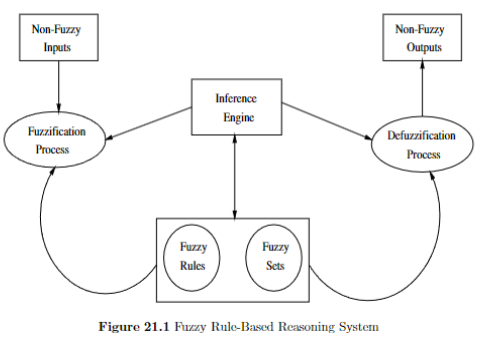
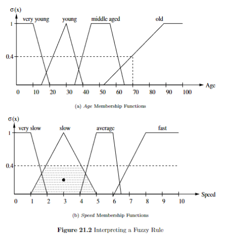
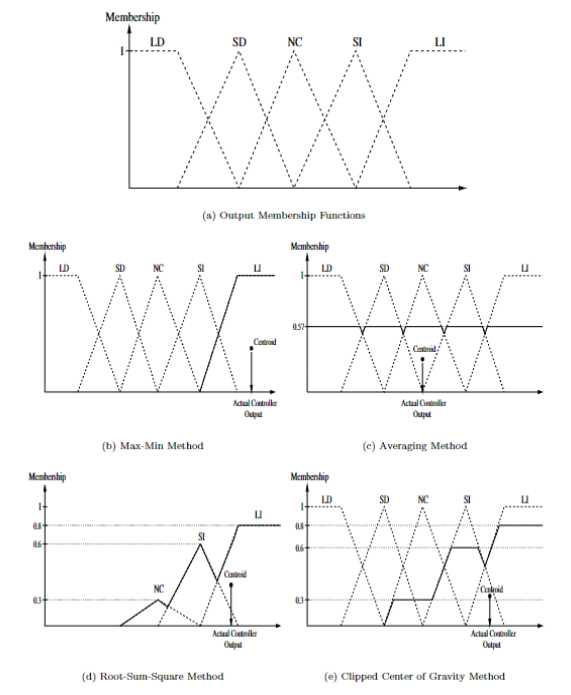
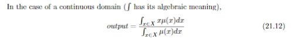

TARGET DECK: CI::FuzzySystems::6.FuzzyReasoningAndInference
# Fuzzy Reasoning and Inference

START
Basic
## What is the purpose of fuzzy if-then rules in a controller?
Back:

Fuzzy if-then rules describe situations that can occur and the corresponding actions the controller should execute, enabling decision-making under uncertainty.
<!--ID: 1750609082698-->
END
START
Basic
## What is the general form of a fuzzy rule, and how are antecedents and consequents structured?
Back:

The general form of a fuzzy rule is:

```
if antecedent(s) then consequent(s)
```

Antecedents are combinations of fuzzy sets using logic operators (complement, intersection, union), while consequents are usually single fuzzy sets or combinations thereof. For example:

```
if *A* is *a* and *B* is *b* then *C* is *c*
```
where *A*, *B*, and *C* are fuzzy sets with respective universes of discourse.
<!--ID: 1750609082701-->
END

START
Basic
## What are the key components of a fuzzy system's dynamic behavior?
Back:

The dynamic behavior of a fuzzy system is characterized by:
1. **Fuzzy Rules**: Linguistic rules based on expert knowledge.
2. **Fuzzy Sets**: Collections of objects with graded membership.
3. **Fuzzification Process**: Converting non-fuzzy inputs into fuzzy sets.
4. **Non-Fuzzy Inputs**: Crisp data inputs to the system.
<!--ID: 1750609082704-->
END

START
Basic
## What are the three main components of a fuzzy reasoning system besides the knowledge base?
Back:

The three main components are:
1. Fuzzification
2. Inferencing
3. Defuzzification


<!--ID: 1750609082706-->
END

START
Basic
## Given the rule 'if *Age* is *Old* then *Speed* is *Slow*' and *µOld*(70) = 0.4, how is the output *Speed* determined?
Back:

The output *Speed* is determined by:
1. Finding the intersection of the horizontal line at *µOld*(70) = 0.4 with the membership function *Slow*.
2. Using a defuzzification operator to find the center of gravity of the shaded area, resulting in *Speed* = 3.


<!--ID: 1750609082709-->
END

START
Basic
## What is the purpose of the fuzzification process, and how is it achieved?
Back:

The fuzzification process finds a fuzzy representation of non-fuzzy input values. This is achieved by applying the membership functions associated with each fuzzy set in the rule input space, assigning membership values to fuzzy sets for input values from the universe of discourse.
<!--ID: 1750609082711-->
END

START
Basic
## Given fuzzy sets *A* and *B* with universe of discourse *X*, and input elements *a, b* ∈ *X*, what does the fuzzification process produce?
Back:

The fuzzification process produces the membership degrees *µA*(*a*), *µA*(*b*), *µB*(*a*), and *µB*(*b*).
<!--ID: 1750609082714-->
END

START
Basic
## How are the input and output spaces defined in a fuzzy reasoning system?
Back:

The input space is defined by the combination of input fuzzy sets, while the output space is defined by the combination of output fuzzy sets.
<!--ID: 1750609082716-->
END

START
Basic
## What does the inferencing component of a fuzzy reasoning system do?
Back:

The inferencing component applies the fuzzy rules from the knowledge base to the fuzzified inputs to produce fuzzy outputs.
<!--ID: 1750609082727-->
END

START
Basic
## What is the role of defuzzification in a fuzzy reasoning system?
Back:

Defuzzification converts the fuzzy output from the inferencing step into a crisp, non-fuzzy value that can be used for decision-making or control.
<!--ID: 1750609082731-->
END

START
Basic
## What are the antecedents and consequents in fuzzy rules, and what spaces do they form?
Back:

The antecedents in fuzzy rules form the fuzzy "input space," while the consequents form the fuzzy "output space." The input space is defined by the combination of input fuzzy sets, and the output space is defined by the combination of output fuzzy sets.
<!--ID: 1750609082733-->
END

START
Basic
## What is the task of the inferencing process in fuzzy logic?
Back:

The inferencing process maps the fuzzified inputs to the rule base and produces a fuzzified output for each rule. It determines degrees of membership to the output sets based on the input membership degrees and the relationships between input sets.
<!--ID: 1750609082735-->
END

START
Basic
## How is the firing strength of a rule calculated, assuming the *min*-operator is used?
Back:

The firing strength is calculated as the minimum of the membership degrees of the input sets in the antecedent. For example, for rule "if *A* is *a* and *B* is *b* then *C* is *c*," the firing strength is 
$$min\{µA(a), µB(b)\}$$.
<!--ID: 1750609082738-->
END

START
Basic
## How is the final fuzzy value *βi* for each outcome *ci* computed during inferencing?
Back:

The final fuzzy value *βi* is computed using the *max*-operator: *βi* = max{*αki*}, where *αki* is the firing strength of rule *k* which has outcome *ci*.
<!--ID: 1750609082740-->
END

START
Basic


START
Basic
## How can rules be weighted, and what does this weighting represent?
Back:

Rules can be weighted with a factor in the range [0,1], representing the degree of confidence in that rule. These weights are determined by the human expert during the design process.
<!--ID: 1750609082743-->
END

START
Basic
## List the defuzzification methods mentioned in the content and briefly describe each.
Back:

1. **Strongest-rule centroid method (max-min method)**: The rule with the highest firing strength is selected. The consequent membership function associated with this rule is clipped, and the centroid of the resulting area is computed to produce the output
2. **Weighted average of centroids**: Each rule's output centroid is calculated, and a weighted average of these centroids is taken using the rule firing strengths as weights.

3. **Root-sum-square method**: Each membership function is scaled such that the peak equals the maximum firing strength. The centroid of the composite area under the scaled functions is used as the output.
4. **Clipped center of gravity method**: Each membership function is clipped at the corresponding rule firing strengths. The centroid of the composite area is used as the output.


<!--ID: 1750609082746-->
END

START
Basic
## How is the centroid calculated for a discrete domain in defuzzification? Provide the formula.
Back:

For a discrete domain, the centroid (output) is calculated as:
$$
\text{output} = \frac{\sum_{i=1}^{n_x} \mu(x_i) \cdot x_i}{\sum_{i=1}^{n_x} \mu(x_i)}
$$
where *X* is the universe of discourse and *n_x* is the number of discrete values.
<!--ID: 1750609082749-->
END

START
Basic
## How is the centroid calculated for a continuous domain in defuzzification? Provide the formula.
Back:
$$
\text{output} = \frac{\int x \cdot \mu(x) \, dx}{\int \mu(x) \, dx}
$$


<!--ID: 1750609082751-->
END


START
Basic
## What is the purpose of fuzzy reasoning systems in natural language processing?
Back:
They enable computing systems to understand and reason with vague linguistic terms (e.g., *very*, *most probably*) by modeling uncertainties and partial truths.
<!--ID: 1750609082754-->
END


START
Basic
## Given *µtall*(Peter) = 0.9 and *µgood athlete*(Peter) = 0.8, compute *µgood basketball player*(Peter) using the intersection operator.
Back:

*µgood basketball player*(Peter) = min(0.9, 0.8) = 0.8.
<!--ID: 1750609082757-->
END

START
Basic
## Based on the fuzzy logic reasoning, who is the better basketball player: Peter or Carl?
Back:
Peter is the better basketball player because *µgood basketball player*(Peter) = 0.8 > *µgood basketball player*(Carl) = 0.5.
<!--ID: 1750609082759-->
END


