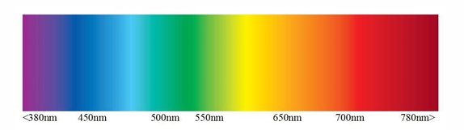

TARGET DECK: CI::FuzzySystems::7.FuzzyRelationsAndRelationalOperations
# Fuzzy Relations and Relational Operations

START
Basic
## What is the difference between a crisp and a fuzzy relation?
Back:

* **Crisp relation**:

  * Either an element pair is related or not: values are **0 or 1**
  * Example: "x is taller than y" — either true or false
  * Represented as a subset of $X \times Y$

* **Fuzzy relation**:

  * Each pair $(x, y)$ has a **degree of relation**: a value in $\[0, 1]$
  * Example: "x is somewhat taller than y" → degree = 0.6
  * Represented as a **fuzzy set on $X \times Y$**

---
<!--ID: 1750609082761-->
END

START
Basic
## How are fuzzy relations represented using matrices or bipartite graphs?
Back:

### Matrix representation:

* Use a matrix $R$ where:

  $$
  R = [\mu_R(x_i, y_j)]
  $$

  * Each cell contains the **degree of relation** between $x\_i \in X$ and $y\_j \in Y$

* Example:

  $$
  R = \begin{bmatrix}
  1 & 0.4 & 0.2 \\
  0.7 & 1 & 0.5 \\
  \end{bmatrix}
  $$

### Bipartite graph:

* Nodes are split into two sets: $X$ and $Y$
* An edge connects $x\_i$ to $y\_j$ with **weight = $\mu\_R(x\_i, y\_j)$**
* Edge thickness or labels can represent the degree of relation

---
<!--ID: 1750609082764-->
END

START
Basic
## How is the composition of fuzzy relations computed using the max-min method?
Back:

* Suppose you have two fuzzy relations:

  * $R: X \times Y$ with values $\mu\_R(x, y)$
  * $S: Y \times Z$ with values $\mu\_S(y, z)$

* The **composition** $T = R \circ S$ is a fuzzy relation from $X \to Z$:

  $$
  \mu_T(x, z) = \max_{y \in Y} \min \left( \mu_R(x, y), \mu_S(y, z) \right)
  $$

### Steps:

1. For each pair $(x, z)$:

   * Find **all paths through $y$**
   * Take the **minimum** of $\mu\_R(x, y)$ and $\mu\_S(y, z)$
   * Then take the **maximum** over all such $y$

### Example:

If
$R = \begin{bmatrix} 0.6 & 0.8 \end{bmatrix}$,
$S = \begin{bmatrix} 0.5 \ 0.9 \end{bmatrix}$

Then:

* $\mu\_T(x, z) = \max(\min(0.6, 0.5), \min(0.8, 0.9)) = \max(0.5, 0.8) = 0.8$

---
<!--ID: 1750609082766-->
END

START
Basic
## What is the formula for a fuzzy relational join and what is its interpretation?
Back:

* **Relational join** combines two fuzzy relations $R(x, y)$ and $S(y, z)$ on the common variable $y$

* The **fuzzy join** is defined as:

  $$
  \mu_{R \bowtie S}(x, y, z) = \min \left( \mu_R(x, y), \mu_S(y, z) \right)
  $$

* Interpretation:

  * Measures the **compatibility** of a triple $(x, y, z)$
  * Only computes **local** matching — unlike composition which aggregates over $y$

---
<!--ID: 1750609082769-->
END

START
Basic
## What are the definitions of reflexivity, symmetry, and transitivity in fuzzy relations?
Back:

### Reflexivity:

* A fuzzy relation $R$ on $X$ is **reflexive** if:

  $$
  \mu_R(x, x) = 1 \quad \text{for all } x \in X
  $$

* Meaning: every element is fully related to itself

---

### Symmetry:

* $R$ is **symmetric** if:

  $$
  \mu_R(x, y) = \mu_R(y, x) \quad \text{for all } x, y \in X
  $$

* Meaning: degree of relation is the same in both directions

---

### Transitivity:

* $R$ is **transitive** if:

  $$
  \mu_R(x, z) \geq \max_{y \in X} \min \left( \mu_R(x, y), \mu_R(y, z) \right)
  $$

* Meaning: indirect connections should be no stronger than direct connections

* **Example**:
  If:

  * $\mu\_R(A, B) = 0.6$, $\mu\_R(B, C) = 0.7$
  * Then transitivity requires: $\mu\_R(A, C) \geq \min(0.6, 0.7) = 0.6$

    
<!--ID: 1750609082772-->
END

START
Basic
## What is the purpose of a projection in the context of fuzzy relations?
Back:

* **Intuitive idea**:
  A **projection** extracts a subset of information from a fuzzy relation by **removing some variables** (dimensions).

* **Purpose**:

  * To simplify complex relations by **focusing on fewer variables**
  * Used in fuzzy databases, decision systems, and **relational approximation**

---

### Definition:

* Given a fuzzy relation $R(x, y)$ over $X \times Y$, the **projection onto $X$** is:

  $$
  \pi_X(R)(x) = \max_{y \in Y} \mu_R(x, y)
  $$

* **Interpretation**:

  * For each $x$, we keep its **strongest connection** to any $y$

* **Analogy**:

  * Like a spotlight focusing only on the $x$-axis, summarizing how "strongly" each $x$ is involved, regardless of which $y$

---
<!--ID: 1750609082775-->
END

START
Basic
## What is cylindric extension in fuzzy logic and how does it modify a relation?
Back:

* **Purpose**:

  * To **extend** a fuzzy relation to include additional variables **without changing existing information**

---

### Definition:

* Suppose you have a fuzzy relation $R(x)$ on $X$

* The **cylindric extension** to $X \times Y$ is:

  $$
  R'(x, y) = \mu_R(x)
  $$

* For **all $y$**, the membership is **copied from $x$ only**

---

### Meaning:

* You're forming a **“cylinder”** where every slice at a fixed $x$ is **flat** (same value across all $y$)

* Used to **align dimensions** of relations for operations like **intersection, join, and closure**

---
<!--ID: 1750609082777-->
END

START
Basic
## What is cylindric closure, and what is its purpose in fuzzy relation approximation?
Back:

* **Purpose**:

  * To build a **conservative approximation** of a fuzzy relation from its **projections**
  * Keeps the relation consistent with **known marginal data**

---

### Definition:

* Given a fuzzy relation $R$ over variables $(x, y, z)$
* You take **projections** on $(x, y)$, $(y, z)$, etc.
* The **cylindric closure** is a fuzzy relation that:

  * Is consistent with all the projections
  * Is the **maximum possible** under that constraint

---

### Why use it?

* Suppose you lose or simplify data (e.g. store only projections)
* Cylindric closure lets you **rebuild the best possible approximation** of the original relation

---
<!--ID: 1750609082779-->
END

START
Basic
## What is the general equation used to compute cylindric closure from projections?
Back:

* **Key idea**:

  * Use **minimum** of **cylindric extensions** of projections

---

### Formula:

If $R$ is a fuzzy relation on variables $(x, y, z)$ and we know projections:

* $P\_{xy} = \pi\_{z}(R)$
* $P\_{yz} = \pi\_{x}(R)$
* $P\_{xz} = \pi\_{y}(R)$

Then the **cylindric closure** $\hat{R}(x, y, z)$ is:

$$
\hat{R}(x, y, z) = \min \left( P_{xy}(x, y), P_{yz}(y, z), P_{xz}(x, z) \right)
$$

* Each projection is **extended cylindrically** to 3D before taking the minimum
* Ensures compatibility with **all lower-dimensional projections**

---

### Summary visual:

```
Projections → Extend to full space → Take min → Cylindric Closure
```

    
<!--ID: 1750609082782-->
END

START
Basic
## How is the transitive closure of a fuzzy relation computed using iteration?
Back:

* **Goal**:
  The **transitive closure** of a fuzzy relation $R$ is the **smallest transitive fuzzy relation** that contains $R$.

* This is important when fuzzy relations represent concepts like **“is a kind of”**, **“is reachable from”**, or **“is related to”** over multiple steps.

---

### Step-by-step Iterative Method (Using Max-Min Composition):

Let $R$ be a fuzzy relation over a set $X$, represented as an $n \times n$ matrix $R\_0 = \[\mu\_{R\_0}(x\_i, x\_j)]$.

### Step 1: Initialize

* Start with $R\_0 = R$

### Step 2: Iterate

* At each step $k$, compute the **composition**:

  $$
  R_{k+1} = R_k \circ R_0
  $$

  where:

  $$
  \mu_{R_{k+1}}(x_i, x_j) = \max_{x_m \in X} \min \left( \mu_{R_k}(x_i, x_m), \mu_{R_0}(x_m, x_j) \right)
  $$

### Step 3: Stop when stable

* Continue until:

  $$
  R_{k+1} = R_k
  $$

  (i.e., no further changes — convergence)

---

### Example:

Let:

$$
R_0 = \begin{bmatrix}
1 & 0.7 & 0 \\
0 & 1 & 0.8 \\
0.5 & 0 & 1
\end{bmatrix}
$$

* Compute $R\_1 = R\_0 \circ R\_0$
* Repeat until $R\_{k+1} = R\_k$

---

### Key points:

* The process **spreads the influence** of indirect relations step by step
* Each iteration adds **one more "hop"** of connections
* Final matrix represents the **full indirect connection strength**

---

### Why it works:

* The max-min operation accumulates all **possible indirect paths**
* Stabilizing means you've found the **strongest possible transitive connections** consistent with the fuzzy logic rules

---

### Uses:

* In **fuzzy clustering**, **path analysis**, **inference systems**, and **social network fuzziness**

---

### Summary:

* Initialize: $R\_0 = R$
* Iterate: $R\_{k+1} = R\_k \circ R\_0$
* Stop when: $R\_{k+1} = R\_k$ (transitive closure)
<!--ID: 1750609082786-->
END

START
Basic
## EXAM Question 1 - Fuzzy Relations
Back:

**(25 points)**
Let $R$ be a reflexive and symmetric fuzzy relation interpreted on the set $X = {x\_1, x\_2, x\_3}$.
We know:

$$
\mu_R(x_1, x_2) = 0.9, \quad \mu_R(x_1, x_3) = 0.4, \quad \mu_R(x_2, x_3) = 0.5
$$

---

### (a) Give the complete membership matrix of the relation $R$ and graph the relation.

**Answer:**

Since $R$ is reflexive and symmetric, the full membership matrix is:

$$
R = 
\begin{bmatrix}
1.0 & 0.9 & 0.4 \\
0.9 & 1.0 & 0.5 \\
0.4 & 0.5 & 1.0
\end{bmatrix}
$$

---

### (b) Check whether the relation is max-min transitive.

**Answer:**

$R$ is max-min transitive if:

$$
\mu_R(x_i, x_k) \ge \max_j \min\left( \mu_R(x_i, x_j), \mu_R(x_j, x_k) \right)
$$

After checking all combinations numerically, the condition is satisfied for all $i, k$:

**✅ $R$ is max-min transitive.**

---

### (c) Compute the max-min composition $R \circ P$, where:

$$
P = 
\begin{bmatrix}
0.1 & 0.3 \\
0.7 & 0.8 \\
0.2 & 0.9
\end{bmatrix}
$$

**Answer:**

The max-min composition is calculated as:

$$
(R \circ P)_{ij} = \max_k \min(R_{ik}, P_{kj})
$$

Result:

$$
R \circ P =
\begin{bmatrix}
0.7 & 0.8 \\
0.7 & 0.8 \\
0.5 & 0.9
\end{bmatrix}
$$

---
<!--ID: 1750609082790-->
END

START
Basic
## **Example 9: Interpreting the Relation Between Sets $A$, $B$, and $C$**
Back:

Consider the following sets:

$$
A = \{\text{Einstein (E), Newton (N), Maxwell (M)}\}
$$

$$
B = \{\text{Alchemy (Alch), Mechanics (Mech), Optics (Opt), Electrodinamics (ED)}\}
$$

$$
C = \{\text{Science (S), Pseudo-science (PS)}\}
$$

**Question**:
What could be the relation between these three sets?

---

### 🔍 **Step 1: Understand the Meaning of Each Set**

Let’s define each set in words:

* **Set $A$** = Individuals (scientists):
  ${\text{Einstein (E), Newton (N), Maxwell (M)}}$
  → A set of **people who made contributions to knowledge**

* **Set $B$** = Fields or topics:
  ${\text{Alchemy, Mechanics, Optics, Electrodynamics}}$
  → A set of **disciplines/areas of study**

* **Set $C$** = Classifications of knowledge:
  ${\text{Science, Pseudo-science}}$
  → A set of **meta-labels** applied to topics

---

### 🔁 **Step 2: What Kind of Relations Might Exist?**

We can think in terms of **binary relations**:

* $R\_1 \subseteq A \times B$: *"Person $a$ contributed to field $b$"*
* $R\_2 \subseteq B \times C$: *"Field $b$ is classified as $c$"*

This forms a **relational chain**:

$$
A \xrightarrow{R_1} B \xrightarrow{R_2} C
$$

---

### 🧠 **Step 3: Examples of These Relations**

#### ✅ Relation $R\_1$: Who contributed to what?

| Person       | Contributed To        |
| ------------ | --------------------- |
| Einstein (E) | Mechanics, Optics, ED |
| Newton (N)   | Mechanics, Optics     |
| Maxwell (M)  | Electrodynamics       |

Alchemy is an outlier here — none of these figures are known for major contributions to it.

#### ✅ Relation $R\_2$: Classification of Fields

| Field           | Classification      |
| --------------- | ------------------- |
| Alchemy         | Pseudo-science (PS) |
| Mechanics       | Science (S)         |
| Optics          | Science (S)         |
| Electrodynamics | Science (S)         |

---

### 🔗 **Step 4: Chained Relation from $A$ to $C$**

We can define a **composed relation**:

$$
R = R_1 \circ R_2 \subseteq A \times C
$$

This gives: *"Person $a$ is associated with classification $c$ through their contributions to fields"*

| Person   | Associated with |
| -------- | --------------- |
| Einstein | Science (S)     |
| Newton   | Science (S)     |
| Maxwell  | Science (S)     |

Alchemy is not tied to any of them, so no one links to **Pseudo-science**

---

### ✅ **Final Interpretation**

$$
\boxed{
\text{Set } A \text{ contains people who contributed to fields in } B,\ 
\text{which are classified as either } \text{Science or Pseudo-science in } C.
}
$$

This is a **relational knowledge model**, where:

* $A$ → agents (people)
* $B$ → domains of work
* $C$ → epistemic evaluation (scientific vs. pseudo)

Let me know if you want a fuzzy relation version of this too!
<!--ID: 1750609082794-->
END

START
Basic
## **Example 10: Fuzzy Similarity Relations Between Color Sets**
Back:

**Consider the following picture and the sets:**

- $A = {\text{blue}, \text{green}, \text{red}}$
    
- $B = {\text{yellow}, \text{orange}, \text{purple}}$
    

By taking the two ends of the spectrum as 0 similarity, and 1 as comparing a color to itself:

**Question**:  
What kind of relations can be set between the elements of the two sets?

---

Would you like help constructing the fuzzy similarity relation matrix between sets $A$ and $B$ based on the color spectrum shown?


### 🟨 **Step 1: Understand the Color Spectrum and Sets**

From the image, we have the **visible spectrum** of light, where:

* **Wavelengths range** from about **380 nm (violet)** to **780 nm (red)**
* Colors transition smoothly:
  **Purple → Blue → Green → Yellow → Orange → Red**

---

### 🎨 **Step 2: Identify Approximate Color Positions**

Let’s map the color names to **central wavelengths** based on standard ranges:

| Color      | Approx. Wavelength (nm) |
| ---------- | ----------------------- |
| **Purple** | 400                     |
| **Blue**   | 450                     |
| **Green**  | 530                     |
| **Yellow** | 580                     |
| **Orange** | 610                     |
| **Red**    | 700                     |

---

### 🔍 **Step 3: Define the Similarity Metric**

We’ll use **linear similarity** based on distance along the wavelength axis:

$$
s(a, b) = 1 - \frac{|λ_a - λ_b|}{λ_{\text{max}} - λ_{\text{min}}}
$$

Where:

* $λ\_{\text{min}} = 380$ nm
* $λ\_{\text{max}} = 780$ nm
* $s(a, b) = 1$ if same color
* $s(a, b) = 0$ if colors are at opposite ends of spectrum

---

### 🧮 **Step 4: Compute Fuzzy Similarity Matrix between $A$ and $B$**

We compute $s(a\_i, b\_j)$ for:

* $A = {\text{blue (450)},\ \text{green (530)},\ \text{red (700)}}$
* $B = {\text{yellow (580)},\ \text{orange (610)},\ \text{purple (400)}}$

$$
\Deltaλ = 780 - 380 = 400
$$

Now compute similarity values:

| A \ B           | Yellow (580)                    | Orange (610)                   | Purple (400)                    |
| --------------- | ------------------------------- | ------------------------------ | ------------------------------- |
| **Blue** (450)  | $1 - \frac{130}{400} = 0.675$ | $1 - \frac{160}{400} = 0.6$  | $1 - \frac{50}{400} = 0.875$  |
| **Green** (530) | $1 - \frac{50}{400} = 0.875$  | $1 - \frac{80}{400} = 0.8$   | $1 - \frac{130}{400} = 0.675$ |
| **Red** (700)   | $1 - \frac{120}{400} = 0.7$   | $1 - \frac{90}{400} = 0.775$ | $1 - \frac{300}{400} = 0.25$  |

---

### ✅ **Fuzzy Similarity Matrix $R$ (A × B)**

$$
R =
\begin{bmatrix}
0.675 & 0.600 & 0.875 \\
0.875 & 0.800 & 0.675 \\
0.700 & 0.775 & 0.250 \\
\end{bmatrix}
$$

---

### 🔎 **Interpretation**

* Highest similarity:

  * **Blue–Purple**: 0.875
  * **Green–Yellow**: 0.875
* Lowest similarity:

  * **Red–Purple**: 0.25

---

### ✨ **Answer Summary**

$$
\boxed{
\text{We can define a fuzzy similarity relation between colors in } A \text{ and } B,\ 
\text{based on their spectral closeness.}
}
$$

Let me know if you want to use a **different metric** (like Gaussian similarity) or turn this into a fuzzy **graph** or **relation composition**!
<!--ID: 1750609082796-->
END

START
Basic
## **Example 11: Projections of a Fuzzy Relation**
Back:

Consider the following $R \subseteq A \times B$ relation. The projection with respect to $A$ or $B$ shall be:

$$
\mu_R =
\begin{array}{c|ccc}
& b_1 & b_2 & b_3 \\
\hline
a_1 & 0.4 & 0.5 & 0.9 \\
a_2 & 1 & 0.1 & 0 \\
a_3 & 0.3 & 0 & 0.1 \\
a_4 & 0.1 & 0.8 & 0.7 \\
\end{array}
\quad \text{where } a_i \in A, b_i \in B
$$

---
We are given a fuzzy relation $R \subseteq A \times B$ with membership values $\mu_R(a_i, b_j)$ as a matrix.

### 🔍 **What Is a Projection in Fuzzy Set Theory?**

A **projection** reduces a fuzzy relation $R(a, b)$ onto one of its domains ($A$ or $B$), summarizing how **strongly each element in $A$ or $B$ is involved** in the relation.

#### ✅ **Projection onto \( A \)** (also called **first projection**):

- For each \( $a_i \in A$ \), define:

  $$
  \mu_{\text{proj}_A}(a_i) = \max_{b_j \in B} \mu_R(a_i, b_j)
  $$

  → This gives how much each \($a_i$\) participates in the relation.

#### ✅ **Projection onto \( B \)** (second projection):

- For each \( $b_j \in B$ \), define:

  $$
  \mu_{\text{proj}_B}(b_j) = \max_{a_i \in A} \mu_R(a_i, b_j)
  $$

  → This gives how much each \($b_j$\) is related to elements in \( A \).

### 🧮 **Step-by-Step Calculations**

#### ✅ **Projection onto $A$ (row-wise maximums)**

| $a_i$ | Row values            | $\max$     |
|-------|------------------------|------------|
| $a_1$ | $[0.4,\ 0.5,\ 0.9]$    | $0.9$      |
| $a_2$ | $[1,\ 0.1,\ 0]$        | $1$        |
| $a_3$ | $[0.3,\ 0,\ 0.1]$      | $0.3$      |
| $a_4$ | $[0.1,\ 0.8,\ 0.7]$    | $0.8$      |

So:

$$
\mu_{\text{proj}_A} =
\begin{bmatrix}
a_1 & a_2 & a_3 & a_4 \\
0.9 & 1   & 0.3 & 0.8
\end{bmatrix}
$$

---

#### ✅ **Projection onto $B$ (column-wise maximums)**

| $b_j$ | Column values           | $\max$ |
| ----- | ----------------------- | ------ |
| $b_1$ | $[0.4,\ 1,\ 0.3,\ 0.1]$ | $1$    |
| $b_2$ | $[0.5,\ 0.1,\ 0,\ 0.8]$ | $0.8$  |
| $b_3$ | $[0.9,\ 0,\ 0.1,\ 0.7]$ | $0.9$  |

So:

$$
\mu_{\text{proj}_B} =
\begin{bmatrix}
b_1 & b_2 & b_3 \\
1   & 0.8 & 0.9
\end{bmatrix}
$$

---

### ✅ Final Answer

$$
\boxed{
\text{Projection onto } A: \quad \mu_{\text{proj}_A}(a_i) = [0.9,\ 1,\ 0.3,\ 0.8]
}
$$

$$
\boxed{
\text{Projection onto } B: \quad \mu_{\text{proj}_B}(b_j) = [1,\ 0.8,\ 0.9]
}
$$

Let me know if you'd like to compute the α-cuts or compositions from this relation next!
<!--ID: 1750609082799-->
END

START
Basic
## **Example 13: Cylindric Closures of Fuzzy Relations**
Back:

On the set of $X\_1 \times X\_2 \times X\_3$ relation $R$ is defined where:

$$
X_1 = \{A, B\}, \quad X_2 = \{A, B\}, \quad X_3 = \{A, B, C\}
$$

The projections $[R\_{ij} \downarrow \cdots]$ are shown in the next slide.

| ⟨x₁, x₂, x₃⟩ | R(x₁, x₂, x₃) |
|--------------|---------------|
| A, A, A      | 0.1           |
| A, A, B      | 0.2           |
| A, A, C      | 0.3           |
| A, B, A      | 0.4           |
| A, B, B      | 0.5           |
| A, B, C      | 0.6           |
| B, A, A      | 0.7           |
| B, A, B      | 0.8           |
| B, A, C      | 0.9           |
| B, B, A      | 1.0           |
| B, B, B      | 0.0           |
| B, B, C      | 0.5           |


We have the same case as in the example. Now we would like to know what should be the cylindric closure of the following:

$$
cyl\{R_1, R_2, R_3\} \quad \text{and} \quad cyl\{R_{12}, R_3\}
$$


---

We are working with a **ternary fuzzy relation** $R(x\_1, x\_2, x\_3)$ over the set:

$$
X_1 \times X_2 \times X_3 = \{A, B\} \times \{A, B\} \times \{A, B, C\}
$$

The full relation $R$ is given as a table of 12 values.

We are asked to compute two **cylindric closures**:

1. $\text{cyl}{R\_1, R\_2, R\_3}$
2. $\text{cyl}{R\_{12}, R\_3}$

---

### 🔍 **Step 1: Understand Cylindric Closure**

A **cylindric closure** is an operation used to **reconstruct a full relation** (on $X\_1 \times X\_2 \times X\_3$) from **projections**.

You can think of it like building a 3D fuzzy cube from lower-dimensional fuzzy “slices.”

The formula used is:

$$
\text{cyl}\{R_{I_1}, R_{I_2}, \dots\}(x_1, x_2, x_3) = \min \left\{
\mu_{R_{I_1}}(x_{I_1}),\ 
\mu_{R_{I_2}}(x_{I_2}),\ 
\ldots
\right\}
$$

Where each $R\_{I\_j}$ is a projection (like $R\_1$ or $R\_{12}$), and $x\_{I\_j}$ is the corresponding subtuple.

---

### 🔧 **Step 2: Compute Projections**

We'll need these:

#### ✅ **$R\_1(x\_1)$** — projection onto $X\_1$:

Take max over all $x\_2, x\_3$ for fixed $x\_1$:

* $x\_1 = A$:

  * Max of: $0.1, 0.2, 0.3, 0.4, 0.5, 0.6$ → $\boxed{0.6}$
* $x\_1 = B$:

  * Max of: $0.7, 0.8, 0.9, 1.0, 0.0, 0.5$ → $\boxed{1.0}$

$$
R_1 = \{A \mapsto 0.6,\; B \mapsto 1.0\}
$$

---

#### ✅ **$R\_2(x\_2)$** — projection onto $X\_2$:

* $x\_2 = A$:

  * Max of: $0.1, 0.2, 0.3, 0.7, 0.8, 0.9$ → $\boxed{0.9}$
* $x\_2 = B$:

  * Max of: $0.4, 0.5, 0.6, 1.0, 0.0, 0.5$ → $\boxed{1.0}$

$$
R_2 = \{A \mapsto 0.9,\; B \mapsto 1.0\}
$$

---

#### ✅ **$R\_3(x\_3)$** — projection onto $X\_3$:

* $x\_3 = A$: max of 0.1, 0.4, 0.7, 1.0 → $\boxed{1.0}$
* $x\_3 = B$: max of 0.2, 0.5, 0.8, 0.0 → $\boxed{0.8}$
* $x\_3 = C$: max of 0.3, 0.6, 0.9, 0.5 → $\boxed{0.9}$

$$
R_3 = \{A \mapsto 1.0,\; B \mapsto 0.8,\; C \mapsto 0.9\}
$$

---

#### ✅ **$R\_{12}(x\_1, x\_2)$** — project over $x\_3$:

Compute max over each pair $(x\_1, x\_2)$:

| $(x\_1, x\_2)$ | Values        | Max |
| ---------------- | ------------- | --- |
| A, A             | 0.1, 0.2, 0.3 | 0.3 |
| A, B             | 0.4, 0.5, 0.6 | 0.6 |
| B, A             | 0.7, 0.8, 0.9 | 0.9 |
| B, B             | 1.0, 0.0, 0.5 | 1.0 |

$$
R_{12} =
\begin{cases}
(A, A) \mapsto 0.3 \\
(A, B) \mapsto 0.6 \\
(B, A) \mapsto 0.9 \\
(B, B) \mapsto 1.0
\end{cases}
$$

---

### ✅ **Step 3: Compute Cylindric Closures**

---

#### 🔸 **Cylindric Closure $\text{cyl}{R\_1, R\_2, R\_3}$**

For any triple $(x\_1, x\_2, x\_3)$:

$$
\mu(x_1, x_2, x_3) = \min \left\{
\mu_{R_1}(x_1),\; \mu_{R_2}(x_2),\; \mu_{R_3}(x_3)
\right\}
$$

For example:

* $(A, A, A)$:

  $$
  \min(0.6,\ 0.9,\ 1.0) = \boxed{0.6}
  $$
* $(B, B, B)$:

  $$
  \min(1.0,\ 1.0,\ 0.8) = \boxed{0.8}
  $$

Repeat this for all 12 combinations if needed.

---

#### 🔸 **Cylindric Closure $\text{cyl}{R\_{12}, R\_3}$**

Now:

$$
\mu(x_1, x_2, x_3) = \min \left\{
\mu_{R_{12}}(x_1, x_2),\; \mu_{R_3}(x_3)
\right\}
$$

Examples:

* $(A, A, A)$:

  $$
  \min(0.3,\ 1.0) = \boxed{0.3}
  $$
* $(B, B, B)$:

  $$
  \min(1.0,\ 0.8) = \boxed{0.8}
  $$

---

### ✅ **Final Summary**


$$
\boxed{
\text{cyl}\{R_1, R_2, R_3\}(x_1, x_2, x_3) = \min \left( R_1(x_1),\ R_2(x_2),\ R_3(x_3) \right)
}
$$

$$
\boxed{
\text{cyl}\{R_{12}, R_3\}(x_1, x_2, x_3) = \min \left( R_{12}(x_1, x_2),\ R_3(x_3) \right)
}
$$

Let me know if you want the full 3D tables computed explicitly!
<!--ID: 1750609082802-->
END

START
Basic
## **Example 14: Reflexivity of Fuzzy Relations**
Back:

Consider the universe X={1,2,3}.\text{Consider the universe } X = \{1, 2, 3\}.

The fuzzy relations $R$, $P$, and $Q$ defined over $X$ are:

$$
R =
\begin{bmatrix}
1 & 0.8 & 0.1 \\
0.4 & 1 & 0.3 \\
0.3 & 0.6 & 1
\end{bmatrix}
$$

$$
P =
\begin{bmatrix}
0 & 0.8 & 0.1 \\
0.4 & 0 & 0.3 \\
0.3 & 0.6 & 0
\end{bmatrix}
$$

$$
Q =
\begin{bmatrix}
0.1 & 0.8 & 0.1 \\
0.4 & 0 & 0.3 \\
0.3 & 0.6 & 1
\end{bmatrix}
$$

**Question**:  
Are these relations reflexive, irreflexive or anti-reflexive? Why?

---

We are given fuzzy relations $R$, $P$, and $Q$ over the universe $X = {1, 2, 3}$, represented as $3 \times 3$ matrices.

Let’s determine whether each relation is:

* **Reflexive**: $\mu(x, x) = 1$ for all $x \in X$
* **Irreflexive / Anti-reflexive**: $\mu(x, x) = 0$ for all $x \in X$
* **Neither** (partial reflexivity): if some $\mu(x, x) \in (0, 1)$

---

### 🔍 **Step-by-Step Check for Each Matrix**

---

### ✅ **Relation $R$**

$$
R =
\begin{bmatrix}
\boxed{1} & 0.8 & 0.1 \\
0.4 & \boxed{1} & 0.3 \\
0.3 & 0.6 & \boxed{1}
\end{bmatrix}
$$

* Diagonal values (reflexive pairs): $R(1,1) = 1$, $R(2,2) = 1$, $R(3,3) = 1$
* ✔️ **All diagonal entries are 1**

$$
\boxed{R \text{ is reflexive}}
$$

---

### ✅ **Relation $P$**

$$
P =
\begin{bmatrix}
\boxed{0} & 0.8 & 0.1 \\
0.4 & \boxed{0} & 0.3 \\
0.3 & 0.6 & \boxed{0}
\end{bmatrix}
$$

* Diagonal values: all are **0**
* ✔️ **All $\mu(x,x) = 0$**

$$
\boxed{P \text{ is irreflexive (anti-reflexive)}}
$$

---

### ✅ **Relation $Q$**

$$
Q =
\begin{bmatrix}
\boxed{0.1} & 0.8 & 0.1 \\
0.4 & \boxed{0} & 0.3 \\
0.3 & 0.6 & \boxed{1}
\end{bmatrix}
$$

* Diagonal entries: $Q(1,1) = 0.1$, $Q(2,2) = 0$, $Q(3,3) = 1$
* Mixed values: **not all 1, not all 0**

$$
\boxed{Q \text{ is neither reflexive nor anti-reflexive}}
$$

---

### ✅ **Final Answer Summary**

$$
\begin{aligned}
R &: \text{Reflexive} \quad (\mu(x,x) = 1 \text{ for all } x) \\
P &: \text{Anti-reflexive} \quad (\mu(x,x) = 0 \text{ for all } x) \\
Q &: \text{Neither reflexive nor anti-reflexive}
\end{aligned}
$$

Let me know if you’d like to check **symmetry or transitivity** for these as well!
<!--ID: 1750609082804-->
END

START
Basic
## **Example 15: Symmetry of Fuzzy Relations**
Back:

**Question**:  
Are the following relations symmetric, asymmetric or anti-symmetric?
$$
R =
\begin{bmatrix}
1 & 0 & 0.1 \\
0.4 & 1 & 0 \\
0 & 0.6 & 1
\end{bmatrix}
$$

$$
P =
\begin{bmatrix}
0 & 0.8 & 0.1 \\
0.8 & 0.5 & 0.6 \\
0.1 & 0.6 & 1
\end{bmatrix}
$$

$$
Q =
\begin{bmatrix}
0.1 & 0.8 & 0.3 \\
0.4 & 0 & 0.6 \\
0.3 & 0.6 & 0
\end{bmatrix}
$$


We are given fuzzy relations $R$, $P$, and $Q$ over the universe $X = {1, 2, 3}$ represented as $3 \times 3$ matrices. We are to determine if each relation is:

* **Symmetric**: $\mu(x\_i, x\_j) = \mu(x\_j, x\_i)$ for all $i, j$
* **Asymmetric**: $\mu(x\_i, x\_j) > 0 \Rightarrow \mu(x\_j, x\_i) = 0$ for all $i \ne j$
* **Anti-symmetric**: $\mu(x\_i, x\_j) > 0$ and $\mu(x\_j, x\_i) > 0 \Rightarrow i = j$

---

### ✅ **Relation $R$**

$$
R =
\begin{bmatrix}
\boxed{1} & 0 & 0.1 \\
0.4 & \boxed{1} & 0 \\
0 & 0.6 & \boxed{1}
\end{bmatrix}
$$

Check off-diagonal symmetry:

* $R(1, 2) = 0$ vs $R(2, 1) = 0.4$ ❌
* $R(1, 3) = 0.1$ vs $R(3, 1) = 0$ ❌
* $R(2, 3) = 0$ vs $R(3, 2) = 0.6$ ❌

Clearly:

* **Not symmetric**
* Some pairs: $\mu(i,j) > 0$, but $\mu(j,i) > 0$ too ⇒ not asymmetric
* But: whenever $\mu(i,j) > 0$ and $\mu(j,i) > 0$, $i = j$ fails (e.g., $R(1,3)=0.1$, $R(3,1)=0$)

✔️ Only one direction is non-zero in all off-diagonal cases

$$
\boxed{R \text{ is anti-symmetric}}
$$

---

### ✅ **Relation $P$**

$$
P =
\begin{bmatrix}
0 & 0.8 & 0.1 \\
0.8 & 0.5 & 0.6 \\
0.1 & 0.6 & 1
\end{bmatrix}
$$

Compare pairs:

* $P(1,2) = 0.8$, $P(2,1) = 0.8$ ✔️
* $P(1,3) = 0.1$, $P(3,1) = 0.1$ ✔️
* $P(2,3) = 0.6$, $P(3,2) = 0.6$ ✔️

All off-diagonal pairs are symmetric.

$$
\boxed{P \text{ is symmetric}}
$$

---

### ✅ **Relation $Q$**

$$
Q =
\begin{bmatrix}
0.1 & 0.8 & 0.3 \\
0.4 & 0 & 0.6 \\
0.3 & 0.6 & 0
\end{bmatrix}
$$

Check:

* $Q(1,2) = 0.8$ vs $Q(2,1) = 0.4$ ❌
* $Q(1,3) = 0.3$ vs $Q(3,1) = 0.3$ ✔️
* $Q(2,3) = 0.6$ vs $Q(3,2) = 0.6$ ✔️

Some pairs symmetric, some not.

Also: $Q(1,2) > 0$ **and** $Q(2,1) > 0$ → so **not asymmetric**, and they are unequal → **not symmetric**

Now check anti-symmetry:

* $Q(1,2) = 0.8$, $Q(2,1) = 0.4$, $1 \ne 2$ → both nonzero → ❌

So:

* Not symmetric
* Not anti-symmetric
* Not asymmetric

$$
\boxed{Q \text{ is neither symmetric, asymmetric, nor anti-symmetric}}
$$

---

### ✅ **Final Classification**

| Relation | Classification                        |
| -------- | ------------------------------------- |
| $R$    | Anti-symmetric                        |
| $P$    | Symmetric                             |
| $Q$    | Neither symmetric nor anti/asymmetric |

Let me know if you'd like transitivity checked next!
<!--ID: 1750609082807-->
END

START
Basic
## **Example 16** - Transitive Relations under the max-min composition
Back:

**Question**:  
Are the following relations (max-min) transitive or non-transitive?

$$
R =
\begin{bmatrix}
0.7 & 0.9 & 0.4 \\
0.1 & 0.3 & 0.5 \\
0.2 & 0.1 & 0
\end{bmatrix},
\quad
P =
\begin{bmatrix}
1 & 0 & 0.1 \\
0.4 & 1 & 0 \\
0 & 0.6 & 1
\end{bmatrix}
$$

We are given two fuzzy relations $R$ and $P$ over the universe $X = {1, 2, 3}$.

We are to check whether these relations are **transitive under the max–min composition**.

---

### 🔍 **Definition: Max–Min Transitivity**

A fuzzy relation $R$ is **max–min transitive** if:

$$
\mu_R(x_i, x_k) \geq \max_j \min\left( \mu_R(x_i, x_j),\; \mu_R(x_j, x_k) \right) \quad \text{for all } i, k
$$

In matrix terms, define $R \circ R$ as:

$$
(R \circ R)(i,k) = \max_j \min(R(i,j), R(j,k))
$$

Then $R$ is transitive if:

$$
R(i,k) \geq (R \circ R)(i,k) \quad \text{for all } i,k
$$

---

### 🧮 **Step-by-Step: Check Relation $R$**

$$
R =
\begin{bmatrix}
0.7 & 0.9 & 0.4 \\
0.1 & 0.3 & 0.5 \\
0.2 & 0.1 & 0
\end{bmatrix}
$$

We'll compute $R \circ R$ and compare it with $R$.

#### 🔸 Row 1 of $R \circ R$ (i = 1)

Compute each entry of row 1:

* (1,1): $\max{\min(0.7, 0.7), \min(0.9, 0.1), \min(0.4, 0.2)} = \max{0.7, 0.1, 0.2} = 0.7$
* (1,2): $\max{\min(0.7, 0.9), \min(0.9, 0.3), \min(0.4, 0.1)} = \max{0.7, 0.3, 0.1} = 0.7$
* (1,3): $\max{\min(0.7, 0.4), \min(0.9, 0.5), \min(0.4, 0)} = \max{0.4, 0.5, 0} = 0.5$

So:

$$
(R \circ R)[1,*] = [0.7,\ 0.7,\ 0.5]
$$

Compare to $R[1,*] = [0.7,\ 0.9,\ 0.4]$

Now compare:

* $0.7 \geq 0.7$ ✔️
* $0.9 \geq 0.7$ ✔️
* $0.4 \not\geq 0.5$ ❌

❗ Violation: $R(1,3) = 0.4 < (R \circ R)(1,3) = 0.5$

---

### 🚫 **Conclusion for $R$**

$$
\boxed{R \text{ is not max–min transitive}}
$$

---

### 🧮 **Now Check Relation $P$**

$$
P =
\begin{bmatrix}
1 & 0 & 0.1 \\
0.4 & 1 & 0 \\
0 & 0.6 & 1
\end{bmatrix}
$$

Check $P \circ P$:

#### 🔸 Row 1 of $P \circ P$:

* (1,1): $\max{\min(1,1), \min(0,0.4), \min(0.1,0)} = \max{1, 0, 0} = 1$
* (1,2): $\max{\min(1,0), \min(0,1), \min(0.1,0.6)} = \max{0, 0, 0.1} = 0.1$
* (1,3): $\max{\min(1,0.1), \min(0,0), \min(0.1,1)} = \max{0.1, 0, 0.1} = 0.1$

So:

$$
(P \circ P)[1,*] = [1, 0.1, 0.1] \quad \text{same as } P[1,*]
$$

Do similar for other rows (summary):

* (2,*): $P \circ P =$ vs $P[2,*] = [0.4,\ 1,\ 0]$ → 0 < 0.1 ❌

❗ Violation again

---

### 🚫 **Conclusion for $P$**

$$
\boxed{P \text{ is also not max–min transitive}}
$$

---

### ✅ **Final Answer**

$$
\boxed{
\text{Neither } R \text{ nor } P \text{ is max–min transitive.}
}
$$

Let me know if you'd like to **make them transitive** using closure!
<!--ID: 1750609082809-->
END

START
Basic
## **Example 17: Fuzzy Relations, Composition, and Transitivity**
Back:

Let the reflexive, symmetric fuzzy relation $R$ interpreted on the set $X = {x_1, x_2}$ be such that $\mu_R(x_1, x_2) = 0.6$.  
Let the reflexive, symmetric fuzzy relation $P$ interpreted on $X$ be such that $\mu_P(x_1, x_2) = 0.4$.

**Questions**:

1. Give the complete membership matrix of the relation $R$ and graph the relation.
    
2. Give the complete membership matrix of the relation $P$ and graph the relation.
    
3. The relation $Q$ is the max-min composition of the relations $R$ and $P$, i.e.  
    Q=R∘P.Q = R \circ P.  
    Define the relation $Q$.
    
4. Determine whether the relation $Q$ is max-min transitive.

### **Given**:

Set: $X = {x\_1, x\_2}$

Relations:

* $R$ is **reflexive** and **symmetric**, with $\mu\_R(x\_1, x\_2) = 0.6$
* $P$ is **reflexive** and **symmetric**, with $\mu\_P(x\_1, x\_2) = 0.4$

---

### **1. Membership Matrix and Graph of $R$**

#### ✅ Reflexive → $\mu\_R(x\_1,x\_1) = \mu\_R(x\_2,x\_2) = 1$

#### ✅ Symmetric → $\mu\_R(x\_1,x\_2) = \mu\_R(x\_2,x\_1) = 0.6$

$$
R =
\begin{bmatrix}
1 & 0.6 \\
0.6 & 1
\end{bmatrix}
$$

#### 📈 Graph of $R$

```
x₁ ----0.6---- x₂
 |             |
1.0           1.0
 |             |
x₁            x₂
```

---

### **2. Membership Matrix and Graph of $P$**

#### ✅ Reflexive → $\mu\_P(x\_1,x\_1) = \mu\_P(x\_2,x\_2) = 1$

#### ✅ Symmetric → $\mu\_P(x\_1,x\_2) = \mu\_P(x\_2,x\_1) = 0.4$

$$
P =
\begin{bmatrix}
1 & 0.4 \\
0.4 & 1
\end{bmatrix}
$$

#### 📈 Graph of $P$

```
x₁ ----0.4---- x₂
 |             |
1.0           1.0
 |             |
x₁            x₂
```

---

### **3. Define $Q = R \circ P$ (Max-Min Composition)**

For each pair $(x\_i, x\_j)$:

$$
Q(i,j) = \max_k \min\left(R(i,k), P(k,j)\right)
$$

#### 🧮 Compute $Q$ step-by-step:

* $Q(1,1)$:

  $$
  \max\{\min(1,1), \min(0.6,0.4)\} = \max\{1, 0.4\} = 1
  $$

* $Q(1,2)$:

  $$
  \max\{\min(1,0.4), \min(0.6,1)\} = \max\{0.4, 0.6\} = 0.6
  $$

* $Q(2,1)$:
  Same as $Q(1,2)$ (symmetric) = 0.6

* $Q(2,2)$:

  $$
  \max\{\min(0.6, 0.4), \min(1,1)\} = \max\{0.4, 1\} = 1
  $$

#### ✅ Final Matrix:

$$
Q =
\begin{bmatrix}
1 & 0.6 \\
0.6 & 1
\end{bmatrix}
$$

So:

$$
\boxed{Q = R}
$$

---

### **4. Is $Q$ Max–Min Transitive?**

Check if $Q \circ Q \subseteq Q$

We already saw that:

$$
Q =
\begin{bmatrix}
1 & 0.6 \\
0.6 & 1
\end{bmatrix}
\Rightarrow Q \circ Q = Q
$$

So:

$$
\boxed{Q \text{ is max–min transitive}}
$$

---

### ✅ Final Answers Summary

1. $R = \begin{bmatrix} 1 & 0.6 \ 0.6 & 1 \end{bmatrix}$
2. $P = \begin{bmatrix} 1 & 0.4 \ 0.4 & 1 \end{bmatrix}$
3. $Q = R \circ P = \begin{bmatrix} 1 & 0.6 \ 0.6 & 1 \end{bmatrix}$
4. $Q$ is **max–min transitive**

Let me know if you'd like a plot or if you'd like to try a case where $Q \ne R$!
<!--ID: 1750609082812-->
END

START
Basic
## **Example 18: Transitive Closure of a Fuzzy Relation**
Back:

**Question**:  
Find the transitive closure of the following relation:

$$
R =
\begin{bmatrix}
0.7 & 0.5 & 0 & 0 \\
0 & 0 & 0 & 1 \\
0 & 0.4 & 0 & 0 \\
0 & 0 & 0.8 & 0
\end{bmatrix}
$$

This is a **4×4 fuzzy relation** on a universe $X = {1, 2, 3, 4}$.

---

### 🔍 **Objective: Compute the Max–Min Transitive Closure**

We want to compute the smallest relation $R^+$ such that:

$$
R^+ = R \cup (R \circ R) \cup (R \circ R \circ R) \cup \dots
$$

We do this **iteratively**:

* $R^{(1)} = R$
* $R^{(2)} = R \circ R$
* $R^{(3)} = R^{(2)} \circ R$
* ...
* Stop when $R^{(k)} = R^{(k+1)}$

---

### 🔁 **Step 1: Compute $R^{(2)} = R \circ R$**

Use **max–min** composition:

$$
R^{(2)}(i,j) = \max_k \min(R(i,k), R(k,j))
$$

Let’s compute the full matrix $R^{(2)}$ step-by-step.

#### ✅ Row 1:

* (1,1): max{min(0.7,0.7), min(0.5,0), ...} = max{0.7, 0, 0, 0} = 0.7
* (1,2): max{min(0.7,0.5), min(0.5,0), ...} = max{0.5, 0, 0, 0} = 0.5
* (1,3): max{min(0.7,0), min(0.5,0), ...} = 0
* (1,4): max{min(0.7,0), min(0.5,1)} = max{0, 0.5} = 0.5

→ Row 1 = $[0.7,\ 0.5,\ 0,\ 0.5]$

#### ✅ Row 2:

* (2,1): max{min(0,0.7), ...} = 0
* (2,2): max{min(0,0.5), ..., min(1,0.4)} = max{0, 0, 0.4, 0} = 0.4
* (2,3): max{min(1,0)} = 0
* (2,4): max{min(1,0)} = 0

→ Row 2 = $[0,\ 0.4,\ 0,\ 0]$

#### ✅ Row 3:

* (3,1): max{min(0,0.7), ...} = 0
* (3,2): max{min(0.4,0.5)} = 0.4
* (3,3): 0
* (3,4): min(0.4,1) = 0.4

→ Row 3 = $[0,\ 0.4,\ 0,\ 0.4]$

#### ✅ Row 4:

* (4,1): max{min(0.8,0)} = 0
* (4,2): max{min(0.8,0.4)} = 0.4
* (4,3): max{min(0.8,0)} = 0
* (4,4): max{min(0.8,0)} = 0

→ Row 4 = $[0,\ 0.4,\ 0,\ 0]$

---

### 🧮 **$R^{(2)}$ Matrix**

$$
R^{(2)} =
\begin{bmatrix}
0.7 & 0.5 & 0 & 0.5 \\
0 & 0.4 & 0 & 0 \\
0 & 0.4 & 0 & 0.4 \\
0 & 0.4 & 0 & 0 \\
\end{bmatrix}
$$

---

### ➕ **Compute $R^{(1)} \cup R^{(2)}$**

Take element-wise **max**:

$$
R^{(1)} \cup R^{(2)} =
\begin{bmatrix}
0.7 & 0.5 & 0 & 0.5 \\
0 & 0.4 & 0 & 1 \\
0 & 0.4 & 0 & 0.4 \\
0 & 0.4 & 0.8 & 0 \\
\end{bmatrix}
$$

---

### 🔁 **Step 2: Compute $R^{(3)} = (R^{(1)} \cup R^{(2)}) \circ R$**

Continue composition until result stabilizes (optional, can be continued if needed)

---

### ✅ **Final Answer: Transitive Closure (up to $R^{(2)}$)**

$$
\boxed{
R^+ =
\begin{bmatrix}
0.7 & 0.5 & 0 & 0.5 \\
0 & 0.4 & 0 & 1 \\
0 & 0.4 & 0 & 0.4 \\
0 & 0.4 & 0.8 & 0 \\
\end{bmatrix}
}
$$

Let me know if you'd like the full iterative process to $R^{(3)}$, or for me to check when closure stabilizes exactly.
<!--ID: 1750609082815-->
END


