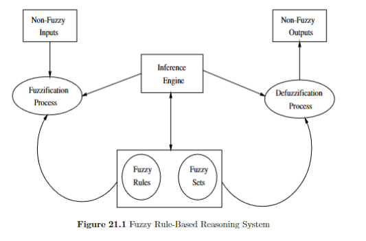

TARGET DECK: CI::FuzzySystems::8.FuzzySystems
# Fuzzy Systems
START
Basic
## What is the Ordered Weighted Averaging (OWA) operator and how is it computed?
Back:

* **Intuitive idea**:
  The OWA operator is a **flexible aggregation tool** that lies between **AND** (minimum) and **OR** (maximum), depending on the weights you assign.

---

### Definition of OWA:

Given a vector of values:

$$
A = (a_1, a_2, ..., a_n) \quad \text{where } a_i \in [0, 1]
$$

and a **weight vector**:

$$
W = (w_1, w_2, ..., w_n) \quad \text{where } w_i \geq 0, \sum w_i = 1
$$

the **OWA operator** is defined as:

$$
\text{OWA}(A) = \sum_{i=1}^{n} w_i \cdot b_i
$$

* Where $b\_i$ is the **$i$-th largest** element of $A$ (i.e., $A$ is **sorted in descending order** before applying weights)

---

### Steps to compute OWA:

1. **Input**: A list of values $A = (a\_1, ..., a\_n)$
2. **Sort** $A$ in descending order: $b\_1 \geq b\_2 \geq \dots \geq b\_n$
3. **Multiply** each $b\_i$ by the corresponding $w\_i$
4. **Sum** the products: $\text{OWA} = \sum w\_i b\_i$

---

### Example:

Let $A = (0.3, 0.8, 0.5)$
Let $W = (0.5, 0.3, 0.2)$

1. Sort $A$: $b = (0.8, 0.5, 0.3)$
2. Multiply and sum:

   $$
   \text{OWA} = 0.5 \cdot 0.8 + 0.3 \cdot 0.5 + 0.2 \cdot 0.3 = 0.4 + 0.15 + 0.06 = 0.61
   $$

---

### Why is OWA useful?

* **Generalizes** min, max, and mean:

  * If $W = (1, 0, ..., 0)$ → OWA = max
  * If $W = (0, ..., 0, 1)$ → OWA = min
  * If $W = (\frac{1}{n}, ..., \frac{1}{n})$ → OWA = arithmetic mean

* Used in **decision making**, **fuzzy aggregation**, and **multi-criteria evaluation**

---
<!--ID: 1750609082819-->
END

START
Basic
## **Example 8: OWA Operators and Their Properties**
Back:

Let’s consider the following weight vectors:

$$
w_1 = (1; 0; 0; 0; 0) \quad 
w_2 = (0.2; 0.2; 0.2; 0.2; 0.2) \quad 
w_3 = (0; 0; 0; 0; 1)
$$

$$
w_4 = (0.3; 0.5; 0.1; 0.3; 0) \quad 
w_5 = (0.05; 0.4; 0.2; 0; 0.35)
$$

**Questions**:

1. Can it be said that these weights can form OWA operators?
2. Calculate the value of the following OWA operator with the weights that can form an OWA operator:

   $$
   h_w(0.25; 0.1; 0; 0.7; 0.55)
   $$
3. From the weights above, does some weight vector have special (notable) properties?

### **1. Can These Weight Vectors Form OWA Operators?**

#### 📘 **What Is an OWA Operator?**

An **Ordered Weighted Averaging (OWA)** operator aggregates inputs using **weights** that satisfy:

* All weights are **in \[0, 1]**
* The sum of weights is **1**
* The weights are applied to **sorted inputs** in descending order:

  $$
  h_w(a_1, a_2, \dots, a_n) = \sum_{i=1}^{n} w_i \cdot b_i
  $$

  where $b\_1 \geq b\_2 \geq \dots \geq b\_n$ are the **sorted** input values

---

#### ✅ **Check the Weights**

| Vector   | Values                        | Sum       | All in \[0,1]? | Valid OWA? |
| -------- | ----------------------------- | --------- | -------------- | ---------- |
| $w\_1$ | $(1; 0; 0; 0; 0)$           | 1         | Yes            | ✅ Yes      |
| $w\_2$ | $(0.2; 0.2; 0.2; 0.2; 0.2)$ | 1         | Yes            | ✅ Yes      |
| $w\_3$ | $(0; 0; 0; 0; 1)$           | 1         | Yes            | ✅ Yes      |
| $w\_4$ | $(0.3; 0.5; 0.1; 0.3; 0)$   | **1.2** ❌ | Yes            | ❌ No       |
| $w\_5$ | $(0.05; 0.4; 0.2; 0; 0.35)$ | 1         | Yes            | ✅ Yes      |

---

#### ✅ **Answer**

$$
\boxed{
\text{The weight vectors } w_1, w_2, w_3, w_5 \text{ can form OWA operators. } w_4 \text{ cannot because it sums to } 1.2 > 1.
}
$$

---

### \*\*2. Compute OWA Value for: } h\_w(0.25; 0.1; 0; 0.7; 0.55)

We must apply **valid OWA weights** to the **sorted input vector**.

#### 📊 **Step 1: Sort Inputs in Descending Order**

Input: $\[0.25;\ 0.1;\ 0;\ 0.7;\ 0.55]$

Sorted: $\[0.7,\ 0.55,\ 0.25,\ 0.1,\ 0]$

Now apply each valid weight vector:

---

#### ✅ **Using $w\_1 = (1; 0; 0; 0; 0)$**

$$
h_{w_1} = 1 \cdot 0.7 + 0 = \boxed{0.7}
$$

---

#### ✅ **Using $w\_2 = (0.2; 0.2; 0.2; 0.2; 0.2)$**

$$
h_{w_2} = 0.2(0.7 + 0.55 + 0.25 + 0.1 + 0) = 0.2 \cdot 1.6 = \boxed{0.32}
$$

---

#### ✅ **Using $w\_3 = (0; 0; 0; 0; 1)$**

$$
h_{w_3} = 1 \cdot 0 = \boxed{0}
$$

---

#### ✅ **Using $w\_5 = (0.05;\ 0.4;\ 0.2;\ 0;\ 0.35)$**

Apply to sorted vector:

$$
h_{w_5} = 0.05 \cdot 0.7 + 0.4 \cdot 0.55 + 0.2 \cdot 0.25 + 0 + 0.35 \cdot 0
$$

Compute:

* $0.05 \cdot 0.7 = 0.035$
* $0.4 \cdot 0.55 = 0.22$
* $0.2 \cdot 0.25 = 0.05$

Sum: $0.035 + 0.22 + 0.05 = \boxed{0.305}$

---

### ✅ **Final Answer for OWA Values**

$$
\begin{aligned}
h_{w_1} &= \boxed{0.7} \quad \text{(max operator)} \\
h_{w_2} &= \boxed{0.32} \quad \text{(simple average)} \\
h_{w_3} &= \boxed{0} \quad \text{(min operator)} \\
h_{w_5} &= \boxed{0.305} \quad \text{(weighted aggregation)}
\end{aligned}
$$

---

### **3. Notable Properties of Some Weights**

Let’s summarize special behavior:

| Weight Vector | Description                                                           |
| ------------- | --------------------------------------------------------------------- |
| **$w\_1$**  | Selects **maximum** value (acts like $\max$ operator)               |
| **$w\_2$**  | All equal ⇒ computes **arithmetic mean**                              |
| **$w\_3$**  | Selects **minimum** value (acts like $\min$ operator)               |
| **$w\_4$**  | ❌ Invalid: sum $>1$ — **not an OWA operator**                       |
| **$w\_5$**  | General non-symmetric OWA operator (can emphasize mid or side values) |

---

### ✅ **Final Conclusion**

$$
\boxed{
\text{$w_1$, $w_2$, and $w_3$ have notable properties — max, average, and min, respectively.}
}
$$
<!--ID: 1750609082822-->
END


START
Basic
## What are the four main components of a fuzzy controller as illustrated in Figure 22.1?
Back:

The four main components of a fuzzy controller are:
1. **Fuzzy rule base**: Contains the linguistic rules representing the control strategy.
2. **Fuzzification Interface**: Translates crisp inputs into fuzzy sets.
3. **Defuzzification Interface**: Defuzzifies the fuzzy output into a crisp control action.
4. **Inference Engine**: The inference engine performs inferencing upon fuzzified inputs to produce a fuzzy output



<!--ID: 1750609082825-->
END

START
Basic
## What are the four sources of nonlinearity in fuzzy controllers?
Back:

The nonlinearity in fuzzy controllers is caused by:
1. The fuzzification process, if nonlinear membership functions are used.
2. The rule base, since rules express a nonlinear control strategy.
3. The inference engine, if operators like *min* for intersection and *max* for union are used.
4. The defuzzification process.
<!--ID: 1750609082828-->
END

START
Basic
## What are the three types of fuzzy controllers discussed in the text?
Back:

The three types of fuzzy controllers are:
1. Table-Based Controller
2. Mamdani Fuzzy Controller
3. Takagi-Sugeno Controller
<!--ID: 1750609082832-->
END

START
Basic
## What are the main characteristics of table-based controllers?
Back:

Table-based controllers are used for discrete universes where all input combinations and their corresponding outputs can be calculated and arranged in a table. They are efficient for situations with a small number of inputs and outputs, as finding an output involves a simple and fast look-up in the table. However, they become inefficient for large numbers of input and output values.
<!--ID: 1750609082836-->
END

START
Basic
## What are the steps involved in designing a Mamdani-type fuzzy controller?
Back:

The steps are:
1. Identify and name input linguistic variables and define their numerical ranges.
2. Identify and name output linguistic variables and define their numerical ranges.
3. Define fuzzy membership functions for input and output variables.
4. Construct the rule base representing the control strategy.
5. Perform fuzzification of input values.
6. Perform inferencing to determine firing strengths of activated rules.
7. Defuzzify, using centroid of gravity, to determine the corresponding action.
<!--ID: 1750609082839-->
END

START
Basic
## EXAM Question 2 - Mamdani Inference With COS defuzzification
Back:

**(25 points)**
The rule base of a two-input fuzzy system consists of two rules illustrated by triangular membership functions.

**Rules:**

* $R\_1$: If $x\_1 = A\_{11}$ and $x\_2 = A\_{21}$ then $y = B\_1$
* $R\_2$: If $x\_1 = A\_{12}$ and $x\_2 = A\_{22}$ then $y = B\_2$

The input vector is $A^* = (2.8, 2.2)$

---

### (a) Express the membership functions in the form:

$$
A_x = (\text{core}, \text{support length})
$$

**Answer:**

| Set         | Core | Support Length |
| ----------- | ---- | -------------- |
| $A\_{11}$ | 3    | 1              |
| $A\_{12}$ | 5    | 1              |
| $A\_{21}$ | 3    | 1              |
| $A\_{22}$ | 6    | 1              |
| $B\_1$    | 3    | 1              |
| $B\_2$    | 6    | 1              |

---

### (b) Perform Mamdani inference with COS defuzzification for $A^* = (2.8, 2.2)$. Show calculations.

**Answer:**

#### Step 1: Fuzzify Inputs

Evaluate membership values:

$$
\mu_{A_{11}}(2.8) = 0.2, \quad \mu_{A_{12}}(2.8) = 0 \\
\mu_{A_{21}}(2.2) = 1.0, \quad \mu_{A_{22}}(2.2) = 0
$$

#### Step 2: Rule Evaluation

* Rule 1 firing strength:

  $$
  \alpha_1 = \min(0.2, 1.0) = 0.2
  $$

* Rule 2 firing strength:

  $$
  \alpha_2 = \min(0, 0) = 0
  $$

#### Step 3: Aggregation

Only $B\_1$ contributes, clipped at 0.2. $B\_2$ is inactive.

#### Step 4: COS Defuzzification

Use:

$$
y^* = \frac{\sum x \cdot \mu(x)}{\sum \mu(x)}
$$

Result:

$$
y^* = 3.00
$$

---

Let me know if you’d like me to continue with **Question 3 (Spike-Timing Dependent Plasticity)** in Obsidian format too.
<!--ID: 1750609082842-->
END

START
Basic
## What is the main difference between the Mamdani and Takagi-Sugeno fuzzy controllers?
Back:

The main difference lies in the output representation. Mamdani controllers use fuzzy sets and membership functions for outputs, while Takagi-Sugeno controllers use linear or constant functions of the input variables to represent the output.
<!--ID: 1750609082845-->
END

START
Basic
## What preprocessing steps might be necessary before using raw measurements in a fuzzy controller?
Back:

Preprocessing steps include:
1. Removal of noise.
2. Discretization of continuous values.
3. Scaling of values.
4. Transforming values into a linguistic form.
<!--ID: 1750609082849-->
END

START
Basic
## How does the inference engine in a fuzzy controller operate?
Back:

The inference engine performs inferencing upon fuzzified inputs to produce a fuzzy output. It uses the rule base to determine the firing strengths of activated rules, often employing operators like *min* for intersection and *max* for union.
<!--ID: 1750609082852-->
END

START
Basic
## How is the firing strength of each rule computed in a Takagi-Sugeno controller?
Back:

The firing strength can be computed using the min-operator:

Alternatively, the product can be used:

<!--ID: 1750609082856-->
END

START
Basic
## What is the output of a Takagi-Sugeno controller determined by?
Back:

The output is determined as:

<!--ID: 1750609082858-->
END


START
Basic
## What are generalized means and how are they classified (harmonic, geometric, arithmetic, max, min)?
Back:

* **Generalized means** provide a **unified framework** for computing different types of averages using a parameter $p$.

---

### Definition of Generalized Mean:

Given non-negative numbers $x\_1, x\_2, ..., x\_n$ and a parameter $p$, the **generalized mean** $M\_p$ is:

$$
M_p(x_1, x_2, ..., x_n) = \left( \frac{1}{n} \sum_{i=1}^n x_i^p \right)^{1/p}
$$

* The value of $p$ determines the **type of mean**.

---

### Special cases:

| Value of $p$    | Type of Mean         | Formula                                       |
| ----------------- | -------------------- | --------------------------------------------- |
| $p \to -\infty$ | Minimum              | $\min(x\_1, ..., x\_n)$                     |
| $p = -1$        | Harmonic mean        | $n \left( \sum \frac{1}{x\_i} \right)^{-1}$ |
| $p = 0$         | Geometric mean       | $\left( \prod x\_i \right)^{1/n}$           |
| $p = 1$         | Arithmetic mean      | $\frac{1}{n} \sum x\_i$                     |
| $p = 2$         | Quadratic (RMS) mean | $\sqrt{ \frac{1}{n} \sum x\_i^2 }$          |
| $p \to +\infty$ | Maximum              | $\max(x\_1, ..., x\_n)$                     |

---

### Intuition:

* **Small $p$** values emphasize **small inputs** (e.g., harmonic mean penalizes low values)
* **Large $p$** values emphasize **large inputs** (e.g., RMS emphasizes outliers)
* **Flexible** — lets you smoothly transition between different types of averages

---

### Visual hierarchy:

```
min ≤ harmonic ≤ geometric ≤ arithmetic ≤ RMS ≤ max
```

* Valid when all $x\_i$ are positive and not all equal.
<!--ID: 1750609082861-->
END

