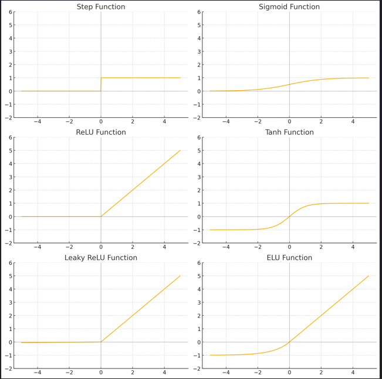

TARGET DECK: CI::NeuralNetworks

START
Basic
## What is a Neural Network?
Back:


- A **neural network** is a computer model inspired by the human brain.
- It consists of layers of connected units called **neurons**.
- These neurons work together to identify patterns and solve problems, like recognizing images or making predictions.

---

### Biological Inspirations

- The human brain has about **86 billion neurons**.
- Each biological neuron works like this:
  - **Dendrites** receive input signals.
  - The **cell body** processes the signals.
  - The **axon** sends the processed signal to other neurons.

---

### Artificial Neurons

- In a neural network, an **artificial neuron** is a simplified model of a biological one.
- Each artificial neuron:
  - **Receives inputs** from other neurons or data.
  - **Processes the inputs** (adds them up and applies an activation function).
  - **Sends output** to neurons in the next layer.

---

### Structure of a Neural Network

- A neural network has **three main types of layers**:

  - **Input layer**:
    - Takes in raw data.
    - Each neuron corresponds to a feature in the data.
  
  - **Hidden layers**:
    - Do internal computation.
    - Can be one or many layers.
    - Allow the network to learn complex features.

  - **Output layer**:
    - Gives the final answer or prediction.

- Diagram:

### Mathematical Model of a Neuron

- A single neuron's output is calculated using the formula:

$$
y = f\left(\sum_{i=1}^{n} w_i x_i + b \right)
$$

- Where:
- $x_i$ = input value (e.g., from the previous layer)
- $w_i$ = weight for each input (how important the input is)
- $b$ = bias (adjusts the output)
- $f$ = activation function (like sigmoid or ReLU) to introduce non-linearity
- $y$ = output of the neuron

- This equation means:
- Multiply each input $x_i$ by a weight $w_i$.
- Add them all up.
- Add a bias $b$.
- Apply the function $f$ to get the final result.

---
<!--ID: 1750612816860-->
END


START
Basic
##  **Differentiate between analytic, rule-based, and empirical knowledge. Give examples.**
Back:


### Analytic Knowledge:

- **Based on logic, mathematics, or formal systems.**
    
- True by definition; does not require real-world observation.
    
- **Example**:
    
    - "All bachelors are unmarried."
        
    - "If A = B and B = C, then A = C."
        

### Rule-Based Knowledge:

- **Encodes expert knowledge using rules** (if-then logic).
    
- Often used in expert systems.
    
- **Example**:
    
    - IF temperature > 100°C THEN sound alarm.
        
    - IF patient has fever AND cough THEN suspect flu.
        

### Empirical Knowledge:

- **Based on observation or experience.**
    
- Often gathered from data or experiments.
    
- **Example**:
    
    - Knowing that rain clouds often lead to rain because you've seen it many times.
        
    - A neural network learns patterns from data (empirical learning).
        

---
<!--ID: 1750612816863-->
END
START
Basic
##  **Explain the three types of learning: supervised, unsupervised, and reinforcement. Give examples.**
Back:


### Supervised Learning:

- **Learn from labeled data** (inputs with correct outputs).
    
- The model is trained to map inputs to known outputs.
    
- Goal: Minimize error between predicted and true output.
    
- **Example**:
    
    - Email spam detection: Emails are labeled "spam" or "not spam".
        
    - Handwriting recognition: Input image → known digit (0-9).
        

### Unsupervised Learning:

- **Learn from unlabeled data.**
    
- The model tries to find patterns, clusters, or structure in the data.
    
- No correct answer is given.
    
- **Example**:
    
    - Customer segmentation: Group customers based on behavior.
        
    - Clustering animals based on features like size, weight, habitat.
        

### Reinforcement Learning:

- **Learn by interacting with an environment.**
    
- The agent takes actions and gets **rewards or penalties**.
    
- Goal: Maximize cumulative reward over time.
    
- **Example**:
    
    - A robot learning to walk by trial and error.
        
    - Game AI learning to win at chess or video games.
        

**Summary Table**:

|Learning Type|Data Label?|Learns What?|Example|
|---|---|---|---|
|Supervised|Yes|Input → Output mapping|Spam detection|
|Unsupervised|No|Patterns/structure|Customer grouping|
|Reinforcement|No direct|Action → Reward mapping|Game-playing AI|    

---
<!--ID: 1750612816866-->
END
START
Basic
##  **Describe the structure and function of a single-layer perceptron.**
Back:


* A **single-layer perceptron** is the simplest type of neural network, used mainly for **binary classification** (i.e., classify inputs into two classes like 0 or 1).

### Structure:

* **Input Layer**: Takes input features $x\_1, x\_2, ..., x\_n$.
* **Weights**: Each input has a weight $w\_i$ showing its importance.
* **Bias ($b$)**: A constant added to shift the output.
* **Summation Function**: Computes the weighted sum:

  $$
  z = \sum_{i=1}^n w_i x_i + b
  $$
* **Activation Function**: Usually a **step function** (threshold):

  $$
  y = \begin{cases}
  1 & \text{if } z > 0 \\
  0 & \text{otherwise}
  \end{cases}
  $$

### Function:

* The perceptron **decides** between two classes based on whether the input falls on one side of a decision boundary (a line or hyperplane).

**Visual** (for 2 inputs):

```
Inputs --> [w1*x1 + w2*x2 + b] --> Step Function --> Output 0 or 1
```

---
<!--ID: 1750612816868-->
END
START
Basic
##  **Explain the perceptron learning algorithm step-by-step.**
Back:


### Goal:

* Adjust the weights $w\_i$ so that the perceptron correctly classifies the training data.

### Steps:

1. **Initialize weights and bias**:

   * Set small random values (or zeros).
   * Example: $w\_i = 0$, $b = 0$

1. **Repeat for each training example ($x$, target output $t$)**:

   * Compute the output:

     $$
     y = \begin{cases}
     1 & \text{if } \sum w_i x_i + b > 0 \\
     0 & \text{otherwise}
     \end{cases}
     $$
   * Compare $y$ (actual output) with $t$ (target).

3. **Update weights if output is wrong**:

   * For each weight:

     $$
     w_i \leftarrow w_i + \eta (t - y)x_i
     $$
   * Update bias:

     $$
     b \leftarrow b + \eta (t - y)
     $$
   * $\eta$ = learning rate (e.g., 0.1), controls step size.

4. **Repeat until all outputs are correct or max epochs reached.**

---
<!--ID: 1750612816871-->
END
START
Basic
##  **Write and explain the perceptron weight update rule.**
Back:


### Weight Update Rule:

* If prediction is wrong, adjust weights:

$$
w_i \leftarrow w_i + \eta (t - y)x_i
$$

### Meaning of each term:

* $w\_i$ = current weight
* $\eta$ = learning rate (e.g., 0.01)
* $t$ = target output (correct label)
* $y$ = perceptron output (prediction)
* $x\_i$ = input feature

### How it works:

* If the perceptron predicts too low ($y = 0$, $t = 1$), we **increase** the weights.
* If it predicts too high ($y = 1$, $t = 0$), we **decrease** the weights.
* If it predicts correctly ($t = y$), no update is made.

**Also update the bias**:

$$
b \leftarrow b + \eta (t - y)
$$

This rule helps the perceptron gradually learn the correct decision boundary.


    
    
<!--ID: 1750612816873-->
END
START
Basic
##  **What are the roles of learning rate (η) and threshold (θ) in perceptron learning?**
Back:


### Learning Rate (η):

* **Symbol**: $\eta$
* **Purpose**: Controls **how big the weight updates are** during learning.
* **Range**: Usually a small positive number (e.g., 0.01 or 0.1).

### Role:

* If $\eta$ is **too small**:

  * Learning is **slow**, many iterations are needed.
* If $\eta$ is **too large**:

  * The weights may **oscillate** and fail to converge (miss the optimal solution).
* Good practice: Choose a **moderate value** or decrease it gradually.

### Threshold (θ):

* **Symbol**: $\theta$ (used in older formulations)
* Sets the **cutoff value** for deciding between output 0 and 1.

### Role:

* The perceptron computes:

  $$
  y = \begin{cases}
  1 & \text{if } \sum w_i x_i > \theta \\
  0 & \text{otherwise}
  \end{cases}
  $$
* Alternatively, it's common to **absorb $\theta$ into the bias** ($b = -\theta$):

  $$
  y = \begin{cases}
  1 & \text{if } \sum w_i x_i + b > 0 \\
  0 & \text{otherwise}
  \end{cases}
  $$

### Summary:

* $\eta$ controls **learning speed and stability**.
* $\theta$ (or $b$) sets the **decision boundary position**.

---
<!--ID: 1750612816875-->
END
START
Basic
##  **What functions can a single-layer perceptron learn? Why can’t it learn XOR? Use a diagram.**
Back:


### Functions It *Can* Learn:

* Any function that is **linearly separable**:

  * Data can be split with a **straight line (2D)**, **plane (3D)**, or **hyperplane (higher-dimensions)**.
* Examples:

  * AND
  * OR
  * NOT

### Functions It *Cannot* Learn:

* **XOR** (exclusive OR): Output is 1 **only when inputs are different**.
* XOR is **not linearly separable**.

### XOR Truth Table:

| $x\_1$ | $x\_2$ | XOR |
| -------- | -------- | --- |
| 0        | 0        | 0   |
| 0        | 1        | 1   |
| 1        | 0        | 1   |
| 1        | 1        | 0   |

### Visual Diagram:

```
  x2
   |
 1 |   *       *      ← Points for XOR = 1
   |
 0 |   o       o      ← Points for XOR = 0
     0   1   x1
```

* "o" = output 0
* "\*" = output 1
* You **cannot draw a single straight line** to separate the stars from the circles.

### Why Can’t Perceptron Learn XOR?

* A single-layer perceptron can only draw **one linear boundary**.
* XOR needs at least **two lines** or a **non-linear model** (e.g., a multi-layer perceptron).
* XOR is a classic example used to show the **limitations** of single-layer networks.
<!--ID: 1750612816878-->
END
START
Basic
##  **Implement NOT, AND, and OR gates using perceptrons. Show equations and weight values.**
Back:


A **perceptron** implements a logic gate using:

$$
y = \begin{cases}
1 & \text{if } w_1x_1 + w_2x_2 + \dots + b > 0 \\
0 & \text{otherwise}
\end{cases}
$$

We choose weights ($w$) and bias ($b$) to get the correct outputs.

---

### **NOT Gate**

| $x$ | NOT $x$ |
| ----- | --------- |
| 0     | 1         |
| 1     | 0         |

* Equation: $y = \text{step}(-x + 0.5)$
* **Weights**: $w = -1$, $b = 0.5$

**Check**:

* If $x = 0$: $-1(0) + 0.5 = 0.5 > 0$ → $y = 1$
* If $x = 1$: $-1(1) + 0.5 = -0.5 < 0$ → $y = 0$

---

### **AND Gate**

| $x\_1$ | $x\_2$ | AND |
| -------- | -------- | --- |
| 0        | 0        | 0   |
| 0        | 1        | 0   |
| 1        | 0        | 0   |
| 1        | 1        | 1   |

* Equation: $y = \text{step}(x\_1 + x\_2 - 1.5)$
* **Weights**: $w\_1 = 1$, $w\_2 = 1$, $b = -1.5$

**Check**:

* Only when $x\_1 = x\_2 = 1$: $1 + 1 - 1.5 = 0.5 > 0$ → $y = 1$
* All other cases: sum ≤ 1.5 → output is 0

---

### **OR Gate**

| $x\_1$ | $x\_2$ | OR |
| -------- | -------- | -- |
| 0        | 0        | 0  |
| 0        | 1        | 1  |
| 1        | 0        | 1  |
| 1        | 1        | 1  |

* Equation: $y = \text{step}(x\_1 + x\_2 - 0.5)$
* **Weights**: $w\_1 = 1$, $w\_2 = 1$, $b = -0.5$

**Check**:

* Only when both inputs are 0: $0 + 0 - 0.5 = -0.5 < 0$ → $y = 0$
* All other cases: sum ≥ 0.5 → $y = 1$

---
<!--ID: 1750612816880-->
END
START
Basic
##  **Explain with diagram why XOR is not linearly separable.**
Back:


### XOR Truth Table:

| $x\_1$ | $x\_2$ | XOR |
| -------- | -------- | --- |
| 0        | 0        | 0   |
| 0        | 1        | 1   |
| 1        | 0        | 1   |
| 1        | 1        | 0   |

### XOR Plot:

```
  x2
   |
 1 |   *       o
   |
 0 |   o       *
     0   1   x1
```

* "\*" = output 1
* "o" = output 0

### Why Not Linearly Separable?

* You **cannot draw a straight line** that separates the 1's from the 0's.
* Any line you draw will always leave one class mixed with the other.

### What You Need Instead:

* A **multi-layer perceptron** (MLP) can combine simpler perceptrons to form a non-linear boundary.
* Example: One hidden layer with two perceptrons (for AND and NAND), and an output perceptron can solve XOR.

This demonstrates a **core limitation** of single-layer perceptrons: they can only learn problems that are **linearly separable**.
<!--ID: 1750612816882-->
END
START
Basic
##  **What are artificial neural networks (ANNs)?**
Back:


* **Artificial Neural Networks (ANNs)** are **computational models** inspired by the structure and function of the **human brain**.
* They consist of layers of **artificial neurons** (also called nodes or units), which process data and adjust internal parameters (weights) to learn tasks.

### Key Components:

* **Input Layer**: Receives raw data (e.g., pixel values, sensor data).
* **Hidden Layers**: Intermediate layers where computation and feature extraction happen.
* **Output Layer**: Produces the final prediction or decision.

### Each Neuron:

* Receives inputs: $x\_1, x\_2, ..., x\_n$
* Computes weighted sum + bias:

  $$
  z = \sum_{i=1}^n w_i x_i + b
  $$
* Applies an **activation function** (e.g., ReLU, sigmoid) to produce output $y = f(z)$.

### Example Tasks:

* Image recognition
* Speech recognition
* Predicting stock prices
* Classifying emails as spam/not spam

---
<!--ID: 1750612816885-->
END
START
Basic
##  **Differentiate between fully connected and partially connected networks.**
Back:


### Fully Connected Networks (Dense Networks):

* **Every neuron** in one layer is connected to **every neuron** in the next layer.
* Common in early ANNs and MLPs.

**Pros**:

* Simple to implement.
* High expressive power (can learn complex patterns).

**Cons**:

* Requires **many weights** → **high memory** and **computational cost**.
* Prone to **overfitting** on small data.

**Diagram**:

```
Layer 1:   o   o
           | \ | \
Layer 2:   o   o   o
```

### Partially Connected Networks:

* Neurons are connected to **only a subset** of neurons in the next layer.
* Example: **Convolutional Neural Networks (CNNs)** use local connections (filters).
* Also seen in **sparse networks** or **pruned** networks.

**Pros**:

* Fewer weights → faster, less memory, less overfitting.
* More biologically realistic.

**Cons**:

* May need more layers or specialized design to match fully connected performance.

---
<!--ID: 1750612816887-->
END
START
Basic
##  **What is weight pruning? Why is it useful?**
Back:


### What is Weight Pruning?

* **Weight pruning** is the process of **removing unimportant or small weights** from a trained neural network.
* The goal is to simplify the network **without significantly hurting performance**.

### How It Works:

1. Train the network normally.
2. Identify weights that are:

   * Very small (close to 0)
   * Contribute little to output
3. Set them to 0 (remove the connection).
4. Optionally retrain the network (fine-tune).

### Why Is It Useful?

* **Reduces model size**: Less memory usage.
* **Speeds up inference**: Fewer computations.
* **Prevents overfitting**: Acts like regularization.
* **Helps deployment**: Easier to run on mobile or embedded systems.

### Analogy:

* Like trimming unnecessary branches from a tree so it grows healthier and more efficiently.
<!--ID: 1750612816889-->
END
START
Basic
##  **Explain feedforward vs. recurrent neural networks. Use diagrams.**
Back:


### Feedforward Neural Networks (FNNs):

* **Definition**: Information flows in **one direction only** — from input to output.
* **No cycles or loops**.
* Typical examples: **Multi-layer Perceptrons (MLPs)**, **Convolutional Neural Networks (CNNs)**.

**Structure**:

```
Input → Hidden → Output

x → o → o → o
```

* Each layer passes data forward to the next.
* Output is only based on **current input**, not any previous inputs.

---

### Recurrent Neural Networks (RNNs):

* **Definition**: A neural network where **connections form cycles**.
* Output at time $t$ depends on **current input AND previous hidden state**.
* Used for **sequential data**: time series, text, speech, etc.

**Structure**:

```
At time t:
x_t → h_t → y_t
       ↑
     h_{t-1}
```

* $x\_t$ = input at time $t$
* $h\_t$ = hidden state at time $t$
* $y\_t$ = output at time $t$
* The **hidden state** acts as a **memory**, allowing the RNN to remember past information.

**Unrolled RNN Diagram (across time steps)**:

```
x1 → h1 → y1
      ↓
x2 → h2 → y2
      ↓
x3 → h3 → y3
```

---
<!--ID: 1750612816891-->
END
START
Basic
##  **What are the advantages of RNNs over feedforward networks?**
Back:


### 1. **Handles Sequential Data**:

* RNNs can process **time-dependent or ordered data**.
* Example: Words in a sentence, stock prices over time.

### 2. **Memory of Past Inputs**:

* Through hidden states, RNNs **retain context** across time.
* Useful in tasks like:

  * Language translation (context matters)
  * Speech recognition (previous sounds matter)
  * Music generation (sequence matters)

### 3. **Parameter Sharing Over Time**:

* Same weights are used at each time step → fewer parameters than trying to use an FNN for sequences.

### 4. **More Powerful for Language and Time Tasks**:

* Feedforward networks treat all inputs **independently**.
* RNNs recognize **patterns over time** or sequence order.

### Summary Table:

| Feature           | Feedforward NN       | Recurrent NN              |
| ----------------- | -------------------- | ------------------------- |
| Input type        | Static data          | Sequential data           |
| Memory            | No                   | Yes (via hidden state)    |
| Direction of flow | Forward only         | Loops allowed             |
| Typical use cases | Images, tabular data | Text, speech, time series |
<!--ID: 1750612816894-->
END
START
Basic
##  **Define and graph the following activation functions:**
Back:


Here are the definitions and graphs (see above) for each activation function:



### **Step Function**

- Output:
    
    f(x)={0if x≤01if x>0f(x) = \begin{cases} 0 & \text{if } x \leq 0 \\ 1 & \text{if } x > 0 \end{cases}
- **Used for binary decisions**, but **not differentiable**, so rarely used in training.
    

---

### **Sigmoid Function**

- Formula:
    
    f(x)=11+e−xf(x) = \frac{1}{1 + e^{-x}}
- **Range**: (0, 1)
    
- **S-shaped curve**
    
- Good for **probabilities**, but suffers from **vanishing gradients** for large inputs.
    

---

### **ReLU (Rectified Linear Unit)**

- Formula:
    
    f(x)=max⁡(0,x)f(x) = \max(0, x)
- Simple and efficient. Most common in hidden layers.
    
- **Range**: $[0, \infty)$
    
- **Issue**: Dead neurons when $x < 0$
    

---

### **Tanh Function**

- Formula:
    
    f(x)=tanh⁡(x)=ex−e−xex+e−xf(x) = \tanh(x) = \frac{e^x - e^{-x}}{e^x + e^{-x}}
- **Range**: $(-1, 1)$
    
- Zero-centered (better than sigmoid), but still has **vanishing gradient** problem.
    

---

### **Leaky ReLU**

- Formula:
    
    f(x)={xif x>00.01xotherwisef(x) = \begin{cases} x & \text{if } x > 0 \\ 0.01x & \text{otherwise} \end{cases}
- Allows small gradient for $x < 0$ → solves "dead neuron" issue in ReLU.
    

---

### **ELU (Exponential Linear Unit)**

- Formula:
    
    f(x)={xif x≥0α(ex−1)if x<0f(x) = \begin{cases} x & \text{if } x \geq 0 \\ \alpha(e^x - 1) & \text{if } x < 0 \end{cases}
- Smooth and differentiable.
    
- Combines benefits of ReLU and leaky behavior for negative values.
    

---
<!--ID: 1750612816897-->
END
START
Basic
##  **Compare the properties of activation functions**
Back:


|Function|Range|Differentiable|Output Centered|Issues / Notes|Use Case|
|---|---|---|---|---|---|
|Step|0 or 1|❌ No|No|Not trainable by gradient descent|Binary logic only|
|Sigmoid|(0, 1)|✅ Yes|No|Vanishing gradient|Probabilities (output layer)|
|Tanh|(-1, 1)|✅ Yes|✅ Yes|Vanishing gradient|Better than sigmoid in hidden layers|
|ReLU|[0, ∞)|✅ Yes|No|Dead neurons (if x < 0)|Default for deep networks|
|Leaky ReLU|(-∞, ∞)|✅ Yes|No|Solves ReLU’s zero gradient issue|When ReLU causes dead neurons|
|ELU|(-α, ∞)|✅ Yes|✅ Yes (approx.)|Computationally expensive|Smooth ReLU alternative|END
<!--ID: 1750612816899-->
END
START
Basic
##  **Explain the purpose and function of convolutional layers.**
Back:


### Purpose:

- **Convolutional layers** are the core building blocks of **Convolutional Neural Networks (CNNs)**.
    
- Their main job is to **extract local features** (like edges, textures, shapes) from input data such as images.
    

### Function:

- A convolutional layer slides a **filter (or kernel)** over the input image.
    
- At each location, it performs a **dot product** between the filter and the region of the image.
    
- This produces a **feature map** (or activation map) that highlights patterns.
    

### Benefits:

- **Parameter sharing**: Same filter used across the image.
    
- **Local connectivity**: Filters focus on small regions → efficient.
    
- Captures **spatial hierarchy**: Low-level (edges) to high-level (objects).
    

---
<!--ID: 1750612816902-->
END
START
Basic
##  **What are filters/kernels, stride, padding, and dilation? Show an example convolution.**
Back:


### 1. **Filters / Kernels**

- Small matrices (e.g., $3 \times 3$) that scan across the input.
    
- Learn to detect patterns like edges, corners, textures.
    

### 2. **Stride**

- Number of steps the filter moves across the input.
    
- **Stride = 1**: moves one pixel at a time.
    
- Larger stride → **smaller output** (downsampling).
    

### 3. **Padding**

- Adds **extra borders (usually zeros)** around the input.
    
- Maintains output size or controls how edges are handled.
    
    - **"Valid" padding**: no padding → output shrinks.
        
    - **"Same" padding**: pads to keep size constant.
        

### 4. **Dilation**

- Inserts **gaps** between filter elements to cover a **larger area**.
    
- Useful in tasks needing large receptive fields without increasing filter size.
    

---

### Example Convolution:

**Input (5×5):**

```
1 1 1 0 0
0 1 1 1 0
0 0 1 1 1
0 0 1 1 0
0 1 1 0 0
```

**Filter (3×3):**

```
1 0 1
0 1 0
1 0 1
```

**Process**:

- Slide filter over the input.
    
- At each position, compute the dot product of the overlapping values.
    
- Example output (feature map) will be a 3×3 or 5×5 matrix depending on stride and padding.
    

---
<!--ID: 1750612816905-->
END
START
Basic
##  **Differentiate between convolution and deconvolution. Use diagrams.**
Back:


### Convolution:

- **Reduces spatial size** (depending on stride/padding).
    
- Extracts **features**.
    
- Operates like **downsampling + pattern detection**.
    

**Diagram (input → smaller feature map):**

```
Input (5x5) → [Conv Layer] → Output (3x3)
```

### Deconvolution (Transposed Convolution):

- Also called **upsampling** or **transposed convolution**.
    
- Increases spatial dimensions — often used in **generative networks** or **image segmentation**.
    
- Tries to **reverse the effect** of convolution.
    

**Diagram (small → large):**

```
Input (3x3) → [Deconv Layer] → Output (5x5)
```

### Key Differences:

|Feature|Convolution|Deconvolution (Transposed Conv)|
|---|---|---|
|Purpose|Downsampling & feature extraction|Upsampling or reconstructing data|
|Input → Output|Large → Small|Small → Large|
|Use Case|Classification (e.g., CNNs)|Generation, segmentation|

Both are **learnable operations** with filters, but they operate in opposite spatial directions.
<!--ID: 1750612816908-->
END
START
Basic
##  **Explain max pooling and average pooling with examples.**
Back:


### Purpose of Pooling:

- Reduces the **spatial size** (width and height) of the feature maps.
    
- Helps with:
    
    - **Dimensionality reduction**
        
    - **Computation speed**
        
    - **Translation invariance**
        

---

### Max Pooling:

- Takes the **maximum value** from each patch of the feature map.
    

**Example** (2×2 max pooling):

Input (4×4):

```
1  3  2  4  
5  6  1  2  
0  1  3  1  
2  4  0  5
```

Apply 2×2 max pooling with stride 2:

Output (2×2):

```
6  4  
4  5
```

---

### Average Pooling:

- Takes the **average of values** in each patch.
    

Same input, apply 2×2 average pooling:

Output (2×2):

```
3.75 2.25  
1.75 2.25
```

---
<!--ID: 1750612816912-->
END
START
Basic
##  **What is unpooling? When is it used?**
Back:


### Unpooling:

- **Reverses pooling** operation by **upsampling** feature maps.
    
- It does **not recreate exact original values**, but **reconstructs spatial structure**.
    

### How It Works:

- **Max unpooling** often uses **indices from max pooling** to place values back in correct positions (others filled with 0).
    

### Used In:

- **Autoencoders**
    
- **Segmentation models** (e.g., U-Net)
    
- **Generative tasks** to rebuild higher-resolution outputs from compact features.
    

---
<!--ID: 1750612816916-->
END
START
Basic
##  **Compare popular CNN architectures: R-CNN, YOLO, SSD.**
Back:


|Feature|R-CNN|YOLO|SSD|
|---|---|---|---|
|**Full Name**|Regions with CNN|You Only Look Once|Single Shot Detector|
|**Speed**|Slow (multi-stage)|Very fast (real-time)|Fast (real-time)|
|**Steps**|1. Region proposal|||

```
            2. CNN on each region  
            3. Classification | 1. Grid-based detection  
                                  2. One-shot classification | 1. Multi-scale feature maps  
                                  3. One-step detection      |
```

| **Accuracy** | High | Good, slightly less precise| Good balance |  
| **Use Case** | High-accuracy needs | Real-time detection | Embedded/mobile apps |

---
<!--ID: 1750612816919-->
END
START
Basic
##  **List common CNN applications and their workflows.**
Back:


### 1. **Image Classification**

- **Input**: Image
    
- **Workflow**:
    
    - CNN layers extract features.
        
    - Fully connected layer → softmax → class label.
        

### 2. **Object Detection**

- **Input**: Image
    
- **Workflow**:
    
    - CNN backbone extracts features.
        
    - Detection head predicts:
        
        - Bounding boxes
            
        - Class labels
            
    - Example: YOLO, SSD
        

### 3. **Image Segmentation**

- **Input**: Image
    
- **Workflow**:
    
    - CNN encodes features.
        
    - Decoder upsamples to original size.
        
    - Output: pixel-wise classification (e.g., U-Net, DeepLab)
        

### 4. **Face Recognition**

- **Input**: Image of a face
    
- **Workflow**:
    
    - CNN extracts face embeddings.
        
    - Compare with stored embeddings (e.g., cosine similarity)
        

### 5. **Style Transfer / Image Generation**

- **Input**: Content and style images
    
- **Workflow**:
    
    - CNN extracts content and style features.
        
    - Optimizer merges them.
        
    - Output: stylized image
        

### 6. **Medical Imaging**

- **Input**: MRI, CT scans
    
- **Workflow**:
    
    - CNN detects tumors, anomalies.
        
    - Segmentation for region marking.
        
    - Classification for diagnosis.
<!--ID: 1750612816922-->
END
START
Basic
##  **Explain the encoder-decoder structure with diagram.**
Back:


### What Is an Encoder-Decoder?

- A **neural network architecture** with two main parts:
    
    - **Encoder**: Compresses input data into a compact **latent representation** (code).
        
    - **Decoder**: Reconstructs or transforms the latent code into a desired **output**.
        

### Diagram:

```
Input  → [Encoder] → Latent Code → [Decoder] → Output
e.g. image             vector            image/label/text
```

### Encoder:

- Series of layers (often CNNs or RNNs) that reduce dimensionality.
    
- Learns abstract features (e.g., edges → objects → meaning).
    

### Decoder:

- Mirrors the encoder, expands the latent vector back to full output size.
    
- Often uses **upsampling, transposed convolutions, or attention**.
    

---
<!--ID: 1750612816926-->
END
START
Basic
##  **What are use cases of encoder-decoder models?**
Back:


### 1. **Autoencoders**

- **Goal**: Reconstruct input from compressed form.
    
- **Use**: Denoising, compression, anomaly detection.
    

### 2. **Image Segmentation (e.g., U-Net)**

- Encoder extracts features.
    
- Decoder predicts pixel-wise labels.
    
- **Used in**: medical imaging, scene parsing.
    

### 3. **Machine Translation**

- Encoder reads input sentence (e.g., English).
    
- Decoder outputs translation (e.g., French).
    
- Often uses **sequence-to-sequence (seq2seq)** models with attention.
    

### 4. **Text Summarization**

- Input: Long document
    
- Output: Short summary
    
- Learns to extract the most relevant information.
    

### 5. **Speech Recognition / Generation**

- Input: Audio features
    
- Output: Text (or vice versa)
    

---
<!--ID: 1750612816928-->
END
START
Basic
##  **Describe how encoder-decoder networks are used in style transfer and image generation.**
Back:


### **Style Transfer**:

**Goal**: Combine **content** of one image with the **style** of another.

**Workflow**:

1. **Encoder** extracts content features from input image.
    
2. Extract style features from style image.
    
3. Combine both (e.g., using Gram matrices for style).
    
4. **Decoder** generates a new image blending the two.
    

**Model**: Often a modified autoencoder or VGG-based architecture.

---

### **Image Generation (e.g., Variational Autoencoders - VAEs)**:

**Goal**: Learn to generate new images from a latent space.

**Workflow**:

1. **Encoder** maps input image to latent variables (mean & variance).
    
2. Sample from this distribution.
    
3. **Decoder** reconstructs image from sampled latent vector.
    

**Use**:

- Face synthesis, data augmentation, creative art generation.
    

---

In both cases, the encoder-decoder learns to **separate content from structure**, enabling flexible and powerful generation or transformation of data.
<!--ID: 1750612816931-->
END
START
Basic
##  **What is neuroevolution?**
Back:


- **Neuroevolution** = **Neural Networks + Evolutionary Algorithms**
    
- It's a method of training neural networks using **evolutionary principles** like:
    
    - **Selection**
        
    - **Mutation**
        
    - **Crossover**
        

### Key Idea:

- Instead of using gradient-based learning (like backpropagation), **neuroevolution evolves populations of networks** over generations.
    

---
<!--ID: 1750612816935-->
END
START
Basic
##  **How are evolutionary algorithms used to evolve neural networks?**
Back:


### Steps:

1. **Initialize a Population**:
    
    - Create multiple **random neural networks** (each with its own weights, or even architecture).
        
2. **Evaluate Fitness**:
    
    - Test each network on a task.
        
    - Assign a **fitness score** (e.g., how well it plays a game).
        
3. **Selection**:
    
    - Select the best-performing networks (like "survival of the fittest").
        
4. **Crossover (Optional)**:
    
    - Combine parts of two networks to create a new one (e.g., mix weights or structure).
        
5. **Mutation**:
    
    - Randomly tweak weights, biases, or even the architecture of the offspring networks.
        
6. **Repeat**:
    
    - Replace old population with new generation and repeat.
        

### Evolvable Parts:

- **Weights** (most common)
    
- **Topology/structure** (Neuroevolution of Augmenting Topologies – NEAT)
    
- **Activation functions, learning rules, etc.**
    

---
<!--ID: 1750612816937-->
END
START
Basic
##  **What are the pros and cons of neuroevolution compared to backpropagation?**
Back:


|Feature|**Neuroevolution**|**Backpropagation**|
|---|---|---|
|**Training method**|Gradient-free (search-based)|Gradient-based optimization|
|**Exploration ability**|Can explore diverse solutions|Gets stuck in local minima|
|**Parallelization**|Easy (evaluate many networks at once)|Harder (gradient steps depend sequentially)|
|**Handles non-differentiable tasks?**|✅ Yes|❌ No (needs differentiable functions)|
|**Training speed**|Slower (requires many evaluations)|Faster (once gradients are available)|
|**Fine-tuning accuracy**|Lower for large tasks|High (good at converging precisely)|
|**Architecture evolution**|Possible (e.g., NEAT)|Not built-in|

### Summary:

- **Neuroevolution** is better for:
    
    - Noisy, non-differentiable problems
        
    - Automatically designing networks
        
    - Game-playing agents
        
- **Backpropagation** is better for:
    
    - Large-scale supervised learning (like ImageNet)
        
    - Fine-grained learning from labeled data
        

Both methods can be combined in **hybrid models**.
<!--ID: 1750612816939-->
END
START
Basic
##  **What is data augmentation? Why is it important?**
Back:


### What Is It?

- **Data augmentation** is the process of **artificially increasing the size and diversity of your dataset** by applying transformations to existing data.
    

### Why Is It Important?

- Helps the model **generalize better**.
    
- Reduces **overfitting** (model memorizing the training data).
    
- Especially useful when **limited data** is available.
    
- Makes the model **robust to variations** (e.g., rotation, lighting, scale).
    

---
<!--ID: 1750612816942-->
END
START
Basic
##  **List and explain common augmentation techniques.**
Back:


### For Images:

1. **Rotation**: Randomly rotate images (e.g., ±15°) to learn orientation invariance.
    
2. **Flipping**: Horizontal or vertical flip to simulate mirrored versions.
    
3. **Scaling / Zooming**: Zoom in/out to help model learn scale invariance.
    
4. **Cropping**: Random crop smaller areas → model focuses on different parts.
    
5. **Translation**: Shift image along X or Y axis (see Q33).
    
6. **Color Jittering**: Change brightness, contrast, saturation → mimic lighting changes.
    
7. **Noise Injection**: Add Gaussian noise → robustness to sensor noise.
    
8. **Cutout / Masking**: Block random parts of the image → forces the model to use context.
    
9. **Mixup**: Combine two images and their labels → smoother decision boundaries.
    

### For Text or Audio:

- **Synonym replacement**, **noise addition**, **time shifting**, **pitch change**, etc.
    

---
<!--ID: 1750612816944-->
END
START
Basic
##  **What is translation invariance in CNNs, and why is it useful?**
Back:


### Definition:

- **Translation invariance** means the CNN can **recognize an object even if it is moved** (shifted) slightly in the image.
    

### Why It's Useful:

- Real-world objects **don’t always appear in the same spot**.
    
- Without translation invariance, a model would need to **see the same object in every position** during training.
    

### How CNNs Achieve This:

- **Convolutional filters** slide across the image → same filter detects features everywhere.
    
- **Pooling layers** (like max pooling) help summarize spatial information → tolerant to small shifts.
    

### Example:

- Whether a cat appears in the top-left or bottom-right of an image, a CNN can still detect it.
    

---
<!--ID: 1750612816947-->
END
START
Basic
##  **What techniques help reduce overfitting during training?**
Back:


### 1. **Data Augmentation**

- Creates variety in training data.
    

### 2. **Regularization**

- **L1 or L2 regularization** adds penalty to large weights.
    

### 3. **Dropout**

- Randomly disables neurons during training → forces redundancy and robustness.
    

### 4. **Early Stopping**

- Stop training when validation error starts increasing.
    

### 5. **Cross-Validation**

- Helps detect and avoid overfitting by testing on unseen data splits.
    

### 6. **Smaller Models**

- Reduce number of parameters if the dataset is small.
    

### 7. **Weight Pruning**

- Remove unimportant weights post-training.
    

### 8. **Batch Normalization**

- Stabilizes and accelerates training; can have a slight regularization effect.
    

### 9. **Noise Injection**

- Add noise to inputs or weights to improve robustness.
    

### 10. **Transfer Learning**

- Use pretrained models and fine-tune → reduces risk of overfitting on small datasets.
    
<!--ID: 1750612816950-->
END
START
Basic
##  **How is 1D convolution used for time series data?**
Back:


### What Is 1D Convolution?

* 1D convolution applies a **filter across a single axis** — typically **time** in time series data.

### Purpose:

* Detect **temporal patterns** (e.g., spikes, trends, cycles).
* Learn **local dependencies** (just like CNNs find image features).

### How It Works:

* Input: A time series (e.g., temperature over 24 hours)

  $$
  x = [x_1, x_2, x_3, ..., x_T]
  $$
* A **1D kernel** (e.g., size = 3) slides along the time axis:

  $$
  y_t = w_1 x_{t} + w_2 x_{t+1} + w_3 x_{t+2} + b
  $$

### Advantages:

* Captures **short-term patterns**.
* Can be **faster** and simpler than RNNs.
* Often used in:

  * Signal processing
  * ECG/EEG analysis
  * Time-series classification

---
<!--ID: 1750612816953-->
END
START
Basic
##  **What are RNNs? Explain their internal structure.**
Back:


### What Is an RNN?

* **Recurrent Neural Network** — designed to handle **sequential data**.
* Maintains a **memory (hidden state)** that evolves over time.

### Structure at Time $t$:

* Inputs: $x\_t$ (current input), $h\_{t-1}$ (previous state)
* Outputs: $h\_t$ (current hidden state)

### Equation:

$$
h_t = \tanh(W_{xh} x_t + W_{hh} h_{t-1} + b_h)
$$

* $W\_{xh}$ = weights for input
* $W\_{hh}$ = weights for previous hidden state
* $b\_h$ = bias
* $\tanh$ = activation

---
<!--ID: 1750612816955-->
END
START
Basic
##  **Explain LSTM architecture with gate equations:**
Back:


LSTM = **Long Short-Term Memory** network
It introduces **gates** to control memory flow.

---

### 1. **Forget Gate ($f\_t$)**

Decides what to remove from the cell memory:

$$
f_t = \sigma(W_f \cdot [h_{t-1}, x_t] + b_f)
$$

---

### 2. **Input Gate ($i\_t$)**

Decides what new information to add:

$$
i_t = \sigma(W_i \cdot [h_{t-1}, x_t] + b_i)
$$

---

### 3. **Candidate Cell State ($\tilde{C}\_t$)**

Proposes new memory values:

$$
\tilde{C}_t = \tanh(W_C \cdot [h_{t-1}, x_t] + b_C)
$$

---

### 4. **Cell State Update ($C\_t$)**

Combines past memory and new input:

$$
C_t = f_t * C_{t-1} + i_t * \tilde{C}_t
$$

---

### 5. **Output Gate ($o\_t$)**

Controls what goes to output:

$$
o_t = \sigma(W_o \cdot [h_{t-1}, x_t] + b_o)
$$

---

### 6. **Hidden State ($h\_t$)**

The final output of the time step:

$$
h_t = o_t * \tanh(C_t)
$$

---
<!--ID: 1750612816958-->
END
START
Basic
##  **Compare RNN, LSTM, and GRU in terms of memory and performance**
Back:


| Feature                | RNN                     | LSTM                        | GRU                              |
| ---------------------- | ----------------------- | --------------------------- | -------------------------------- |
| **Memory**             | Short (forgets quickly) | Long (remembers for longer) | Medium-Long (simpler memory)     |
| **Vanishing Gradient** | Severe                  | Solved with gates           | Mostly solved                    |
| **Speed**              | Fast                    | Slower (more gates/weights) | Faster than LSTM                 |
| **Gates**              | None                    | Forget, Input, Output       | Reset, Update                    |
| **Use Cases**          | Simple sequences        | Complex dependencies        | Faster training on moderate data |
| **Complexity**         | Low                     | High                        | Medium                           |

### Summary:

* **RNN**: Basic but limited.
* **LSTM**: Strong memory, great for long sequences.
* **GRU**: A lightweight LSTM alternative — faster, fewer parameters.
<!--ID: 1750612816962-->
END
START
Basic
##  **State the Universal Approximation Theorem.**
Back:


### Theorem:

- A **feedforward neural network** with:
    
    - **At least one hidden layer**
        
    - A **non-linear activation function** (e.g., sigmoid, ReLU)
        
    - A **finite number of neurons**
        

**Can approximate any continuous function** on a compact subset of $\mathbb{R}^n$ to any desired accuracy.

### Formally:

For any continuous function $f: \mathbb{R}^n \to \mathbb{R}$ and $\epsilon > 0$,  
there exists a neural network $F(x)$ such that:

∣F(x)−f(x)∣<ϵfor all x∈compact domain|F(x) - f(x)| < \epsilon \quad \text{for all } x \in \text{compact domain}

---
<!--ID: 1750612816965-->
END
START
Basic
##  **What does it imply about neural networks and function approximation?**
Back:


### Implications:

- Neural networks are **universal function approximators**.
    
- They can **represent any continuous function** if given enough:
    
    - **Neurons**
        
    - **Proper weights**
        
    - **Non-linear activation**
        

### Important Notes:

- The theorem guarantees **existence**, not:
    
    - **Efficiency** (may require many neurons)
        
    - **Trainability** (training may still be hard)
        
    - **Generalization** (overfitting can occur)
        

---
<!--ID: 1750612816969-->
END
START
Basic
##  **Who are Kolmogorov, Sprecher, and Kurkova, and what were their contributions?**
Back:


### **Andrey Kolmogorov**:

- Russian mathematician.
    
- In 1957, proved that **any multivariate continuous function** can be expressed as a **composition of univariate functions**.
    
- Foundation for **neural function decomposition** theory.
    

### **David Sprecher**:

- Extended Kolmogorov's work.
    
- Showed **explicit constructions** using **continuous** rather than just measurable functions.
    
- Helped bridge theory and implementability.
    

### **Věra Kůrková**:

- Czech researcher.
    
- Worked on **neural network approximation theory**.
    
- Linked Kolmogorov's ideas to **modern neural networks** and **activation functions**.
    

---
<!--ID: 1750612816971-->
END
START
Basic
##  **Does the theorem apply to fuzzy systems? Explain.**
Back:


### Short Answer: **Yes — in a generalized way.**

### Explanation:

- **Fuzzy systems**, like fuzzy rule-based models or fuzzy neural networks, also aim to **approximate functions** using **linguistic rules and membership functions**.
    

### Key Points:

- **Fuzzy systems with enough rules and fuzzy sets** can approximate **any continuous function** (Zeng & Singh, Wang & Mendel).
    
- This is called the **Fuzzy Approximation Theorem**.
    
- Similar in spirit to the Universal Approximation Theorem for NNs.
    

### Implication:


- Like neural networks, **fuzzy systems are universal approximators**, though their structure and interpretability differ.
<!--ID: 1750612816974-->
END

START
Basic
##  **How do SNNs differ from ANNs?**
Back:


### ANNs (Artificial Neural Networks):

- Use **continuous-valued activations** (e.g., sigmoid, ReLU).
    
- Process data in **discrete time steps** or all-at-once.
    
- Represent signals with **real numbers**.
    

### SNNs (Spiking Neural Networks):

- Mimic biological neurons more closely.
    
- Neurons **communicate via spikes** (short, timed electrical pulses).
    
- Time is **explicit** — learning depends on **when** spikes occur.
    
- More **energy-efficient** and suitable for neuromorphic hardware.
    

### Key Differences:

|Feature|ANN|SNN|
|---|---|---|
|Communication|Continuous activation values|Binary spikes over time|
|Timing|Not explicitly modeled|Time-sensitive dynamics|
|Biological realism|Low|High|
|Learning Rule|Backpropagation|STDP, Hebbian rules|
|Power Efficiency|Moderate|High (ideal for edge devices)|

---
<!--ID: 1750612816977-->
END
START
Basic
##  **What is spike-timing-dependent plasticity (STDP)?**
Back:


### STDP = **Spike-Timing-Dependent Plasticity**

- A biologically-inspired **learning rule** used in SNNs.
    
- Adjusts synaptic weights based on **timing difference** between:
    
    - **Pre-synaptic spike** (input neuron)
        
    - **Post-synaptic spike** (output neuron)
        

### Rule:

- If **pre fires before post**: **strengthen** the connection (potentiation).
    
- If **pre fires after post**: **weaken** the connection (depression).
    

### Mathematical Form:

Let $\Delta t = t_{\text{post}} - t_{\text{pre}}$

- If $\Delta t > 0$:
    
    Δw=A+⋅e−Δt/τ+\Delta w = A_+ \cdot e^{-\Delta t / \tau_+}
- If $\Delta t < 0$:
    
    Δw=−A−⋅eΔt/τ−\Delta w = -A_- \cdot e^{\Delta t / \tau_-}
- $A_+$, $A_-$: learning rates
    
- $\tau_+$, $\tau_-$: time constants
    

---
<!--ID: 1750612816981-->
END
START
Basic
##  **Explain the “fire together, wire together” rule with diagram.**
Back:


### Phrase:

- Coined by **Donald Hebb (1949)**.
    
- If **two neurons frequently fire together**, the **synapse connecting them strengthens**.
    

### Biological Basis:

- Foundation of **Hebbian learning**, extended in STDP.
    

### Diagram:

```
Neuron A →──┐
            ├──► Neuron B fires
Neuron A →──┘

↑ If A and B fire closely in time → strengthen this connection
```

### Interpretation:

- **Temporal correlation** increases synaptic strength.
    
- Learning emerges from the **timing patterns** between neurons.
    

### Importance:

- Explains how **memories** and **patterns** are learned biologically.
    
- SNNs use this to perform learning **without gradients or backpropagation**.    
<!--ID: 1750612816983-->
END
START
Basic
##  **Define the Integrate-and-Fire neuron model. Show equations.**
Back:


### Overview:

* The **Integrate-and-Fire (I\&F)** model is a simple spiking neuron model used in SNNs.
* It mimics how biological neurons **accumulate input** over time and **fire** (emit a spike) when a threshold is reached.

---

### Basic Dynamics:

1. **Membrane Potential ($V(t)$)**:

   * Increases as neuron receives input (integration).
   * Resets when spike threshold is reached (firing).

2. **Equation** (Leaky Integrate-and-Fire):

   $$
   \tau_m \frac{dV(t)}{dt} = -V(t) + R \cdot I(t)
   $$

   * $\tau\_m$: membrane time constant
   * $V(t)$: membrane potential
   * $R$: resistance
   * $I(t)$: input current

3. **Firing Condition**:

   * If $V(t) \geq V\_{\text{th}}$, then:

     * Emit spike
     * Reset $V(t) \to V\_{\text{reset}}$
     * Optional: add **refractory period**

---

### Summary:

* **"Integrate"**: Accumulate input signals
* **"Fire"**: Emit spike when threshold is reached
* **Reset**: Start over after firing

---
<!--ID: 1750612816985-->
END
START
Basic
##  **What is local learning in SNNs?**
Back:


### Definition:

* **Local learning** = Each neuron updates its weights **based only on local information**:

  * Its own spike history
  * Incoming spikes
  * Local timing (e.g., STDP)

### Features:

* No need for global feedback (e.g., error gradients).
* Biologically plausible (closer to how real brains learn).
* Can be **implemented efficiently on neuromorphic hardware**.

### Examples:

* STDP (Spike-Timing-Dependent Plasticity)
* Hebbian learning
* Homeostatic plasticity

---
<!--ID: 1750612816988-->
END
START
Basic
##  **Compare supervised and unsupervised learning in SNNs.**
Back:


| Feature              | **Supervised Learning**                 | **Unsupervised Learning**                   |
| -------------------- | --------------------------------------- | ------------------------------------------- |
| **Labels required?** | ✅ Yes                                   | ❌ No                                        |
| **Goal**             | Match predicted spikes to target output | Learn patterns and representations          |
| **Common methods**   | SpikeProp, Tempotron                    | STDP, Hebbian learning                      |
| **Learning signal**  | Global error or target spike timing     | Spike correlations and local activity       |
| **Complexity**       | Higher (requires error backpropagation) | Lower (fully local, biologically plausible) |
| **Applications**     | Classification, control tasks           | Feature extraction, clustering              |

### Summary:

* **Supervised SNNs** are used when labeled data is available and precise output is needed.
* **Unsupervised SNNs** are more scalable and biologically inspired, ideal for **representation learning** or when labels are unavailable.
<!--ID: 1750612816990-->
END
START
Basic
##  **Explain how STDP modifies weights based on spike timing.**
Back:


### STDP = Spike-Timing-Dependent Plasticity

* STDP updates **synaptic weights** based on the **relative timing** of spikes from:

  * **Pre-synaptic neuron** (sending signal)
  * **Post-synaptic neuron** (receiving signal)

### Rule:

* If **pre-synaptic fires before post-synaptic**:

  * **Strengthen** the connection (Long-Term Potentiation, LTP)
* If **post fires before pre**:

  * **Weaken** the connection (Long-Term Depression, LTD)

### Update Equation:

Let $\Delta t = t\_{\text{post}} - t\_{\text{pre}}$

* For $\Delta t > 0$ (pre before post):

  $$
  \Delta w = A_+ \cdot e^{-\Delta t / \tau_+}
  $$

* For $\Delta t < 0$ (post before pre):

  $$
  \Delta w = -A_- \cdot e^{\Delta t / \tau_-}
  $$

* $A\_+$, $A\_-$ = learning rates

* $\tau\_+$, $\tau\_-$ = time constants for decay

### Intuition:

* Closer the spikes are in time, **larger the update**.
* Timing encodes **causality**: "Pre may have caused post."

---
<!--ID: 1750612816993-->
END
START
Basic
##  **How does STDP implement Hebbian learning?**
Back:


### Hebbian Principle:

> "Neurons that fire together, wire together."

### STDP as Hebbian:

* **If pre-synaptic spike helps cause post-synaptic spike** (i.e., comes just before it):

  * **Strengthen** the synapse (classic Hebbian).
* **If pre and post are not causally linked** (wrong timing):

  * **Weaken** the synapse (anti-Hebbian).

### Summary:

* STDP refines Hebbian learning by adding **temporal precision**.
* It not only strengthens based on co-activation but also on **causal timing**.

---
<!--ID: 1750612816996-->
END
START
Basic
##  **What is STDP-LMS? How does it combine STDP with supervised learning?**
Back:


### STDP-LMS = **STDP + Least Mean Squares (LMS)**

### Goal:

* Combine **local, spike-based learning (STDP)** with **supervised error correction** (LMS).

### Key Idea:

* STDP handles **temporal learning**.
* LMS adjusts weights based on **output error**:

  $$
  \Delta w_i = \eta \cdot (t - y) \cdot x_i
  $$

  * $t$: target output
  * $y$: actual output
  * $x\_i$: input
  * $\eta$: learning rate

### How They Combine:

* STDP provides **initial unsupervised weight shaping** based on spike timing.
* LMS adjusts the final layer to **minimize error** between actual and desired spikes.

### Benefits:

* Uses **spike timing** for feature learning (unsupervised).
* Uses **error feedback** for output tuning (supervised).
* Combines **biological plausibility** with **task accuracy**.

### Use Case:

* Spiking networks in tasks like **classification** or **motor control**, where both **timing** and **accuracy** matter.
<!--ID: 1750612816999-->
END

START
Basic
##  **How can ANNs be converted to SNNs?**
Back:


### Overview:

- You can **convert a trained Artificial Neural Network (ANN)** into a **Spiking Neural Network (SNN)**.
    
- This allows using the high performance of ANNs with the **low-power, time-based benefits** of SNNs.
    

### Steps to Convert:

1. **Train an ANN** using standard methods (e.g., with ReLU or ReLU-like activations).
    
2. **Replace activation functions** with spiking neuron models (like Integrate-and-Fire).
    
3. **Map ANN output values to firing rates**:
    
    - High ANN activation → high spike rate
        
    - Low activation → low spike rate
        
4. **Normalize weights and thresholds** to maintain balance of firing.
    
5. **Simulate over time**:
    
    - SNNs run over multiple time steps to accumulate spikes.
        

### Challenges:

- Spikes are **discrete and time-based**, unlike continuous ANN activations.
    
- Requires careful **normalization and calibration**.
    

---
<!--ID: 1750612817002-->
END
START
Basic
##  **What are surrogate gradients and how are they used in SNN training?**
Back:


### Problem:

- Spikes are **non-differentiable** — you can't use standard backpropagation directly.
    

### Solution: **Surrogate Gradients**

- Replace the non-differentiable spike function with a **smooth, differentiable approximation** during backpropagation.
    

### How It Works:

1. **Forward Pass**:
    
    - Use actual spiking neuron (e.g., step function).
        
2. **Backward Pass**:
    
    - Use a **surrogate function** (like sigmoid or piecewise linear) to compute gradients.
        

**Example Surrogate Function**:

σ′(x)≈11+e−x(1−e−x)\sigma'(x) \approx \frac{1}{1 + e^{-x}(1 - e^{-x})}

### Benefits:

- Enables **gradient-based training** in SNNs.
    
- Keeps spiking behavior while allowing **deep learning techniques**.
    

---
<!--ID: 1750612817004-->
END
START
Basic
##  **What are event-based methods for spike-based training?**
Back:


### Definition:

- Event-based methods train SNNs using the **timing of spikes** (events), not just rates or averaged signals.
    

### Key Ideas:

- Update weights **only when spikes occur** (events).
    
- Reduces computation — only active neurons contribute.
    

### Types:

1. **STDP (unsupervised)**: Local timing rules update synapses based on spike events.
    
2. **Event-driven backpropagation**: Combines spike events with global error signals.
    
3. **Temporal coding methods**: Encode information in **when** spikes occur, not how often.
    

### Advantages:

- Efficient on **neuromorphic hardware** (e.g., Intel Loihi).
    
- Naturally suited to **real-time sensory data** (e.g., from event cameras).
    
- Lower power and higher speed.
    

### Applications:

- Real-time robotics
    
- Low-power vision
    
- Tactile sensing in prosthetics
    

These methods push SNNs closer to **biological realism** and **efficient brain-like computation**.
<!--ID: 1750612817007-->
END
START
Basic
##  **Describe gesture recognition using SNNs (e.g., UR3e robot, Kodály method).**
Back:


### Use Case:

* Recognizing **hand gestures** in real-time to control devices (e.g., robots like UR3e).
* Inspired by the **Kodály method** — a music teaching system that uses **hand signs** to indicate musical notes.

### SNN-Based Gesture Recognition:

* **Input**: Data from **event-based cameras** or sensors (captures motion as spikes).
* **Processing**:

  * SNN extracts **temporal-spatial features** from gestures.
  * Uses **spike timing and patterns** to classify gestures.
* **Output**: Recognized gesture → triggers robot action (e.g., UR3e arm motion).

### Benefits:

* **High temporal resolution**: SNNs handle time-dependent gestures naturally.
* **Low latency**: Suitable for real-time control.
* **Energy-efficient**: SNNs only compute on events (spikes), not frames.

---
<!--ID: 1750612817009-->
END
START
Basic
##  **How do SNNs perform on MNIST compared to ANNs?**
Back:


### MNIST = Handwritten digit dataset (28×28 grayscale images)

### ANN Performance:

* CNNs and MLPs achieve **>99% accuracy** with standard training.

### SNN Performance:

* When converted from trained ANNs → \~98–99% accuracy.
* Trained natively using STDP or surrogate gradients → \~95–98% accuracy (varies by method).

### Summary:

| Model                         | Accuracy | Notes                  |
| ----------------------------- | -------- | ---------------------- |
| ANN (MLP/CNN)                 | >99%     | High, with deep models |
| Converted SNN                 | 98–99%   | From pre-trained ANN   |
| Trained SNN (STDP, surrogate) | 95–98%   | Fully spiking training |

### Trade-off:

* SNNs may lose a bit of accuracy but gain **energy efficiency** and **biological realism**.

---
<!--ID: 1750612817012-->
END
START
Basic
##  **What are practical benefits of SNNs in real-world applications (e.g., energy efficiency)?**
Back:


### 1. **Energy Efficiency**

* Neurons spike **only when needed**.
* Ideal for **low-power devices** and **edge computing**.
* Example: SNNs consume **orders of magnitude less power** than ANNs on neuromorphic chips (e.g., Loihi, SpiNNaker).

### 2. **Real-Time Processing**

* Process data **event-by-event** → no need for fixed input size or time window.
* Great for **video, audio, or robotic sensor streams**.

### 3. **Biological Plausibility**

* Models brain-like computation.
* Useful in neuroscience, brain-computer interfaces, prosthetics.

### 4. **Temporal Pattern Recognition**

* Naturally suited for time-sensitive tasks:

  * Speech
  * ECG/EEG analysis
  * Motion and gesture recognition

### 5. **Robustness and Sparsity**

* Spikes lead to **sparse activation** → more robust to noise and efficient storage.

### Summary:

SNNs offer practical advantages for tasks needing **low energy, real-time decision making, and time-sensitive perception**, making them ideal for **wearables, robotics, smart sensors**, and **edge AI**.
<!--ID: 1750612817015-->
END
START
Basic
##  **What is a Tempotron model?**
Back:


* The **Tempotron** is a type of **spiking neural network (SNN)** model used for **supervised learning** of **spatio-temporal patterns** (i.e. patterns in time and space).
* It was introduced to classify **time-varying input spike trains** using a **single spiking neuron**.
* Think of it as a simple "brain cell" that learns to fire (or not fire) in response to **specific patterns of incoming spikes** (electrical pulses).

### Key Concepts:

* The **input** to a Tempotron is a set of **spike trains** (lists of spike times) from presynaptic neurons.
* The **output** is a **single spike** (or no spike) based on whether a **learned pattern** is detected.
* Learning is done by adjusting **synaptic weights** so that the neuron spikes for "positive" examples and stays silent for "negative" ones.

### Biological Analogy:

* It's like training a biological neuron to recognize a sound or image by reinforcing the timing of incoming pulses that lead to firing.

---
<!--ID: 1750612817018-->
END
START
Basic
##  **Explain how Tempotron uses membrane potential and thresholds.**
Back:


* A Tempotron simulates the **membrane potential** $V(t)$ of a neuron over time, based on incoming spikes.

### Step-by-Step:

1. **Incoming Spikes**:

   * Each input neuron $i$ fires at specific times ${t\_i^f}$.
   * These spikes contribute to the membrane potential via a **post-synaptic potential (PSP) kernel**.

2. **Membrane Potential Equation**:

   $$
   V(t) = \sum_i w_i \sum_f K(t - t_i^f)
   $$

   * $w\_i$ = synaptic weight for input neuron $i$
   * $t\_i^f$ = time of the $f$-th spike from input neuron $i$
   * $K(t)$ = PSP kernel, typically:

     $$
     K(t) = V_0 (e^{-t/\tau} - e^{-t/\tau_s}) \quad \text{for } t > 0
     $$
   * $\tau, \tau\_s$ = time constants (membrane and synaptic decay)
   * $V\_0$ = scaling constant

3. **Threshold**:

   * If at any time $t$, $V(t)$ exceeds a **threshold** $V\_{th}$, the neuron fires.
   * If $V(t) < V\_{th}$ for all $t$, the neuron stays silent.

### Intuition:

* Each incoming spike "adds a bump" to the voltage.
* These bumps add up over time.
* If the bumps stack high enough at the right moment, the neuron fires.

---
<!--ID: 1750612817020-->
END
START
Basic
##  **How does Tempotron support supervised learning and backpropagation?**
Back:


### Supervised Learning:

* The Tempotron is trained using **labelled examples**:

  * **Positive examples**: The neuron should fire.
  * **Negative examples**: The neuron should stay silent.

### Learning Rule:

* Weight updates happen **only after an error**:

  * **Missed spike (false negative)**: Increase weights of active synapses.
  * **Wrong spike (false positive)**: Decrease weights of active synapses.

### Learning Step:

1. **Find $t\_{\text{max}}$**: the time where $V(t)$ is highest.
2. **If error occurred**:

   * Update weights using:

     $$
     \Delta w_i = \begin{cases}
     +\eta \sum_{t_i^f < t_{\text{max}}} K(t_{\text{max}} - t_i^f) & \text{if missed spike} \\
     -\eta \sum_{t_i^f < t_{\text{max}}} K(t_{\text{max}} - t_i^f) & \text{if wrong spike}
     \end{cases}
     $$
   * $\eta$ = learning rate

### Relation to Backpropagation:

* Tempotron doesn’t use full backpropagation like deep networks.
* But it **computes gradients** of membrane potential wrt weights at the critical time $t\_{\text{max}}$.
* So it's a **gradient-based, supervised learning** method, specific to spiking neurons.

### Intuition:

* If you miss a pattern you should have fired for, you “pull” the weights up.
* If you wrongly fired, you “push” the weights down — all based on the contribution to the peak potential.
<!--ID: 1750612817023-->
END
START
Basic
##  **What is the Caputron model?**
Back:


- The **Caputron** is a novel learning algorithm for **spiking neural networks (SNNs)** that integrates **fractional calculus**, specifically the **Caputo fractional derivative**, into the training process.
    
- It extends the **Tempotron** model by incorporating **fractional-order derivatives** to capture **long-term dependencies** and **memory effects** in neuronal dynamics.
    
- By using the Caputo derivative, Caputron allows for a more nuanced adjustment of synaptic weights, potentially leading to improved learning performance in tasks involving temporal patterns.
    

---
<!--ID: 1750612817026-->
END
START
Basic
##  **What is a Caputo fractional derivative and how is it used in Caputron?**
Back:


- The **Caputo fractional derivative** is a generalization of the traditional derivative to non-integer (fractional) orders, allowing for the modeling of systems with memory and hereditary properties.
    
- Mathematically, for a function f(t)f(t), the Caputo derivative of order α\alpha (where 0<α<10 < \alpha < 1) is defined as:
    
    Dαf(t)=1Γ(1−α)∫0tf′(τ)(t−τ)αdτD^\alpha f(t) = \frac{1}{\Gamma(1 - \alpha)} \int_{0}^{t} \frac{f'(\tau)}{(t - \tau)^\alpha} d\tau
    
    where Γ\Gamma is the Gamma function.
    
- In the **Caputron** model, this derivative is used to compute the gradient of the loss function with respect to synaptic weights, effectively incorporating the history of neuronal activity into the learning process.
    
- This approach allows the model to adjust weights based on a broader temporal context, potentially leading to more robust learning in dynamic environments.
    

---
<!--ID: 1750612817030-->
END
START
Basic
##  **Compare Caputron vs Tempotron vs Gradient Descent in terms of accuracy and biological realism.**
Back:


| **Model**            | **Accuracy**                                                                                                                 | **Biological Realism**                                                             | **Learning Mechanism**                                                                            |
| -------------------- | ---------------------------------------------------------------------------------------------------------------------------- | ---------------------------------------------------------------------------------- | ------------------------------------------------------------------------------------------------- |
| **Caputron**         | Demonstrates improved accuracy over traditional methods in certain tasks due to its ability to model long-term dependencies. | High; incorporates fractional-order dynamics that mimic biological memory effects. | Utilizes Caputo fractional derivatives for gradient computation, capturing temporal dependencies. |
| **Tempotron**        | Effective in classifying spatio-temporal patterns but may struggle with complex temporal dependencies.                       | Moderate; models spike timing but lacks mechanisms for long-term memory.           | Adjusts weights based on membrane potential peaks and spike timing.                               |
| **Gradient Descent** | High accuracy in many applications but may not capture temporal dynamics effectively.                                        | Low; operates on static inputs without modeling biological spiking behavior.       | Updates weights based on the gradient of the loss function with respect to weights.               |

- **Caputron** offers a balance between accuracy and biological plausibility by integrating memory effects into the learning process.
    
- **Tempotron** provides a biologically inspired approach focusing on spike timing but may lack the ability to model long-term dependencies.
    
- **Gradient Descent** is a powerful optimization method but does not inherently model temporal dynamics or biological processes.
    
<!--ID: 1750612817034-->
END
