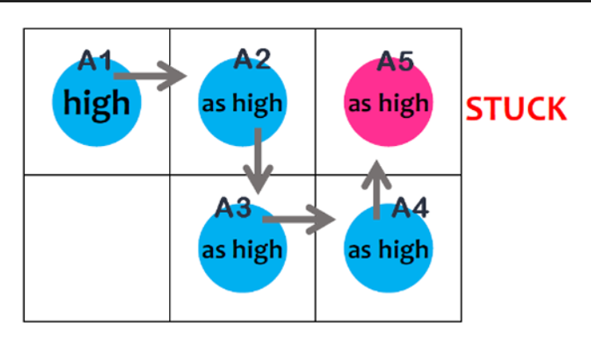
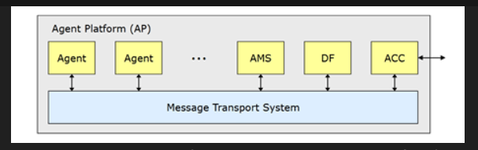

# MMAS
## Agents
### Agent Paradigms
#### Post-Declarative System **(~GI)**
##### **High-Level Goal Focus**
- Specifies what to achieve rather than how, leaving agents to determine the steps using their autonomy and reasoning.
##### **Interaction-Based Behavior**
- Agents develop behavior through interactions with data and the environment, rather than relying solely on predefined rules.
##### Vs Other Systems
###### **Procedural**
- Specifies exact steps to follow in a "do this, then that" manner.
###### **Declarative**
- Defines the goal and relationships, leaving the system to determine how to achieve it.

#### Intentional System **(~ICU)**
##### **Intentional Stance**
- Treating the system as having beliefs, desires, and intentions aids in predicting and interpreting its actions.
##### **Compact Expression**
- Mental-like concepts such as goals and beliefs provide concise explanations for system behavior.
##### **Understanding Structure and Behavior**
- Enables explanation and potential improvement of the system’s functioning.

#### Agents Comparisons
##### Vs Objects **(~AIA)**
###### **Autonomy**
- Unlike objects that execute commands when called, agents can choose or refuse actions based on their internal state.
###### **Intelligence**
- Objects are passive and lack reasoning, whereas agents exhibit smart, adaptable behavior.
###### **Activeness**
- Objects remain idle until invoked, while agents actively initiate their own actions.
##### Vs Expert Systems **(~EAO)**
###### **Environment Awareness**
- Agents perceive and act within their environment, while expert systems rely solely on input data.
###### **Action Capability**
- Agents can execute actions, whereas expert systems mainly offer advice or conclusions.
###### **Overlap**
- Some advanced expert systems function like agents, but this is not universally true.
### Agent Properties **(~RPS)**
#### **Reactivity**
- Agents continuously sense and respond to environmental changes.
#### **Proactivity**
- Agents are driven by goals and proactively take actions to achieve them.
#### **Social Ability**
- Agents interact with others through cooperation, coordination, and negotiation to fulfill tasks.
### Agent Architecture
#### Definition (~`Perceives, Processes, Remembers, and Acts`)
  - Agent architecture is the **underlying structure** of an agent system.
  - It defines how an agent:
    - **Perceives** its environment.
    - **Processes** information.
    - **Maintains** internal state.
    - **Selects** actions.

#### Main Architectures (~ `Really Powerful Systems Act Using Optimal Balance`)
  - **Purely Reactive Agents**: Respond directly to stimuli without memory or reasoning.
  - **Agents with Perception Ability**: Can detect and interpret environmental inputs.
  - **Agents with State**: Maintain internal data about past interactions.
  - **Agents with Action-Selection**: Use mechanisms to choose from available actions.
  - **Utility-based Agents**: Make decisions based on maximizing expected utility.
  - **Optimal Agents**: Always choose the best action given perfect knowledge.
  - **Bounded Optimal Agents**: Aim to act optimally within resource constraints.

#### Brook's Reactive Architecture/Subsumption Architecture (~`Hungary Simple Creatures Like Overriding`)
##### Hierarchy of Task-Specific Behaviours
##### Each Behaviour is Simple and Rule Based
##### Behaviours Compete for Agent Control
##### Lower Layered Handle Urgent/Primitive Tasks
##### Lower Layers Override Higher Ones When Needed
#### Hybrid Architecture Subsystems
##### **Deliberative Subsystem**
- Relies on a symbolic world model to handle planning and decision-making.
##### **Reactive Subsystem**
- Responds swiftly to events without engaging in complex reasoning or planning.
##### 3 Layering Possibilities (Horizontal, 1 Or 2 pass Vertical)

### Agent Reasoning & Commitment
- Deductive Reasoning
    - **Approach**:
        - Uses **logic and theorem proving** to choose actions.
        - Encodes a **theory (ρ)** that defines which actions are best in which situations.

    - **Algorithm**:
        1. Iterate through all possible actions: $\alpha \in \text{ValidActions}$.
        2. For each action, check:
            - If $\rho \vdash \text{Do}(\alpha)$ (i.e., it's provable that action α is the correct thing to do), or
            - If $\neg \rho \vdash \neg \text{Do}(\alpha)$ (i.e., it is not provable that not doing α is better).
        3. If so, **return** that action α.
        4. If no action satisfies this, return **null** (no action selected).

- Practical Reasoning & Commitment Strategies (~ BOWSU)
    - **Essence**
        - Focuses on deciding actions to achieve goals rather than managing beliefs.
    - **Basic Algorithm**
        - Continuously observes the world, updates its model, deliberates intentions, plans via means-ends reasoning, and executes the plan.
    - Commitment Strategies
        - Blind-commitment
        - Over-commitment
        - Wise Guy
        - Single-minded Commitment
        - Under-commitment
## Multi-Agent Systems
### Developmental Drivers (~ **UIIDH**)
#### **Ubiquity**
- Computing has become inexpensive and widespread, enabling its integration into many everyday devices.
#### **Interconnection**
- Systems are now networked, forming complex, interconnected environments.
#### **Intelligence**
- Computers can now automate increasingly complex tasks.
#### **Delegation**
- Machines act more autonomously, reducing the need for human intervention.
#### **Human Orientation**
- There is a shift toward designing systems that align with human thought processes rather than machine logic.

### Intent Management
#### Explore Intention Algorithm  **SPiDeR - Start Pattern Distination Route End**
##### **Initial State**
- The agent begins exploring from its starting point with most of the map unknown.
##### **Exploration Pattern**
- It follows a spiral-like pattern by always targeting the nearest unknown location from its current or starting position, breaking ties randomly.
##### **Destination Selection**
- The destination is set slightly beyond the chosen unknown point to reveal new areas and support spiral expansion.
##### **Travel**
- The agent uses the Travel Intention to reach the selected destination.
##### **Termination**
- Exploration ends once the full map size is known and all locations have been di:scovered.

#### Biding for Task Execution (**BID LOW, GO!: Bid, Input, Decide**)
##### **Bid Content**
- Agents submit bids estimating the number of steps needed to complete a task, including any required role changes.
##### **Selection Criteria**
- The agent with the lowest step estimate is selected, ensuring the task is handled by the most efficient option.
#### Task Achieving Intentions
##### Definitions of Intentions
- Intentions guide agent behavior for task completion
    - are used exclusively by coordinators and block providers.
##### Types of Intentions (**1A 3B 2C 2S**)
###### **Assemble**
- Allows the coordinator to receive a block from another agent.
###### **Block Collection**
- Instructs an agent to retrieve a specific type of block needed for a task.
###### **Block Delivery**
- Commands the agent to deliver a block to the coordinator.
###### **Block Providing**
- A core intention managing block scheduling, collection, and delivery.
###### **Connect**
- Directs an agent to hand over a block to another agent, typically the coordinator.
###### **Coordination**
- The main intention for overseeing and completing the task submission process.
###### **Single Block Submission**
- Involves delivering and submitting a single block to a goal zone.
###### **Single Block Providing**
- Merges block collection and coordination for single-task flows

##### Task Option Generation & Filtering (**TOP F: Tasks every tick, Only if ready, Per map, Filter by fit**)
###### **Task Option Generation**
- Tasks are generated at every simulation step, independently of agent actions or resource reservations.
###### **Conditions**
- A task becomes an option only if its prerequisites are met.
###### **Per-Map Basis**
- Task generation occurs separately for each dynamic map.
###### **Filtering Parameters**
- Generated tasks are filtered based on the availability of goal zones, agents, and role zones, keeping only those that match current resources.
### Path Finding
#### Path Finder **(AIDF - A\* Modified, Iteration Limit, Distance Eculidean, First step only)**
##### **Algorithm Base**
- Built on a modified A\* algorithm.
##### **Heuristic**
- Uses Euclidean distance to estimate the cost to the destination.
##### **Time Constraint**
- Pathfinding is capped by a fixed iteration limit; if the goal isn't reached, the closest node becomes the endpoint.
##### **Dynamic Adaptation**
- Only the first step of the path is reliably used, as frequent environment changes can invalidate the rest.
#### Cooperative A* **(TIPS, Time-tagged cells, In order, Priority-based reservations, Space-time A\*)**
##### **Extension of A\***
- Adapts A\* to support multi-agent collision avoidance by adding time as a third dimension.
##### **Time Dimension**
- Each cell is marked with the time an agent will occupy it.
##### **Sequential Planning**
- Agents plan in priority order, reserving timed cells which later agents treat as moving obstacles.
##### **Collision Avoidance**
- A\* is run in space-time, preventing both spatial and temporal conflicts between agents.
#### Cooperative A* with Lifelong Multi-Agent Pathfinding **(NO replan, Newbies stuck, Old paths frozen)**
##### Definition
- Continuously Assigning new Tasks to Agents over time.
##### Problem1: Lack of Dynamic Planning:
- Once paths are reserved, agents don't adapt to changes, leading to suboptimal or blocked paths.
##### Problem2: New Agents Get Stuck
- Unable to reroute or negotiate around existing reservations.
#### PIBT (Priority Inheritance with Backtracking)
##### Overview **(HELP, Higher-rank shared, Each timestep counts, Locked in loops: Problem Deadlock)**
###### **PIBT**
- Stands for Priority Inheritance with Backtracking.
###### **Priority Inheritance**
- Lets lower-priority agents temporarily adopt higher-priority ones’ priorities to enable their movement.
###### **Step-by-step Operation**
- At each timestep, agents update priorities and, in descending order, select a move while avoiding cells requested by higher-priority agents.
###### **Deadlock Possibility**
- Cyclic priority inheritance can cause deadlock when the last agent in the chain has no valid move options.

##### Backtracking Solution **(BACK: Block check, avoid nodes, Chain returns, Kickstart again)**
###### **Validation Check**
- After inheriting priority, an agent waits to confirm if its move is valid; if not, it must select another node.
###### **Exclusion Rules**
- Agents avoid nodes already claimed by higher-priority agents or previously resulting in invalid outcomes.
###### **Backtracking Chain**
- If no valid moves remain, the agent returns an invalid outcome to the one that passed it priority.
###### **Example Resolution**
- In a blocked chain, agents backtrack step-by-step until one finds a valid move, allowing others to follow and resolve the deadlock.
- 

### Perception & Environment Mapping
#### Agent Identification
##### **Detection**
- An agent attempts to identify another agent when it spots one nearby.
##### **Inquiry**
- It asks all agents if they see someone in the mirrored position, based on relative distance and direction.
##### **Matching**
- Agents compare shared visible landmarks or obstacles to eliminate unlikely identities.
##### **Success**
- Identification succeeds if only one matching candidate is found.
##### **Failure**
- The process fails if no unique match is identified.

#### Map Merging
##### **Pairwise Merging**
- Maps are merged two at a time, though several such merges can occur in a single time step.
##### **Coordinate System**
- One agent’s coordinate system remains fixed while the other’s is adjusted to align.
##### **Map Integration**
- Unique elements are added directly, while shared elements are resolved by keeping the most recent data.

#### Map Size Discovery
##### **Looping World**
- The map wraps around, allowing agents to move endlessly without encountering visible edges.
##### **Map Size Discovery**
- If two agents report the same object at different coordinates during map merging, it indicates the map loops.
##### **Size Calculation**
- The map size is computed using the difference in reported coordinates plus relative distance, revealing its full width or height.    $$    \text{Map size} = |\text{coordinate}_1 - \text{coordinate}_2 + \text{relative distance}|    $$

### Coordination & Cooperation
#### FIPA Agent Platform Components 
- 
- AMS (Agent Management System)
- ACC (Agent Communication Channel)
- DF (Directory Facilitator) Providing Yellow-Pages Service for Agents
#### Cooperative Distributed Problem Solving
##### **Problem Decomposition**
- The main problem is divided into smaller, manageable sub-problems.
##### **Subproblem Distribution**
- Each sub-problem is assigned to an agent best suited to solve it.
##### **Subproblem Solution**
- Agents work independently to solve their respective sub-problems.
##### **Answer Synthesis**
- All individual solutions are combined to form a complete solution to the original problem.

#### Joint Intention Termination
##### A joint intention is removed when an agent believes it has succeeded, become impossible, or unachievable
##### Then the agent forms a new intention to ensure all agents share this belief before the joint intention is officially dropped
#### Speech Act Message
##### **Performative Verb**
- Specifies the type of communication act, such as a request or an inform.
##### **Propositional Content**
- Represents the actual message or information being communicated.
##### **Example**
- In "Please close the door!", the performative is `request` and the propositional content is `the door is closed`.

### Game Theory Models
#### Equilibrium Conditions in Routing Games & Price of Anarchy
##### **Non-Atomic Routing Games**
- Always have an equilibrium, with a Price of Anarchy (PoA) upper bound of $\frac{4}{3}$ for affine cost functions.
##### **Atomic Routing Games**
- Equilibrium exists if traffic units are equal or costs are affine, with PoA bounds of $\frac{5}{2}$ for equal units and approximately 2.618 for affine costs.

#### Nash Equilibrium
- A pair of strategies is in Nash Equilibrium if neither agent can benefit by changing their strategy alone, as each is the best response to the other. 
- $s_1 = \text{BestResponse}(s_2), \quad s_2 = \text{BestResponse}(s_1)$
#### Dynamic Shortest Path & Dynamic Equilibrium
##### **Dynamic Shortest Path**
- A particle starting at time θ\theta follows a path that minimizes its arrival time at the destination, accounting for time-dependent edge delays.  $T_p(\theta) = T_{e_k} \circ \dots \circ T_{e_1}(\theta)$
##### **Dynamic Equilibrium**
- A routing state where all agents use their dynamic shortest paths, with no incentive to switch routes, ensuring stability given current traffic conditions.
#### Sum, Hicks and Pareto Optimality
##### **Sum Optimality**
- Maximizes the total utility of all agents, focusing solely on overall outcome efficiency.
##### **Hicks Optimality**
- A state where winners could compensate losers and still benefit, emphasizing theoretical fairness.
##### **Pareto Optimality**
- No one can be better off without making someone else worse off, ensuring efficient outcomes without waste.
##### **Is Pareto Optimal an Equilibrium?**
- Not always—Pareto optimality doesn’t ensure stability, as agents may still have incentives to deviate.
##### **Example**
- A payoff of (4,4) is Pareto optimal, but Agent 1 might prefer (5,3) for personal gain, even at Agent 2’s expense.
#### Prisoner's Dilemma 
##### **Problem**
- Cooperation breaks down among self-interested agents.
##### **Cause**
- Agents act on individual rationality, choosing to defect even when cooperation yields better overall outcomes.
##### **Correct Strategy**
- Always defect in every round.
##### **Justification**
- Backward induction shows rational agents will defect in the final round and, anticipating this, defect in every previous round as well.
##### **When This Fails**
- If the number of rounds is unknown, infinite, or not predetermined, agents may cooperate to preserve future benefits.

### Agreements
#### **Strategy**
- The decision-making plan an agent follows, based on its private knowledge and assumptions about others.
#### **Mechanism**
- A protocol outlining the rules and structure of agent interactions.
#### **Negotiation Set**
- The complete set of proposals that agents can potentially offer.
#### **Termination Rule**
- Specifies the conditions under which negotiation concludes and a deal is finalized.
#### **Mechanism Design**
- The process of crafting mechanisms to achieve specific desired outcomes.
#### **Mechanism Design Properties**
##### **Stability**
- No agent has an incentive to deviate from the agreed solution.
##### **Convergence**
- Ensures the negotiation will reach a definite conclusion.
##### **Individual Rationality**
- Participation is beneficial for each agent compared to opting out.
##### **Pareto Efficiency**
- Guarantees no agent can be better off without disadvantaging another.
##### **Maximizing Social Welfare**
- The outcome maximizes the overall benefit for all agents involved.

#### Negotiation Types
##### **Task Oriented**
- Agents negotiate to allocate indivisible tasks with associated costs in a way that minimizes individual burdens through fair or efficient redistribution.
-  Deception Possibilities 
    - **Phantom/Decoy Tasks**
        - Agents fake tasks to mislead others and appear busier, distorting negotiation outcomes.
    - **Hidden Tasks**
        - Agents hide real tasks to seem less loaded, manipulating task allocation in their favor.

##### **State Oriented**
- Agents negotiate to create a joint plan and schedule that leads to a mutually acceptable final world state, considering the side-effects of their actions.
##### **Worth Oriented**
- Based on **maximizing collective value or worth**.
#### Auction
##### **English Auction** 
- Bidders openly raise their offers, and the highest bidder wins by paying their bid amount; it's an open auction.
##### **Dutch Auction**
- The auctioneer lowers the price until someone accepts, with the first to accept winning and paying the current price; it's open.
##### **Vickrey Auction**
- Bidders submit sealed bids privately, the highest bidder wins but pays the second-highest bid; it's a closed auction and aligns with the Generalized Second Price model used online.
##### **First-Price Sealed Bid**
- One bid submitted secretly; highest wins.
#### Contract Net Protocol Phases
##### **Recognition**
- An agent realizes it needs assistance to complete a task.
##### **Announcement**
- The agent broadcasts task details to potential helpers.
##### **Bidding**
- Other agents submit bids based on their capability or interest.
##### **Awarding**
- The task is assigned to the most suitable bidder.
##### **Expediting**
- The chosen agent performs the task and may delegate parts if needed.
##### **Why it's a Natural Extension**
- It evolves centralized control into dynamic, decentralized task allocation via negotiation.